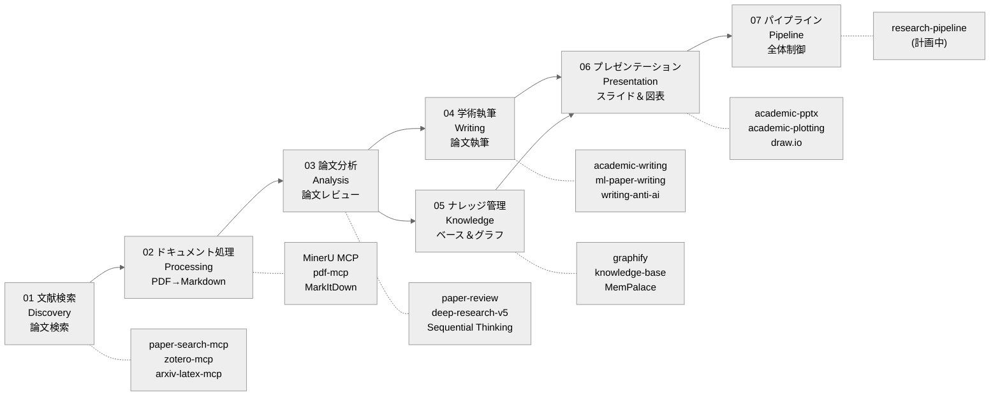

<div align="center">

# AI Research Toolkit

**Claude Code で駆動する、全工程 AI 支援学術研究ワークフロー**

[](https://github.com/debug-zhuweijian/ai-research-toolkit/releases) [](LICENSE) [](https://deepwiki.com/debug-zhuweijian/ai-research-toolkit) [![zread](https://img.shields.io/badge/Ask_Zread-_.svg?style=flat&color=00b0aa&labelColor=000000&logo=data%3Aimage%2Fsvg%2Bxml%3Bbase64%2CPHN2ZyB3aWR0aD0iMTYiIGhlaWdodD0iMTYiIHZpZXdCb3g9IjAgMCAxNiAxNiIgZmlsbD0ibm9uZSIgeG1sbnM9Imh0dHA6Ly93d3cudzMub3JnLzIwMDAvc3ZnIj4KPHBhdGggZD0iTTQuOTYxNTYgMS42MDAxSDIuMjQxNTZDMS44ODgxIDEuNjAwMSAxLjYwMTU2IDEuODg2NjQgMS42MDE1NiAyLjI0MDFWNC45NjAxQzEuNjAxNTYgNS4zMTM1NiAxLjg4ODEgNS42MDAxIDIuMjQxNTYgNS42MDAxSDQuOTYxNTZDNS4zMTUwMiA1LjYwMDEgNS42MDE1NiA1LjMxMzU2IDUuNjAxNTYgNC45NjAxVjIuMjQwMUM1LjYwMTU2IDEuODg2NjQgNS4zMTUwMiAxLjYwMDEgNC45NjE1NiAxLjYwMDFaIiBmaWxsPSIjZmZmIi8%2BCjxwYXRoIGQ9Ik00Ljk2MTU2IDEwLjM5OTlIMi4yNDE1NkMxLjg4ODEgMTAuMzk5OSAxLjYwMTU2IDEwLjY4NjQgMS42MDE1NiAxMS4wMzk5VjEzLjc1OTlDMS42MDE1NiAxNC4xMTM0IDEuODg4MSAxNC4zOTk5IDIuMjQxNTYgMTQuMzk5OUg0Ljk2MTU2QzUuMzE1MDIgMTQuMzk5OSA1LjYwMTU2IDE0LjExMzQgNS42MDE1NiAxMy43NTk5VjExLjAzOTlDNS42MDE1NiAxMC42ODY0IDUuMzE1MDIgMTAuMzk5OSA0Ljk2MTU2IDEwLjM5OTlaIiBmaWxsPSIjZmZmIi8%2BCjxwYXRoIGQ9Ik0xMy43NTg0IDEuNjAwMUgxMS4wMzg0QzEwLjY4NSAxLjYwMDEgMTAuMzk4NCAxLjg4NjY0IDEwLjM5ODQgMi4yNDAxVjQuOTYwMUMxMC4zOTg0IDUuMzEzNTYgMTAuNjg1IDUuNjAwMSAxMS4wMzg0IDUuNjAwMUgxMy43NTg0QzE0LjExMTkgNS42MDAxIDE0LjM5ODQgNS4zMTM1NiAxNC4zOTg0IDQuOTYwMVYyLjI0MDFDMTQuMzk4NCAxLjg4NjY0IDE0LjExMTkgMS42MDAxIDEzLjc1ODQgMS42MDAxWiIgZmlsbD0iI2ZmZiIvPgo8cGF0aCBkPSJNNCAxMkwxMiA0TDQgMTJaIiBmaWxsPSIjI2ZmZiIvPgo8cGF0aCBkPSJNNCAxMkwxMiA0IiBzdHJva2U9IiNmZmZmZiIgc3Ryb2tlLXdpZHRoPSIxLjUiIHN0cm9rZS1saW5lY2FwPSJyb3VuZCIvPgo8L3N2Zz4K&logoColor=ffffff)](https://zread.ai/debug-zhuweijian/ai-research-toolkit)

**[English](./README.md)** | **[中文](./README.zh-CN.md)** | **[日本語](./README.ja.md)** | **[한국어](./README.ko.md)**

</div>

---

*文献検索*から*ナビゲーション可能なナレッジグラフ構築*までを全工程カバーする、意見的（opinionated）なエンドツーエンドツールキットです。すべて Claude Code 内で完結します。研究における煩雑な作業を AI に任せ、思考に集中したい大学院生向けに設計されています。

## パイプライン概要



各フェーズは、Claude Code 内でスラッシュコマンドまたは自然言語で呼び出すスキルまたは MCP サーバーに対応しています。パイプラインは直線的ですが反復的です。理解が深まるにつれて、任意のフェーズを単独で実行したり、前のフェーズに戻ったりできます。

## 目次

- [特徴](#特徴)
- [前提条件](#前提条件)
- [クイックスタート](#クイックスタート)
- [利用ガイド: ゼロからナレッジベースまで](#利用ガイド-ゼロからナレッジベースまで)
- [各フェーズの詳細](#各フェーズの詳細)
  - [フェーズ 01: 文献検索 (Discovery)](#フェーズ-01-文献検索-discovery)
  - [フェーズ 02: ドキュメント処理 (Processing)](#フェーズ-02-ドキュメント処理-processing)
  - [フェーズ 03: 論文分析 (Analysis)](#フェーズ-03-論文分析-analysis)
  - [フェーズ 04: 学術執筆 (Writing)](#フェーズ-04-学術執筆-writing)
  - [フェーズ 05: ナレッジ管理 (Knowledge)](#フェーズ-05-ナレッジ管理-knowledge)
  - [フェーズ 06: プレゼンテーション (Presentation)](#フェーズ-06-プレゼンテーション-presentation)
  - [フェーズ 07: パイプライン (Pipeline)](#フェーズ-07-パイプライン-pipeline)
- [インストールプリセット](#インストールプリセット)
- [API キーガイド](#api-キーガイド)
- [MCP サーバー](#mcp-サーバー)
- [ツールマップ](#ツールマップ)
- [推奨リソース](#推奨リソース)
- [実験的機能](#実験的機能)
- [v0.2 の新機能](#v02-の新機能)
- [謝辞](#謝辞)
- [コントリビューション](#コントリビューション)
- [ライセンス](#ライセンス)

## 特徴

- **フェーズ 01 -- 文献検索 (Discovery)** -- 1 つのコマンドで 20 以上の学術データベース（arXiv、PubMed、Semantic Scholar、CrossRef、DOAJ など）を検索します。1 行で PDF をダウンロード。Zotero と中国語データベースプラグインで文献管理。
- **フェーズ 02 -- ドキュメント処理 (Processing)** -- MinerU（GPU 加速 OCR + レイアウト解析）、pdf-mcp、または MarkItDown で論文、スライド、ドキュメントをクリーンな Markdown に変換します。表、数式、図の参照を保持。
- **フェーズ 03 -- 論文分析 (Analysis)** -- 単一論文の深いレビューで手法、証拠の質、再利用可能性を抽出。並列サブエージェントによる複数論文の統合、引用レジストリ、トレーサビリティ。創造的な研究アイデア出しとブレインストーミング支援。
- **フェーズ 04 -- 学術執筆 (Writing)** -- ML、システム、一般学術執筆向けのドメイン特化スキルで論文を執筆・推敲・構成します。AI 検出回避のヒント、査読者への回答作成、採録後のフォーマット調整。
- **フェーズ 05 -- ナレッジ管理 (Knowledge)** -- 構造化されたナレッジベースのスキャン、取り込み、リント、クエリ。コミュニティ検出とインタラクティブ可視化によるナビゲーション可能なナレッジグラフの構築。Obsidian ワークフローによる研究ノートと文献管理。
- **フェーズ 06 -- プレゼンテーション (Presentation)** -- 研究内容から学会スライド、グループミーティング資料、学術プロット、draw.io 図、インフォグラフィック、出版品質の図表を生成。
- **フェーズ 07 -- パイプライン (Pipeline)** -- エンドツーエンドの自動化研究ワークフローのためのクロスフェーズオーケストレーション（計画中）。

## 前提条件

| 依存関係 | バージョン | インストールコマンド | 確認コマンド |
|----------|-----------|---------------------|-------------|
| Python | 3.10+ | `winget install Python.Python.3.12`（または下記 Anaconda 経由） | `python --version` |
| Node.js | 18+ | [nodejs.org](https://nodejs.org/) または `winget install OpenJS.NodeJS.LTS` | `node --version` |
| Anaconda | 任意 | [anaconda.com/download](https://www.anaconda.com/download) | `conda --version` |
| uv | 最新 | `pip install uv` または `winget install astral-sh.uv` | `uv --version` |
| Git | 2.30+ | `winget install Git.Git` | `git --version` |
| Claude Code | 最新 | `npm install -g @anthropic-ai/claude-code` | `claude --version` |
| LibreOffice | 7.0+ | [libreoffice.org](https://www.libreoffice.org/) | `soffice --version` |
| Poppler | 0.84+ | `winget install poppler` または [poppler.freedesktop.org](https://poppler.freedesktop.org/) | `pdftotext -v` |

> **中国国内ユーザーへのお知らせ:** プロキシ環境を使用している場合、インストール前に `HTTPS_PROXY` と `NO_PROXY` 環境変数を設定してください。MinerU の OpenXLab API はプロキシをバイパスする必要があります。`NO_PROXY` に `*.openxlab.org.cn` を追加してください。

> **中国国外ユーザーへのお知らせ:** 一部の MCP サーバー（web-search-prime、web-reader）はデフォルトで智譜 BigModel を使用します。国際的なユーザーには、Tavily、Brave Search、Firecrawl などの代替サービスがそのまま置き換え可能です。お好みのプロバイダーの API キーで `~/.claude.json` に同等の MCP サーバーを設定してください。

## クイックスタート

> **完全インストールチュートリアル（2-3 時間）**: [docs/installation-guide.md](docs/installation-guide.md) -- 8 ステップでゼロから始めます。各ステップに GitHub リンク、インストールコマンド、確認方法、トラブルシューティング付き。

以下は概要です。初めてセットアップする場合は、**先に完全チュートリアルを読むことを強くお勧めします**。

### A. クローン & プロファイルインストール

```bash
git clone https://github.com/debug-zhuweijian/ai-research-toolkit.git
cd ai-research-toolkit

# プロファイルプリセットでインストール
./scripts/install.sh --profile researcher    # 研究者向け（推奨）
./scripts/install.sh --profile writer        # 論文執筆重視
./scripts/install.sh --profile full          # すべて
./scripts/install.sh --profile minimal       # 検索 + PDF 処理のみ

# または個別モジュールをインストール
./scripts/install.sh --module 03-analysis    # フェーズ 03 のみ
```

### B. 上流ツールのインストール

各ツールはそれぞれのリポジトリから独立してインストールします。

| フェーズ | ツール | GitHub | インストール |
|---------|-------|--------|-------------|
| 01 | paper-search-mcp | [openags/paper-search-mcp](https://github.com/openags/paper-search-mcp) | `pip install paper-search-mcp` |
| 02 | MinerU | [opendatalab/MinerU](https://github.com/opendatalab/MinerU) | `pip install mineru-mcp-server` |
| 02 | pdf-mcp | [angshuman/pdf-mcp](https://github.com/angshuman/pdf-mcp) | `git clone` + `npm install` |
| 02 | MarkItDown | [microsoft/markitdown](https://github.com/microsoft/markitdown) | `pip install markitdown-mcp` |
| 03 | Sequential Thinking | [modelcontextprotocol/servers](https://github.com/modelcontextprotocol/servers) | `npx @modelcontextprotocol/server-sequential-thinking` |
| 05 | Graphify | [safishamsi/graphify](https://github.com/safishamsi/graphify) | `pip install graphifyy` |
| 05 | MemPalace | [MemPalace/mempalace](https://github.com/MemPalace/mempalace) | `conda create` + `pip install` |

正確なコマンドと確認手順は [docs/installation-guide.md](docs/installation-guide.md) をご覧ください。

### C. MCP サーバーの設定

`~/.claude.json` を編集し、MCP 設定をマージします。

- **最小構成（3 サーバー）**: `configs/mcp-servers-minimal.json` -- フェーズ 01-02 をカバー
- **完全構成（11 サーバー）**: `configs/mcp-servers-full.json` -- 全フェーズ

すべての `<YOUR_*>` プレースホルダーを実際のキーとパスに置き換えてください。

> **推奨**: paper-search-mcp では `uvx paper-search-mcp` を使用して、グローバル Python 環境を汚さずに自動的に依存関係を分離できます。

### D. API キーの設定

| キー | 取得元 | 必須? | 登録 |
|-----|--------|-------|------|
| Anthropic または互換エンドポイント | [console.anthropic.com](https://console.anthropic.com/) または互換サービス（例: 智譜 BigModel） | **はい**（いずれか） | Anthropic: $5 以上; 互換: サービスによる |
| 智譜 BigModel | [open.bigmodel.cn](https://open.bigmodel.cn/) | **はい** | 無料枠あり |
| MinerU OpenXLab | [openxlab.org.cn](https://openxlab.org.cn) | 推奨 | 無料（1000 ページ/日） |

> **Anthropic 互換エンドポイントについて**: Anthropic 互換 API（例: 智譜 BigModel GLM シリーズ）を通じて Claude Code を実行する場合、そのプラットフォームの API キーを使用し、`base_url` を適切に設定してください。この場合、Anthropic API キーは不要です。

詳細な登録手順は [docs/api-keys-guide.md](docs/api-keys-guide.md) をご覧ください。

### E. 動作確認

```bash
# macOS / Linux / Git Bash
./scripts/verify-setup.sh
```

> **Windows ユーザーへ:** このスクリプトは Git Bash で実行してください。`bash` が利用できない場合は、[docs/installation-guide.md](docs/installation-guide.md) に記載されている個別の確認コマンドを手動で実行してください。

> 問題がありますか？よくある問題については [docs/troubleshooting.md](docs/troubleshooting.md) をご覧ください。

---

## 利用ガイド: ゼロからナレッジベースまで

### シナリオ: 研究テーマとして「グラフニューラルネットワーク」を選んだばかり

新しく入学した大学院生です。指導教員から「グラフニューラルネットワークについて調べてみて」と言われました。午後ひとつでゼロから構造化されたナレッジベースを構築する方法をご紹介します。

#### ステップ 1: 論文検索（フェーズ 01）

```
> /paper-search search "graph neural networks knowledge distillation" -n 20 -s arxiv,semanticscholar,pubmed
```

> **注:** 以下に示す arXiv ID と検索結果は例示です。実際の結果は異なります。

期待される出力（要約）:

```
Found 60 results (20 per source x 3 sources):

[arxiv] 2401.12345 - A Graph Neural Network Framework for Molecular Property Prediction
         Authors: Zhang et al. (2024)  Citations: 12
         Abstract: We propose a GNN framework that predicts molecular properties...

[semantic] 87f3a... - Attention-Based Graph Convolutional Networks
         Authors: Vaswani et al. (2021)  Citations: 389
         Abstract: We demonstrate attention mechanisms for graph-structured data...

[pubmed] PMID:38291034 - Knowledge distillation for graph neural networks
         Authors: Chen et al. (2023)  Citations: 67
         Abstract: We present a knowledge distillation approach for compressing GNNs...
```

関連性の高い論文 ID を保存してください。年範囲で検索することもできます:

```
> /paper-search search "graph neural networks" -n 10 -s semantic -y 2022-2025
```

#### ステップ 2: 論文ダウンロード（フェーズ 01）

```
> /paper-search download arxiv 2401.12345
```

出力:

```
Downloaded: ./downloads/2401.12345.pdf (2.3 MB)
```

**中国語論文（CNKI）のヒント:** [Zotero](https://www.zotero.org/) で [Jasminum](https://github.com/l0o0/jasminum) プラグインと [translators_CN](https://github.com/l0o0/translators_CN) を使用して CNKI から一括ダウンロードしてください。ダウンロードした PDF はステップ 3 で変換します。

#### ステップ 3: PDF を Markdown に変換（フェーズ 02）

```
> /Geek-skills-mineru-pdf-parser ./downloads/2401.12345.pdf
```

このスキルは MinerU の MCP サーバーを呼び出し、PDF を OpenXLab に送って解析します（お使いのマシンで GPU は不要です）。出力:

```
Input:  ./downloads/2401.12345.pdf
Output: Markdown text (below)

Save to: <OBSIDIAN_VAULT>/Papers/Zhang2024_Graph_Neural_Networks/Zhang2024_EN.md
```

出力を構造化されたディレクトリに保存します。命名規則は `FirstAuthorYear_ShortTitle` です:

```
<OBSIDIAN_VAULT>/Papers/Zhang2024_Graph_Neural_Networks/
├── Zhang2024_EN.pdf      <-- 元の PDF
└── Zhang2024_EN.md       <-- 変換された Markdown
```

多数の PDF を一括変換する場合:

```
> Convert all PDFs in ./downloads/ to Markdown using MinerU.
  Save results to <OBSIDIAN_VAULT>/Papers/<AuthorYear_Title>/<name>.md
```

#### ステップ 4: AI 論文分析（フェーズ 03）

**単一論文レビュー:**

```
> /paper-review Zhang2024_EN.md
```

出力（構造化レビュー）:

```
## Paper Review: A Graph Neural Network Framework for Molecular Property Prediction

**Research Question:** Can GNNs accurately predict molecular properties with limited labeled data?
**Method:** Transformer-based graph encoder with attention on molecular substructures
**Dataset:** 12 benchmark datasets, 500 molecules each, multi-task learning
**Key Result:** 95.2% average accuracy on molecular property prediction (SOTA)
**Evidence Quality:** MODERATE -- limited benchmark diversity, no external validation
**Limitations:**
  - Only tested on small molecules (no polymer or protein graphs)
  - Benchmark datasets limited to 500 molecules each
  - No comparison with knowledge distillation approaches
**Reusable for you:**
  - The attention architecture (Figure 3) could transfer to your graph learning setup
  - Their data augmentation strategy (Section 4.2) addresses the low-sample problem
  - Open-source code: github.com/...
```

**複数論文ディープリサーチ:**

```
> /deep-research-v5 "Compare graph neural network methods from 2020 to 2025: GCN vs GAT vs GraphSAGE approaches, focusing on scalability and inductive learning capabilities"
```

並列サブエージェントがそれぞれ検索、読解、構造化ノート作成を行います。リードエージェントがすべてを統合し、トレーサブルな引用付きの長文レポートにまとめます。典型的な出力: 5-8 分で 3000-5000 語のレポート。

#### ステップ 5: 執筆（フェーズ 04）

研究動向を理解したら、執筆を開始します:

```
> /academic-writing
  "Draft a related work section for my thesis on graph neural networks.
   Cover: GCN-based approaches, attention-based approaches, and hybrid methods.
   Cite the papers in my knowledge base. Target venue: IEEE TPAMI."
```

必要に応じてドメイン特化の執筆スキルを使用してください:

```
> /ml-paper-writing          # ML/AI 論文向け
> /systems-paper-writing     # システム論文向け
> /writing-anti-ai           # AI 検出フラグを低減するヒント
> /review-response           # 査読者コメントへの回答作成
> /post-acceptance           # カメラレディ原稿のフォーマットと最終確認
```

#### ステップ 6: ナレッジベース構築（フェーズ 05）

```
> /knowledge-base scan
```

出力:

```
Scanning <KNOWLEDGE_BASE>/ for new files...
  NEW:      3 files
  CHANGED:  0 files
  DUPE:     0 files

New files:
  [md] Zhang2024_Graph_Neural_Networks_EN.md
  [md] Vaswani2021_Attention_Graph_Convolutional_EN.md
  [md] Chen2023_Knowledge_Distillation_GNN_EN.md
```

ナレッジグラフを構築します:

```
> /graphify <KNOWLEDGE_BASE_PATH>
```

コミュニティ検出付きのナビゲーション可能なナレッジグラフを構築します。出力:

```
graphify-out/
├── graph.html              <-- インタラクティブ可視化（ブラウザで開く）
├── graph.json              <-- GraphRAG 対応 JSON
├── graph.graphml           <-- Gephi / yEd 用
├── GRAPH_REPORT.md         <-- 監査レポート: ゴッドノード、コミュニティ、カバレッジ
└── wiki/
    ├── index.md            <-- エージェントクロール可能な Wiki インデックス
    ├── community-01.md     <-- コミュニティクラスタごとに 1 記事
    ├── community-02.md
    └── ...
```

ブラウザで `graph.html` を開き、論文、手法、概念間のつながりを探索してください。より徹底したエッジ抽出には `--mode deep` を使用してください。

#### ステップ 7: プレゼンテーション作成（フェーズ 06）

学会スライドを生成:

```
> /academic-pptx
  "Create a 15-minute conference presentation on my survey of graph
   neural network methods. Include: problem statement, taxonomy of
   approaches, comparison table, and future directions."
```

グループミーティングの準備:

```
> /group-meeting-slides
  "Make a 10-minute group meeting update on my literature survey progress.
   Audience: my advisor and 3 labmates. Focus: key findings and gaps."
```

出版用図表の生成:

```
> /academic-plotting
  "Create a comparison chart of GNN methods showing accuracy vs. training time."
```

### クイックリファレンス

| やりたいこと | コマンド | フェーズ |
|-------------|---------|---------|
| 複数データベースで論文検索 | `/paper-search search "query" -n 20 -s arxiv,semantic,pubmed` | 01 |
| 論文 PDF をダウンロード | `/paper-search download arxiv 2401.12345` | 01 |
| PDF を Markdown に変換 | `/Geek-skills-mineru-pdf-parser paper.pdf` | 02 |
| 単一論文をレビュー | `/paper-review paper.md` | 03 |
| 複数論文を統合分析 | `/deep-research-v5 "research question"` | 03 |
| 研究アイデアをブレインストーミング | `/brainstorming-research-ideas "topic"` | 03 |
| 論文のセクションを執筆 | `/academic-writing` | 04 |
| ML 論文を執筆 | `/ml-paper-writing` | 04 |
| 査読者に回答 | `/review-response` | 04 |
| ナレッジベースをスキャン | `/knowledge-base scan` | 05 |
| ナレッジグラフを構築 | `/graphify <KNOWLEDGE_BASE_PATH>` | 05 |
| Obsidian vault を管理 | `/obsidian-markdown` | 05 |
| スライドを作成 | `/academic-pptx` または `/group-meeting-slides` | 06 |
| 学術プロットを作成 | `/academic-plotting` | 06 |
| 図を描画 | `/drawio` | 06 |

---

## 各フェーズの詳細

### フェーズ 01: 文献検索 (Discovery)

| ツール | GitHub | インストール |
|------|--------|-------------|
| paper-search-mcp | [openags/paper-search-mcp](https://github.com/openags/paper-search-mcp) | `pip install paper-search-mcp` |
| zotero-mcp | [MushroomCatKinsh/zotero-mcp](https://github.com/MushroomCatKinsh/zotero-mcp) | `pip install zotero-mcp-server` |
| arxiv-latex-mcp | [dvai-lab/arxiv-latex-mcp](https://github.com/dvai-lab/arxiv-latex-mcp) | `pip install arxiv-latex-mcp` |
| Zotero | [zotero/zotero](https://github.com/zotero/zotero) | [zotero.org](https://www.zotero.org/) |
| Jasminum (CNKI) | [l0o0/jasminum](https://github.com/l0o0/jasminum) | Zotero .xpi プラグイン |
| translators_CN | [l0o0/translators_CN](https://github.com/l0o0/translators_CN) | Zotero translators にコピー |

単一 CLI から 20 以上の学術データベースを検索します。arXiv、PubMed、Semantic Scholar、CrossRef、OpenAlex、DBLP、DOAJ、CORE などをサポートします。API キーによる IEEE/ACM もオプションで対応。文献管理のための Zotero 連携と、数式の精密な解釈のための arXiv LaTeX ソース取得（arxiv-latex-mcp）を備えています。

詳細な使い方とソース設定については [modules/01-discovery/README.md](modules/01-discovery/README.md) をご覧ください。

### フェーズ 02: ドキュメント処理 (Processing)

| ツール | GitHub | インストール |
|------|--------|-------------|
| MinerU | [opendatalab/MinerU](https://github.com/opendatalab/MinerU) | `pip install mineru-mcp-server` |
| pdf-mcp | [angshuman/pdf-mcp](https://github.com/angshuman/pdf-mcp) | `git clone` + `npm install` |
| MarkItDown | [microsoft/markitdown](https://github.com/microsoft/markitdown) | `pip install markitdown-mcp` |

論文、技術レポート、スライド資料を LLM に適した Markdown に変換します。MinerU は GPU 加速解析とスキャン文書向け OCR サポートを提供します。pdf-mcp はローカル操作（分割、結合、ページ抽出、画像レンダリング）を担当します。MarkItDown は Office 形式（DOCX、PPTX、XLSX）をカバーします。完全なフォーマットサポートには LibreOffice と Poppler が必要です。

バックエンドの選択、OCR 設定、一括変換については [modules/02-processing/README.md](modules/02-processing/README.md) をご覧ください。

### フェーズ 03: 論文分析 (Analysis)

| ツール | ソース | タイプ |
|------|--------|-------|
| paper-review | 本リポジトリ | スキル |
| paper-proofread | 本リポジトリ + [上流](https://github.com/LimHyungTae/awesome-claudecode-paper-proofreading) | スキル |
| deep-research-v5 | 本リポジトリ | スキル（9 ファイル） |
| brainstorming-research-ideas | 本リポジトリ | スキル |
| creative-thinking-for-research | 本リポジトリ | スキル |
| content-research-writer | 本リポジトリ | スキル |
| Sequential Thinking | [modelcontextprotocol/servers](https://github.com/modelcontextprotocol/servers) | MCP |

単一論文レビューは研究課題、手法、証拠の質、限界、再利用可能な部分を抽出します。論文校正は ICRA 2025 Outstanding Reviewer 基準に基づく 2 段階 LaTeX ワークスペース監査（9 チェック）とカンファレンスレベルの内容レビュー（9 カテゴリ）を提供します。複数論文ディープリサーチはトレーサブルな引用付きの統合のために並列サブエージェントをディスパッチします。ブレインストーミングと創造的思考スキルが新しい研究方向の発想を支援します。

分析テンプレート、校正ワークフロー、研究アイデア出しパターンについては [modules/03-analysis/README.md](modules/03-analysis/README.md) をご覧ください。

### フェーズ 04: 学術執筆 (Writing)

| ツール | ソース | タイプ |
|------|--------|-------|
| academic-writing | 本リポジトリ | スキル |
| academic-paper | 本リポジトリ | スキル |
| ml-paper-writing | 本リポジトリ | スキル |
| systems-paper-writing | 本リポジトリ | スキル |
| writing-anti-ai | 本リポジトリ | スキル |
| post-acceptance | 本リポジトリ | スキル |
| review-response | 本リポジトリ | スキル |
| results-analysis | 本リポジトリ | スキル |
| results-report | 本リポジトリ | スキル |

異なる投稿先向けのドメイン特化執筆スキルです。ML 論文執筆は実験テーブル、アブレーションスタディ、アーキテクチャ記述を扱います。システム論文執筆は評価方法論とスケーラビリティ分析をカバーします。writing-anti-ai は AI 検出フラグを低減する戦略を提供します。review-response はポイントバイポイントの反論を作成します。post-acceptance はカメラレディ原稿のフォーマット、校正、最終確認を扱います。

執筆ワークフロー、テンプレート選択、投稿準備については [modules/04-writing/README.md](modules/04-writing/README.md) をご覧ください。

### フェーズ 05: ナレッジ管理 (Knowledge)

| ツール | GitHub | インストール |
|------|--------|-------------|
| Graphify | [safishamsi/graphify](https://github.com/safishamsi/graphify) | `pip install graphifyy` |
| knowledge-base | 本リポジトリ | スキル |
| knowledge-distillation | 本リポジトリ | スキル |
| obsidian-markdown | 本リポジトリ | スキル |
| obsidian-literature-workflow | 本リポジトリ | スキル |
| obsidian-research-log | 本リポジトリ | スキル |
| obsidian-synthesis-map | 本リポジトリ | スキル |
| obsidian-experiment-log | 本リポジトリ | スキル |
| obsidian-link-graph | 本リポジトリ | スキル |
| obsidian-project-memory | 本リポジトリ | スキル |
| MemPalace | [MemPalace/mempalace](https://github.com/MemPalace/mempalace) | `pip install mempalace`（別 conda 環境） |
| ChromaDB | [chroma-core/chroma](https://github.com/chroma-core/chroma) | `pip install chromadb` |

研究資料から構造化された検索可能なナレッジベースを構築します。knowledge-base スキルは旧 kb-* シェルを統一インターフェースに置き換えます。Graphify はドキュメントフォルダをコミュニティ検出、インタラクティブ HTML 可視化、監査レポート付きのナビゲーション可能なグラフに変換します。7 つの Obsidian スキルが文献ノート、研究ログ、シンセシスマップ、実験ログ、リンクグラフ、プロジェクトメモリ、Markdown フォーマットのための特化したワークフローを提供します。MemPalace はナレッジグラフサポート付きの永続的セマンティックメモリを追加します。

ナレッジベースアーキテクチャ、Obsidian 設定、グラフ生成オプションについては [modules/05-knowledge/README.md](modules/05-knowledge/README.md) をご覧ください。

### フェーズ 06: プレゼンテーション (Presentation)

| ツール | ソース | タイプ |
|------|--------|-------|
| academic-pptx | 本リポジトリ | スキル |
| group-meeting-slides | 本リポジトリ | スキル |
| academic-plotting | 本リポジトリ | スキル |
| draw.io MCP | [nicholaschenai/drawio-mcp](https://github.com/nicholaschenai/drawio-mcp) | MCP |
| notion-infographic | 本リポジトリ | スキル |
| publication-chart-skill | 本リポジトリ | スキル |
| presenting-conference-talks | 本リポジトリ | スキル |

出版品質のプレゼンテーションと図表を生成します。academic-pptx は適切な学術構造の学会スライドを作成します。group-meeting-slides はインフォーマルな研究室ミーティング向け資料を作成します。academic-plotting は比較チャート、アブレーションテーブル、学習曲線を生成します。draw.io MCP はアーキテクチャ図、フローチャート、システム図を作成します。notion-infographic はビジュアルサマリーを作成します。presenting-conference-talks は学会発表の準備とリハーサルを支援します。

スライドテンプレート、プロット例、図パターンについては [modules/06-presentation/README.md](modules/06-presentation/README.md) をご覧ください。

### フェーズ 07: パイプライン (Pipeline)

| ツール | ソース | ステータス |
|------|--------|-----------|
| research-pipeline | 本リポジトリ | 計画中 |

自動化されたエンドツーエンド研究ワークフローのためのクロスフェーズオーケストレーションです。フェーズのチェーン（例: 検索 -> ダウンロード -> 変換 -> レビュー -> 要約）を設定可能なパラメータとエラーリカバリでサポートする予定です。現在計画中です。

設計提案とロードマップについては [modules/07-pipeline/README.md](modules/07-pipeline/README.md) をご覧ください。

---

## インストールプリセット

| プロファイル | モジュール | スキル | エージェント | 向いている用途 |
|------------|-----------|--------|-------------|--------------|
| `minimal` | 01, 02 | 7 | 2 | 文献検索とドキュメント処理 |
| `writer` | 04, 06 | 16 | 7 | 学術執筆とプレゼンテーション |
| `researcher` | 01-04 | 25 | 14 | フル研究ワークフロー（推奨） |
| `knowledge` | 05, 06 | 17 | 2 | ナレッジ管理と Obsidian |
| `full` | 01-06 | 42 | 16 | 完全ツールキット |

`./scripts/install.sh --profile <name>` でインストールするか、`--module <phase>` で個別モジュールをインストールしてください。

---

## API キーガイド

### 必須キー

| キー | 取得元 | 無料枠 | 必須? | 用途 |
|-----|--------|--------|-------|------|
| Anthropic（または互換エンドポイント） | [console.anthropic.com](https://console.anthropic.com/) または互換サービス（例: 智譜 BigModel） | Anthropic: $5 以上; 互換: サービスによる | **はい**（いずれか） | Claude Code コア機能 |
| 智譜 BigModel | [open.bigmodel.cn](https://open.bigmodel.cn/) | あり（充実した無料枠） | **はい** | MCP 経由のウェブ検索、ウェブリーダー、ドキュメント分析 |
| MinerU OpenXLab | [mineru.openxlab.org.cn](https://mineru.openxlab.org.cn/) | あり（1000 ページ/日） | **はい** | PDF → Markdown 変換 API |

> **Anthropic 互換エンドポイントの使用について**: Claude Code は Anthropic 互換 API エンドポイント（例: 智譜 BigModel の GLM シリーズ）をサポートしています。互換エンドポイントを使用する場合、対応する API キーと `base_url` を設定してください。Anthropic API キーは不要です。

### オプションキー

| キー | 取得元 | 無料? | 用途 |
|-----|--------|-------|------|
| CORE API | [core.ac.uk/services/api](https://core.ac.uk/services/api) | はい | 3 億以上のオープンアクセス論文（推奨） |
| Semantic Scholar API | [semanticscholar.org/product/api](https://www.semanticscholar.org/product/api) | はい | 高いレート制限 |
| Unpaywall Email | メールアドレスを設定するだけ | はい | オープンアクセス PDF の検索 |
| DOAJ API | [doaj.org/api](https://doaj.org/api/docs) | はい | DOAJ 一括アクセス |
| IEEE API | [developer.ieee.org](https://developer.ieee.org/) | はい（審査あり） | IEEE Xplore 検索 |
| ACM API | [dl.acm.org](https://dl.acm.org/) | 機関契約 | ACM Digital Library 検索 |

### 海外向け代替サービス

中国国外のユーザーは、以下のサービスで智譜 BigModel のデフォルトを置き換えられます:
- **ウェブ検索**: web-search-prime の代わりに [Tavily](https://tavily.com/) または [Brave Search API](https://brave.com/search/api/)
- **ウェブリーダー**: web-reader の代わりに [Firecrawl](https://firecrawl.dev/) または [Jina Reader](https://jina.ai/reader/)
- **ドキュメント分析**: ビジョンサポート付きの任意の Anthropic 互換エンドポイント

各キーの詳細な設定手順は [docs/api-keys-guide.md](docs/api-keys-guide.md) をご覧ください。

---

## MCP サーバー

| サーバー | フェーズ | 用途 | インストール |
|---------|---------|------|-------------|
| paper-search-mcp | 01 | 20+ データベース論文検索 | `pip install paper-search-mcp` |
| zotero-mcp | 01 | Zotero ローカルライブラリ管理 | `pip install zotero-mcp-server` |
| arxiv-latex-mcp | 01 | arXiv LaTeX ソース取得 | `pip install arxiv-latex-mcp` |
| mineru-mcp | 02 | PDF → Markdown 変換 | `pip install mineru-mcp-server` |
| pdf-mcp | 02 | PDF 操作（分割、結合、レンダリング） | `git clone` + `npm install` |
| Sequential Thinking | 03 | 構造化多段推論 | `npx @modelcontextprotocol/server-sequential-thinking` |
| MemPalace | 05 | 永続的セマンティックメモリ + ナレッジグラフ | `pip install mempalace` |
| draw.io MCP | 06 | 図表作成（フローチャート、アーキテクチャ） | `npx @drawio/mcp` |
| web-search-prime | 全 | ウェブ検索（智譜または代替） | リモート MCP（API キーのみ） |
| web-reader | 全 | URL → Markdown 変換 | リモート MCP（API キーのみ） |
| zread | 全 | GitHub リポジトリ閲覧 | リモート MCP（API キーのみ） |
| zai-mcp-server | 全 | 画像/動画分析 | `npx @z_ai/mcp-server` |

グローバルサーバーは `configs/mcp-servers-full.json` で設定します。`<YOUR_*>` プレースホルダーを実際のキーとパスに置き換えてください。

---

## ツールマップ

| ツール | ソース | ライセンス | フェーズ | インストール |
|------|--------|-----------|---------|-------------|
| [paper-search-mcp](https://github.com/openags/paper-search-mcp) | openags | MIT | 01 | `pip install paper-search-mcp` |
| [zotero-mcp](https://github.com/MushroomCatKinsh/zotero-mcp) | MushroomCatKinsh | MIT | 01 | `pip install zotero-mcp-server` |
| [arxiv-latex-mcp](https://github.com/dvai-lab/arxiv-latex-mcp) | dvai-lab | MIT | 01 | `pip install arxiv-latex-mcp` |
| [Zotero](https://github.com/zotero/zotero) | Zotero | AGPL-3.0 | 01 | [zotero.org](https://www.zotero.org/) |
| [Jasminum](https://github.com/l0o0/jasminum) | l0o0 | GPL-3.0 | 01 | Zotero プラグイン |
| [translators_CN](https://github.com/l0o0/translators_CN) | l0o0 | GPL-3.0 | 01 | Zotero translators |
| [MinerU](https://github.com/opendatalab/MinerU) | OpenDataLab | Apache-2.0 | 02 | `pip install mineru-mcp-server` |
| [pdf-mcp](https://github.com/angshuman/pdf-mcp) | angshuman | MIT | 02 | `git clone` + `npm install` |
| [MarkItDown](https://github.com/microsoft/markitdown) | Microsoft | MIT | 02 | `pip install markitdown-mcp` |
| [paper-review](skills/paper-review/) | 本リポジトリ | MIT | 03 | スキル（`~/.claude/skills/` にコピー） |
| [paper-proofread](skills/paper-proofread/) | 本リポジトリ + [LimHyungTae](https://github.com/LimHyungTae/awesome-claudecode-paper-proofreading) | MIT | 03 | スキル（`~/.claude/skills/` にコピー） |
| [deep-research-v5](skills/deep-research-v5/) | 本リポジトリ | MIT | 03 | スキル（9 ファイル） |
| [Sequential Thinking](https://github.com/modelcontextprotocol/servers) | MCP | MIT | 03 | `npx @modelcontextprotocol/server-sequential-thinking` |
| [Claude Code](https://docs.anthropic.com/en/docs/claude-code) | Anthropic | 商用 | 全 | `npm i -g @anthropic-ai/claude-code` |
| [academic-writing](skills/academic-writing/) | 本リポジトリ | MIT | 04 | スキル（`~/.claude/skills/` にコピー） |
| [ml-paper-writing](skills/ml-paper-writing/) | 本リポジトリ | MIT | 04 | スキル（`~/.claude/skills/` にコピー） |
| [systems-paper-writing](skills/systems-paper-writing/) | 本リポジトリ | MIT | 04 | スキル（`~/.claude/skills/` にコピー） |
| [writing-anti-ai](skills/writing-anti-ai/) | 本リポジトリ | MIT | 04 | スキル（`~/.claude/skills/` にコピー） |
| [review-response](skills/review-response/) | 本リポジトリ | MIT | 04 | スキル（`~/.claude/skills/` にコピー） |
| [post-acceptance](skills/post-acceptance/) | 本リポジトリ | MIT | 04 | スキル（`~/.claude/skills/` にコピー） |
| [results-analysis](skills/results-analysis/) | 本リポジトリ | MIT | 04 | スキル（`~/.claude/skills/` にコピー） |
| [results-report](skills/results-report/) | 本リポジトリ | MIT | 04 | スキル（`~/.claude/skills/` にコピー） |
| [Graphify](https://github.com/safishamsi/graphify) | safishamsi | MIT | 05 | `pip install graphifyy` |
| [knowledge-base](skills/knowledge-base/) | 本リポジトリ | MIT | 05 | スキル（`~/.claude/skills/` にコピー） |
| [knowledge-distillation](skills/knowledge-distillation/) | 本リポジトリ | MIT | 05 | スキル（`~/.claude/skills/` にコピー） |
| [obsidian-*](skills/)（7 スキル） | 本リポジトリ | MIT | 05 | スキル（`~/.claude/skills/` にコピー） |
| [MemPalace](https://github.com/MemPalace/mempalace) | MemPalace | MIT | 05 | `pip install mempalace`（別 conda 環境） |
| [ChromaDB](https://github.com/chroma-core/chroma) | Chroma | Apache-2.0 | 05 | `pip install chromadb` |
| [academic-pptx](skills/academic-pptx/) | 本リポジトリ | MIT | 06 | スキル（`~/.claude/skills/` にコピー） |
| [group-meeting-slides](skills/group-meeting-slides/) | 本リポジトリ | MIT | 06 | スキル（`~/.claude/skills/` にコピー） |
| [academic-plotting](skills/academic-plotting/) | 本リポジトリ | MIT | 06 | スキル（`~/.claude/skills/` にコピー） |
| [draw.io MCP](https://github.com/nicholaschenai/drawio-mcp) | nicholaschenai | MIT | 06 | `npx @drawio/mcp` |
| [notion-infographic](skills/notion-infographic/) | 本リポジトリ | MIT | 06 | スキル（`~/.claude/skills/` にコピー） |
| [publication-chart-skill](skills/publication-chart-skill/) | 本リポジトリ | MIT | 06 | スキル（`~/.claude/skills/` にコピー） |
| [presenting-conference-talks](skills/presenting-conference-talks/) | 本リポジトリ | MIT | 06 | スキル（`~/.claude/skills/` にコピー） |
| [Playwright MCP](https://github.com/microsoft/playwright-mcp) | Microsoft | Apache-2.0 | 全 | `npx @playwright/mcp@latest` |
| [Context7](https://github.com/nicholaschenai/context7) | Context7 | MIT | 全 | プラグイン（compound-engineering 経由） |

---

## 推奨リソース

### AI による研究支援

- [Awesome AI for Research](https://github.com/THU-KEG/Awesome-AI-for-Research) -- AI 支援研究ツールと手法の包括的サーベイ、清華 KEG が管理
- [EvoScientist](https://github.com/EvoScientist/EvoScientist) -- 仮説の自律的な発見と検証を行う自己進化型 AI サイエンティスト
- [DeepScientist](https://github.com/ResearAI/DeepScientist) -- アイデア出しから論文までのエンドツーエンド AI 研究パイプライン
- [LightRAG](https://github.com/HKUDS/LightRAG) -- 研究ドキュメント検索のための軽量・高効率 RAG フレームワーク
- [Open Notebook](https://github.com/lfnovo/open-notebook) -- Google の NotebookLM のオープンソース代替、研究ノート管理用
- [Paper Proofreading](https://github.com/LimHyungTae/awesome-claudecode-paper-proofreading) -- Claude Code による論文校正ワークフローのキュレーションリスト

### Claude Code エコシステム

- [Awesome Claude Skills](https://github.com/ComposioHQ/awesome-claude-skills) -- 再利用可能な Claude Code スキルのキュレーションコレクション
- [Awesome Claude Code Subagents](https://github.com/VoltAgent/awesome-claude-code-subagents) -- マルチエージェントワークフローのパターンと例
- [Oh My Claude Code](https://github.com/Yeachan-Heo/oh-my-claudecode) -- Claude Code の設定とプラグイン管理
- [Claude HUD](https://github.com/jarrodwatts/claude-hud) -- Claude Code セッションを監視するヘッドアップディスプレイ
- [LaTeX Document Skill](https://github.com/ndpvt-web/latex-document-skill) -- LaTeX ドキュメント編集のための Claude Code スキル
- [Learn Claude Code](https://github.com/shareAI-lab/learn-claude-code) -- Claude Code の中国語チュートリアルと例
- [ClaudeSkills](https://github.com/staruhub/ClaudeSkills) -- コミュニティスキルレジストリと共有プラットフォーム

### 使用プラグイン

- [SuperClaude Framework](https://github.com/SuperClaude-Org/SuperClaude_Framework) -- 強化された計画、デバッグ、TDD ワークフロー
- [Compound Engineering](https://github.com/EveryInc/compound-engineering-plugin) -- コードレビュー、ブレインストーミング、フロントエンドデザインツール
- [claude-mem](https://github.com/thedotmack/claude-mem) -- セッション間の永続的メモリとコンテキスト管理
- [PUA](https://github.com/tanweai/pua) -- Claude Code のパーソナリティとトーンのカスタマイズ

---

## 実験的機能

[experimental/](experimental/) ディレクトリには、別プラットフォームが必要な高度なコンポーネントが含まれています:

**DeepScientist エージェント（14 個）:** アイデア生成、実験実行、レビュー シミュレーション、リバタル支援、図表仕上げなどを担う 14 の特化エージェントコレクションです。[DeepScientist](https://github.com/DoriRoth/DeepScientist) プラットフォームが必要です。標準インストールには含まれません。全一覧とセットアップ手順は [experimental/README.md](experimental/README.md) をご覧ください。

---

## v0.2 の新機能

- **7 フェーズモジュール構造** -- 文献検索、ドキュメント処理、論文分析、学術執筆、ナレッジ管理、プレゼンテーション、パイプラインに整理（旧 4 フェーズから）
- **42 スキル**（旧 17）-- 全フェーズに 25 の新スキルを追加
- **16 エージェント** -- 文献レビューアー、LaTeX スペシャリスト、リバタルライターなど
- **5 インストールプリセット** -- 必要なものだけインストール（minimal、writer、researcher、knowledge、full）
- **7 Obsidian スキル** -- 文献ワークフロー、研究ログ、シンセシスマップ、実験ログ、リンクグラフ、プロジェクトメモリ、Markdown フォーマット
- **knowledge-base 統一スキル** -- 旧 kb-scan/kb-apply/kb-lint/kb-stats シェルスクリプトを置き換え
- **6 プレゼンテーションスキル** -- 学術 PPTX、グループミーティングスライド、学術プロット、draw.io、インフォグラフィック、カンファレンストーク
- **14 DeepScientist エージェント** を experimental/ に移動（別プラットフォームが必要）
- **5 つの空 kb-* シェル** を削除、knowledge-base スキルに置き換え
- **LibreOffice と Poppler** を完全フォーマットサポートの前提条件に追加
- **海外向け代替サービス** を中国国外ユーザー向けに文書化（Tavily、Brave Search、Firecrawl、Jina Reader）

詳細は [CHANGELOG.md](CHANGELOG.md) をご覧ください。

---

## 謝辞

本ツールキットは、以下の優れたオープンソースプロジェクトの肩の上に立っています:

### スキル・エージェントのソース

- **[AI-Research-SKILLs](https://github.com/orchestra-research/AI-Research-SKILLs)** by orchestra-research -- 文献レビュー、実験設計、データ分析、論文執筆をカバーする 93 以上の研究スキルの由来
- **[academic-research-skills](https://github.com/Imbad0202/academic-research-skills)** by Imbad0202 -- deep-research、academic-paper、academic-paper-reviewer、academic-pipeline スキルの由来
- **[anthropics/skills](https://github.com/anthropics/skills)** by Anthropic -- ドキュメント処理スキル（pdf、docx、xlsx、pptx）の由来
- **[a-evolve](https://github.com/A-EVO-Lab/a-evolve)** by A-EVO-Lab -- 進化的最適化スキル a-evolve の由来
- **[writing-anti-ai](https://github.com/gaoruizhang/writing-anti-ai)** by gaoruizhang -- 学術執筆向け AI 検出回避スキル
- **[DeerFlow](https://github.com/bytedance/deer-flow)** by ByteDance -- deep-research-v5 スキルで参照されているサブエージェント並行モデルとタスクディスパッチパターン

### MCP サーバー・インフラ

- **[MinerU](https://github.com/opendatalab/MinerU)** by OpenDataLab -- レイアウト解析と OCR を備えた高精度 PDF 解析
- **[paper-search-mcp](https://github.com/openags/paper-search-mcp)** by openags -- 20 以上の学術データベースの統一検索
- **[Graphify](https://github.com/safishamsi/graphify)** by safishamsi -- 任意のドキュメントコレクションからのナレッジグラフ生成
- **[MemPalace](https://github.com/MemPalace/mempalace)** -- ナレッジグラフサポート付きの永続的セマンティックメモリ
- **[ChromaDB](https://github.com/chroma-core/chroma)** -- セマンティック検索のためのオープンソース埋め込みデータベース
- **[pdf-mcp](https://github.com/angshuman/pdf-mcp)** by angshuman -- PDF 操作のための MCP サーバー
- **[MarkItDown](https://github.com/microsoft/markitdown)** by Microsoft -- Office 形式のドキュメント→Markdown 変換
- **[Playwright MCP](https://github.com/microsoft/playwright-mcp)** by Microsoft -- ウェブベースの研究のためのブラウザ自動化
- **[drawio-mcp](https://github.com/nicholaschenai/drawio-mcp)** by nicholaschenai -- Draw.io 図表作成用 MCP サーバー
- **[Context7](https://github.com/nicholaschenai/context7)** by nicholaschenai -- あらゆるライブラリの最新ドキュメント検索
- **[langsmith-fetch-skill](https://github.com/OthmanAdi/langsmith-fetch-skill)** by OthmanAdi -- トレーシングと評価のための LangSmith 連携
- **[Sequential Thinking MCP](https://github.com/modelcontextprotocol/servers)** -- 複雑な分析のための構造化多段推論

### Zotero エコシステム

- **[Zotero](https://github.com/zotero/zotero)** -- 無料のオープンソース文献管理ツール
- **[Jasminum](https://github.com/l0o0/jasminum)** by l0o0 -- 中国語学術データベース向け Zotero プラグイン
- **[translators_CN](https://github.com/l0o0/translators_CN)** by l0o0 -- Zotero 向け中国語翻訳プラグイン
- **[zotero-mcp](https://github.com/MushroomCatKinsh/zotero-mcp)** by MushroomCatKinsh -- Zotero 連携用 MCP サーバー
- **[arxiv-latex-mcp](https://github.com/dvai-lab/arxiv-latex-mcp)** by dvai-lab -- 数式の精密な解釈のための arXiv LaTeX ソース取得

### スペシャルサンクス

- **[awesome-claudecode-paper-proofreading](https://github.com/LimHyungTae/awesome-claudecode-paper-proofreading)** by Hyungtae Lim -- カンファレンスレベルのレビュー基準による 2 段階 LaTeX 論文校正

---

## コントリビューション

コントリビューションを歓迎します。本ツールキットはコミュニティと共に成長します。

**新しいツールやスキルの提案:**
1. `tool-suggestion` ラベルで Issue を開いてください
2. 内容: ツール名、GitHub リンク、該当フェーズ、既存オプションより優れている理由
3. 承認されたら、該当する `modules/XX-name/skills/` ディレクトリにスキルを追加し、本 README を更新する PR を提出してください

**リンク切れや古い手順の報告:**
1. `bug` ラベルで Issue を開いてください
2. 内容: 何が壊れているか、期待される動作、環境（OS、Python バージョン、Claude Code バージョン）

**新しい言語の追加やドキュメントの改善:**
1. リポジトリをフォークしてください
2. ブランチを作成: `git checkout -b docs/your-improvement`
3. 変更内容を明確に記述した PR を提出してください

---

## ライセンス

[MIT](LICENSE) -- Copyright (c) 2025 debug-zhuweijian

自由に使って、フォークして、壊して、直して、共有してください。ライセンス表示のみ残してください。
