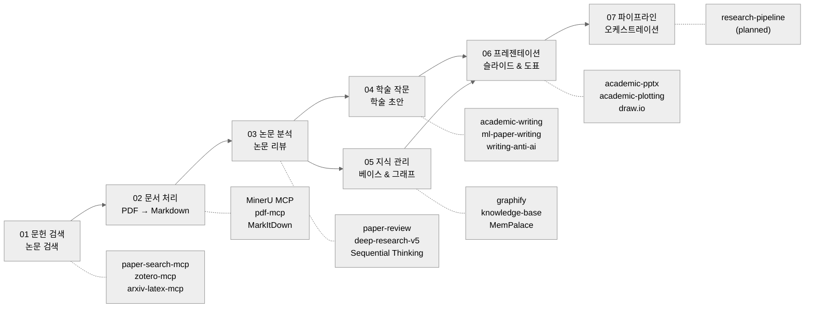

<div align="center">

# AI Research Toolkit

**Claude Code 기반 전체 파이프라인 AI 보조 학술 연구 워크플로우**

[](https://github.com/debug-zhuweijian/ai-research-toolkit/releases) [](LICENSE) [](https://deepwiki.com/debug-zhuweijian/ai-research-toolkit) [![zread](https://img.shields.io/badge/Ask_Zread-_.svg?style=flat&color=00b0aa&labelColor=000000&logo=data%3Aimage%2Fsvg%2Bxml%3Bbase64%2CPHN2ZyB3aWR0aD0iMTYiIGhlaWdodD0iMTYiIHZpZXdCb3g9IjAgMCAxNiAxNiIgZmlsbD0ibm9uZSIgeG1sbnM9Imh0dHA6Ly93d3cudzMub3JnLzIwMDAvc3ZnIj4KPHBhdGggZD0iTTQuOTYxNTYgMS42MDAxSDIuMjQxNTZDMS44ODgxIDEuNjAwMSAxLjYwMTU2IDEuODg2NjQgMS42MDE1NiAyLjI0MDFWNC45NjAxQzEuNjAxNTYgNS4zMTM1NiAxLjg4ODEgNS42MDAxIDIuMjQxNTYgNS42MDAxSDQuOTYxNTZDNS4zMTUwMiA1LjYwMDEgNS42MDE1NiA1LjMxMzU2IDUuNjAxNTYgNC45NjAxVjIuMjQwMUM1LjYwMTU2IDEuODg2NjQgNS4zMTUwMiAxLjYwMDEgNC45NjE1NiAxLjYwMDFaIiBmaWxsPSIjZmZmIi8%2BCjxwYXRoIGQ9Ik00Ljk2MTU2IDEwLjM5OTlIMi4yNDE1NkMxLjg4ODEgMTAuMzk5OSAxLjYwMTU2IDEwLjY4NjQgMS42MDE1NiAxMS4wMzk5VjEzLjc1OTlDMS42MDE1NiAxNC4xMTM0IDEuODg4MSAxNC4zOTk5IDIuMjQxNTYgMTQuMzk5OUg0Ljk2MTU2QzUuMzE1MDIgMTQuMzk5OSA1LjYwMTU2IDE0LjExMzQgNS42MDE1NiAxMy43NTk5VjExLjAzOTlDNS42MDE1NiAxMC42ODY0IDUuMzE1MDIgMTAuMzk5OSA0Ljk2MTU2IDEwLjM5OTlaIiBmaWxsPSIjZmZmIi8%2BCjxwYXRoIGQ9Ik0xMy43NTg0IDEuNjAwMUgxMS4wMzg0QzEwLjY4NSAxLjYwMDEgMTAuMzk4NCAxLjg4NjY0IDEwLjM5ODQgMi4yNDAxVjQuOTYwMUMxMC4zOTg0IDUuMzEzNTYgMTAuNjg1IDUuNjAwMSAxMS4wMzg0IDUuNjAwMUgxMy43NTg0QzE0LjExMTkgNS42MDAxIDE0LjM5ODQgNS4zMTM1NiAxNC4zOTg0IDQuOTYwMVYyLjI0MDFDMTQuMzk4NCAxLjg4NjY0IDE0LjExMTkgMS42MDAxIDEzLjc1ODQgMS42MDAxWiIgZmlsbD0iI2ZmZiIvPgo8cGF0aCBkPSJNNCAxMkwxMiA0TDQgMTJaIiBmaWxsPSIjI2ZmZiIvPgo8cGF0aCBkPSJNNCAxMkwxMiA0IiBzdHJva2U9IiNmZmZmZiIgc3Ryb2tlLXdpZHRoPSIxLjUiIHN0cm9rZS1saW5lY2FwPSJyb3VuZCIvPgo8L3N2Zz4K&logoColor=ffffff)](https://zread.ai/debug-zhuweijian/ai-research-toolkit)

**[English](./README.md)** | **[中文](./README.zh-CN.md)** | **[日本語](./README.ja.md)** | **[한국어](./README.ko.md)**

</div>

---

본 툴킷은 *논문 검색*부터 *탐색 가능한 지식 그래프 구축*까지 전 과정을 Claude Code 내에서 수행할 수 있도록 설계된 의견이 반영된 엔드투엔드 툴킷입니다. 연구의 지루한 부분은 AI가 처리하고, 연구자가 사고에 집중할 수 있도록 고안되었습니다.

## 파이프라인 개요



각 단계는 슬래시 명령어나 자연어로 Claude Code에서 호출하는 스킬 또는 MCP 서버에 매핑됩니다. 파이프라인은 선형적이지만 반복적입니다. 즉, 어떤 단계든 독립적으로 실행하거나 이해가 깊어짐에 따라 이전 단계로 돌아갈 수 있습니다.

## 목차

- [주요 기능](#주요-기능)
- [필수 사항](#필수-사항)
- [빠른 시작](#빠른-시작)
- [사용 가이드: 제로에서 지식 베이스까지](#사용-가이드-제로에서-지식-베이스까지)
- [단계별 상세 정보](#단계별-상세-정보)
  - [단계 01: 문헌 검색](#단계-01-문헌-검색)
  - [단계 02: 문서 처리](#단계-02-문서-처리)
  - [단계 03: 논문 분석](#단계-03-논문-분석)
  - [단계 04: 학술 작문](#단계-04-학술-작문)
  - [단계 05: 지식 관리](#단계-05-지식-관리)
  - [단계 06: 프레젠테이션](#단계-06-프레젠테이션)
  - [단계 07: 파이프라인](#단계-07-파이프라인)
- [설치 프리셋](#설치-프리셋)
- [API 키 가이드](#api-키-가이드)
- [MCP 서버](#mcp-서버)
- [도구 맵](#도구-맵)
- [추천 리소스](#추천-리소스)
- [실험적 기능](#실험적-기능)
- [v0.2의 새로운 기능](#v02의-새로운-기능)
- [감사의 글](#감사의-글)
- [기여하기](#기여하기)
- [라이선스](#라이선스)

## 주요 기능

- **단계 01 -- 문헌 검색** -- 하나의 명령으로 20개 이상의 학술 데이터베이스(arXiv, PubMed, Semantic Scholar, CrossRef, DOAJ 등)를 검색합니다. 한 줄로 PDF를 다운로드할 수 있습니다. Zotero 및 중국어 데이터베이스 플러그인으로 문헌 라이브러리를 관리합니다.
- **단계 02 -- 문서 처리** -- MinerU(GPU 가속 OCR + 레이아웃 분석), pdf-mcp 또는 MarkItDown을 통해 논문, 슬라이드, 문서를 깔끔한 Markdown으로 변환합니다. 표, 수식, 그림 참조를 보존합니다.
- **단계 03 -- 논문 분석** -- 단일 논문 심층 리뷰로 방법론, 증거 수준, 재사용 가능성을 추출합니다. 병렬 서브 에이전트, 인용 레지스트리, 추적 가능한 주장을 활용한 다중 논문 종합 분석을 제공합니다. 창의적인 연구 아이디어 브레인스토밍을 지원합니다.
- **단계 04 -- 학술 작문** -- ML, 시스템, 일반 학술 작문을 위한 도메인 특화 스킬로 논문을 초안 작성, 다듬기, 구조화합니다. AI 탐지 회피 팁, 리뷰어 응답 작성, 게재 후 포맷팅을 지원합니다.
- **단계 05 -- 지식 관리** -- 구조화된 지식 베이스를 스캔, 수집, 린트, 쿼리합니다. 커뮤니티 탐지 및 대화형 시각화를 갖춘 탐색 가능한 지식 그래프를 구축합니다. 연구 노트 및 문헌 관리를 위한 Obsidian 워크플로우를 제공합니다.
- **단계 06 -- 프레젠테이션** -- 학회 슬라이드, 연구실 미팅 자료, 학술 플롯, draw.io 다이어그램, 인포그래픽, 출판 품질의 도표를 생성합니다.
- **단계 07 -- 파이프라인** -- 엔드투엔드 자동화 연구 워크플로우를 위한 교차 단계 오케스트레이션(계획 중).

## 필수 사항

| 의존성 | 버전 | 설치 명령어 | 확인 명령어 |
|------------|---------|-----------------|----------------|
| Python | 3.10+ | `winget install Python.Python.3.12` (또는 아래 Anaconda로 설치) | `python --version` |
| Node.js | 18+ | [nodejs.org](https://nodejs.org/) 또는 `winget install OpenJS.NodeJS.LTS` | `node --version` |
| Anaconda | Any | [anaconda.com/download](https://www.anaconda.com/download) | `conda --version` |
| uv | Latest | `pip install uv` 또는 `winget install astral-sh.uv` | `uv --version` |
| Git | 2.30+ | `winget install Git.Git` | `git --version` |
| Claude Code | Latest | `npm install -g @anthropic-ai/claude-code` | `claude --version` |
| LibreOffice | 7.0+ | [libreoffice.org](https://www.libreoffice.org/) | `soffice --version` |
| Poppler | 0.84+ | `winget install poppler` 또는 [poppler.freedesktop.org](https://poppler.freedesktop.org/) | `pdftotext -v` |

> **중국 사용자 안내:** 프록시 환경을 사용 중인 경우, 설치 전에 `HTTPS_PROXY` 및 `NO_PROXY` 환경 변수를 설정하십시오. MinerU의 OpenXLab API는 프록시를 우회해야 합니다. `*.openxlab.org.cn`을 `NO_PROXY`에 추가하십시오.

> **중국 외 사용자 안내:** 일부 MCP 서버(web-search-prime, web-reader)는 ZhiPu BigModel을 기본값으로 사용합니다. 국제 사용자의 경우 Tavily, Brave Search 또는 Firecrawl을 대체품으로 사용할 수 있습니다. 선호하는 제공업체의 API 키로 `~/.claude.json`에서 해당 MCP 서버를 구성하십시오.

## 빠른 시작

> **전체 설치 튜토리얼(2-3시간)**: [docs/installation-guide.md](docs/installation-guide.md) -- 8단계로 처음부터 시작하며, 각 단계에 GitHub 링크, 설치 명령어, 확인 및 문제 해결 방법이 포함되어 있습니다.

아래는 빠른 개요입니다. 처음 설정하는 경우 **전체 튜토리얼을 먼저 읽기를 강력히 권장합니다**.

### A. 프리셋으로 클론 및 설치

```bash
git clone https://github.com/debug-zhuweijian/ai-research-toolkit.git
cd ai-research-toolkit

# 설치 프리셋으로 설치
./scripts/install.sh --profile minimal       # 검색 + PDF 처리만
./scripts/install.sh --profile knowledge     # 지식 관리 + 프레젠테이션
./scripts/install.sh --profile full          # 전체 설치
./scripts/install.sh --list                  # 프리셋과 모듈 보기

# 또는 개별 모듈 설치
./scripts/install.sh --module 03-analysis    # 단계 03만
```

### B. 업스트림 도구 설치

각 도구는 자체 저장소에서 독립적으로 설치됩니다:

| 단계 | 도구 | GitHub | 설치 |
|-------|------|--------|---------|
| 01 | paper-search-mcp | [openags/paper-search-mcp](https://github.com/openags/paper-search-mcp) | `pip install paper-search-mcp` |
| 02 | MinerU | [opendatalab/MinerU](https://github.com/opendatalab/MinerU) | `pip install mineru-mcp-server` |
| 02 | pdf-mcp | [angshuman/pdf-mcp](https://github.com/angshuman/pdf-mcp) | `git clone` + `npm install` |
| 02 | MarkItDown | [microsoft/markitdown](https://github.com/microsoft/markitdown) | `pip install markitdown-mcp` |
| 03 | Sequential Thinking | [modelcontextprotocol/servers](https://github.com/modelcontextprotocol/servers) | `npx @modelcontextprotocol/server-sequential-thinking` |
| 05 | Graphify | [safishamsi/graphify](https://github.com/safishamsi/graphify) | `pip install graphifyy` |
| 05 | MemPalace | [MemPalace/mempalace](https://github.com/MemPalace/mempalace) | `conda create` + `pip install` |

정확한 명령어와 확인 단계는 [docs/installation-guide.md](docs/installation-guide.md)를 참조하십시오.

### C. MCP 서버 구성

`~/.claude.json`을 편집하고 MCP 설정을 병합합니다:

- **최소(3개 서버)**: `configs/mcp-servers-minimal.json` -- 단계 01-02 포함
- **전체(11개 서버)**: `configs/mcp-servers-full.json` -- 모든 단계 포함

모든 `<YOUR_*>` 자리 표시자를 실제 키와 경로로 교체하십시오.

> **권장 사항**: paper-search-mcp의 경우 `uvx paper-search-mcp`를 사용하면 글로벌 Python 환경을 오염시키지 않고 자동으로 의존성을 격리할 수 있습니다.

### D. API 키 설정

| 키 | 출처 | 필수 여부 | 등록 |
|-----|--------|-----------|-------------|
| Anthropic 또는 호환 엔드포인트 | [console.anthropic.com](https://console.anthropic.com/) 또는 호환 서비스(예: ZhiPu BigModel) | **예**(둘 중 하나) | Anthropic: 최소 $5; 호환 서비스: 상이 |
| ZhiPu BigModel | [open.bigmodel.cn](https://open.bigmodel.cn/) | **예** | 무료 티어 제공 |
| MinerU OpenXLab | [openxlab.org.cn](https://openxlab.org.cn) | 권장 | 무료(일일 1000페이지) |

> **Anthropic 호환 엔드포인트**: Anthropic 호환 API(예: ZhiPu BigModel GLM 시리즈)를 통해 Claude Code를 실행하는 경우, 해당 플랫폼의 API Key를 사용하고 `base_url`을 적절히 구성하십시오. 이 경우 Anthropic API Key가 필요하지 않습니다.

자세한 등록 안내는 [docs/api-keys-guide.md](docs/api-keys-guide.md)를 참조하십시오.

### E. 확인

```bash
# macOS / Linux / Git Bash
./scripts/verify-setup.sh
```

> **Windows 사용자:** 이 스크립트를 Git Bash에서 실행하십시오. `bash`를 사용할 수 없는 경우 [docs/installation-guide.md](docs/installation-guide.md)에 나열된 개별 확인 명령어를 수동으로 실행하십시오.

> 문제가 있으신가요? 일반적인 문제는 [docs/troubleshooting.md](docs/troubleshooting.md)를 참조하십시오.

---

## 사용 가이드: 제로에서 지식 베이스까지

### 시나리오: 방금 "그래프 신경망"을 연구 방향으로 선택했습니다

새로 입학한 대학원생이라고 가정해 봅시다. 지도교수님이 "그래프 신경망을 알아보라"고 하셨습니다. 다음은 오후 하나 만에 제로에서 구조화된 지식 베이스를 구축하는 방법입니다.

#### 1단계: 논문 검색(단계 01)

```
> /paper-search search "graph neural networks knowledge distillation" -n 20 -s arxiv,semanticscholar,pubmed
```

> **참고:** 아래에 표시된 arXiv ID 및 검색 결과는 예시입니다. 실제 결과는 다를 수 있습니다.

예상 출력(요약):

```
Found 60 results (20 per source x 3 sources):

[arxiv] 2401.12345 - A Graph Neural Network Framework for Molecular Property Prediction
         Authors: Zhang et al. (2024)  Citations: 12
         Abstract: We propose a GNN framework that predicts molecular properties...

[semantic] 87f3a... - Attention-Based Graph Convolutional Networks
         Authors: Vaswani et al. (2021)  Citations: 389
         Abstract: We demonstrate attention mechanisms for graph-structured data...

[pubmed] PMID:38291034 - Knowledge distillation for graph neural networks
         Authors: Chen et al. (2023)  Citations: 67
         Abstract: We present a knowledge distillation approach for compressing GNNs...
```

관련성이 높아 보이는 논문 ID를 저장하십시오. 연도 범위로 검색할 수도 있습니다:

```
> /paper-search search "graph neural networks" -n 10 -s semantic -y 2022-2025
```

#### 2단계: 논문 다운로드(단계 01)

```
> /paper-search download arxiv 2401.12345
```

출력:

```
Downloaded: ./downloads/2401.12345.pdf (2.3 MB)
```

**중국어 논문(CNKI) 팁:** [Zotero](https://www.zotero.org/)와 [Jasminum](https://github.com/l0o0/jasminum) 플러그인 및 [translators_CN](https://github.com/l0o0/translators_CN)을 사용하여 CNKI에서 일괄 다운로드할 수 있습니다. 그런 다음 3단계에서 다운로드한 PDF를 변환하십시오.

#### 3단계: PDF를 Markdown으로 변환(단계 02)

```
> /Geek-skills-mineru-pdf-parser ./downloads/2401.12345.pdf
```

이 스킬은 MinerU의 MCP 서버를 호출하여 PDF를 OpenXLab으로 전송하여 파싱합니다(로컬 GPU 불필요). 출력:

```
Input:  ./downloads/2401.12345.pdf
Output: Markdown text (below)

Save to: <OBSIDIAN_VAULT>/Papers/Zhang2024_Graph_Neural_Networks/Zhang2024_EN.md
```

출력을 구조화된 디렉토리에 저장하십시오. 명명 규칙은 `FirstAuthorYear_ShortTitle`입니다:

```
<OBSIDIAN_VAULT>/Papers/Zhang2024_Graph_Neural_Networks/
├── Zhang2024_EN.pdf      <-- 원본 PDF
└── Zhang2024_EN.md       <-- 변환된 Markdown
```

여러 PDF를 일괄 변환하려면:

```
> Convert all PDFs in ./downloads/ to Markdown using MinerU.
  Save results to <OBSIDIAN_VAULT>/Papers/<AuthorYear_Title>/<name>.md
```

#### 4단계: AI 논문 분석(단계 03)

**단일 논문 리뷰:**

```
> /paper-review Zhang2024_EN.md
```

출력(구조화된 리뷰):

```
## Paper Review: A Graph Neural Network Framework for Molecular Property Prediction

**Research Question:** Can GNNs accurately predict molecular properties with limited labeled data?
**Method:** Transformer-based graph encoder with attention on molecular substructures
**Dataset:** 12 benchmark datasets, 500 molecules each, multi-task learning
**Key Result:** 95.2% average accuracy on molecular property prediction (SOTA)
**Evidence Quality:** MODERATE -- limited benchmark diversity, no external validation
**Limitations:**
  - Only tested on small molecules (no polymer or protein graphs)
  - Benchmark datasets limited to 500 molecules each
  - No comparison with knowledge distillation approaches
**Reusable for you:**
  - The attention architecture (Figure 3) could transfer to your graph learning setup
  - Their data augmentation strategy (Section 4.2) addresses the low-sample problem
  - Open-source code: github.com/...
```

**다중 논문 심층 연구:**

```
> /deep-research-v5 "Compare graph neural network methods from 2020 to 2025: GCN vs GAT vs GraphSAGE approaches, focusing on scalability and inductive learning capabilities"
```

이 명령은 병렬 서브 에이전트를 배치하여 각각 검색, 읽기, 구조화된 노트를 작성합니다. 리드 에이전트가 모든 내용을 추적 가능한 인용이 포함된 장문 보고서로 종합합니다. 일반적 출력: 5-8분 내 3000-5000단어 보고서.

#### 5단계: 초안 작성(단계 04)

연구 동향을 이해했으니, 이제 글을 쓰기 시작합니다:

```
> /academic-writing
  "Draft a related work section for my thesis on graph neural networks.
   Cover: GCN-based approaches, attention-based approaches, and hybrid methods.
   Cite the papers in my knowledge base. Target venue: IEEE TPAMI."
```

필요에 따라 도메인 특화 작문 스킬을 사용하십시오:

```
> /ml-paper-writing          # ML/AI 논문용
> /systems-paper-writing     # 시스템 논문용
> /writing-anti-ai           # AI 탐지 플래그 감소 팁
> /review-response           # 리뷰어 코멘트에 대한 응답 초안
> /post-acceptance           # 카메라 레디 포맷팅 및 최종 확인
```

#### 6단계: 지식 베이스 구축(단계 05)

```
> /knowledge-base scan
```

출력:

```
Scanning <KNOWLEDGE_BASE>/ for new files...
  NEW:      3 files
  CHANGED:  0 files
  DUPE:     0 files

New files:
  [md] Zhang2024_Graph_Neural_Networks_EN.md
  [md] Vaswani2021_Attention_Graph_Convolutional_EN.md
  [md] Chen2023_Knowledge_Distillation_GNN_EN.md
```

지식 그래프를 구축합니다:

```
> /graphify <KNOWLEDGE_BASE_PATH>
```

이 명령은 커뮤니티 탐지 기능을 갖춘 탐색 가능한 지식 그래프를 구축합니다. 출력:

```
graphify-out/
├── graph.html              <-- 대화형 시각화(브라우저에서 열기)
├── graph.json              <-- GraphRAG 준비 JSON
├── graph.graphml           <-- Gephi / yEd용
├── GRAPH_REPORT.md         <-- 감사 보고서: god 노드, 커뮤니티, 커버리지
└── wiki/
    ├── index.md            <-- 에이전트 탐색 가능 위키 인덱스
    ├── community-01.md     <-- 커뮤니티 클러스터당 한 편의 문서
    ├── community-02.md
    └── ...
```

`graph.html`을 브라우저에서 열어 논문, 방법론, 개념 간의 연결을 탐색하십시오. 더 철저한 엣지 추출을 위해 `--mode deep`을 사용하십시오.

#### 7단계: 프레젠테이션 제작(단계 06)

프레젠테이션 슬라이드를 생성합니다:

```
> /academic-pptx
  "Create a 15-minute conference presentation on my survey of graph
   neural network methods. Include: problem statement, taxonomy of
   approaches, comparison table, and future directions."
```

연구실 미팅을 준비합니다:

```
> /group-meeting-slides
  "Make a 10-minute group meeting update on my literature survey progress.
   Audience: my advisor and 3 labmates. Focus: key findings and gaps."
```

출판용 도표를 생성합니다:

```
> /academic-plotting
  "Create a comparison chart of GNN methods showing accuracy vs. training time."
```

### 빠른 참조 표

| 작업 | 명령어 | 단계 |
|-------------|---------|-------|
| 여러 데이터베이스에서 논문 검색 | `/paper-search search "query" -n 20 -s arxiv,semantic,pubmed` | 01 |
| 논문 PDF 다운로드 | `/paper-search download arxiv 2401.12345` | 01 |
| PDF를 Markdown으로 변환 | `/Geek-skills-mineru-pdf-parser paper.pdf` | 02 |
| 단일 논문 리뷰 | `/paper-review paper.md` | 03 |
| 다중 논문 종합 분석 | `/deep-research-v5 "research question"` | 03 |
| 연구 아이디어 브레인스토밍 | `/brainstorming-research-ideas "topic"` | 03 |
| 논문 섹션 초안 작성 | `/academic-writing` | 04 |
| ML 논문 작성 | `/ml-paper-writing` | 04 |
| 리뷰어에게 응답 | `/review-response` | 04 |
| 지식 베이스 스캔 | `/knowledge-base scan` | 05 |
| 지식 그래프 구축 | `/graphify <KNOWLEDGE_BASE_PATH>` | 05 |
| Obsidian vault 관리 | `/obsidian-markdown` | 05 |
| 프레젠테이션 슬라이드 제작 | `/academic-pptx` 또는 `/group-meeting-slides` | 06 |
| 학술 플롯 생성 | `/academic-plotting` | 06 |
| 다이어그램 작성 | `/drawio` | 06 |

---

## 단계별 상세 정보

### 단계 01: 문헌 검색

| 도구 | GitHub | 설치 |
|------|--------|---------|
| paper-search-mcp | [openags/paper-search-mcp](https://github.com/openags/paper-search-mcp) | `pip install paper-search-mcp` |
| zotero-mcp | [MushroomCatKinsh/zotero-mcp](https://github.com/MushroomCatKinsh/zotero-mcp) | `pip install zotero-mcp-server` |
| arxiv-latex-mcp | [dvai-lab/arxiv-latex-mcp](https://github.com/dvai-lab/arxiv-latex-mcp) | `pip install arxiv-latex-mcp` |
| Zotero | [zotero/zotero](https://github.com/zotero/zotero) | [zotero.org](https://www.zotero.org/) |
| Jasminum (CNKI) | [l0o0/jasminum](https://github.com/l0o0/jasminum) | Zotero .xpi 플러그인 |
| translators_CN | [l0o0/translators_CN](https://github.com/l0o0/translators_CN) | Zotero translators에 복사 |

단일 CLI에서 20개 이상의 학술 데이터베이스를 검색합니다. arXiv, PubMed, Semantic Scholar, CrossRef, OpenAlex, DBLP, DOAJ, CORE 등을 지원합니다. API 키가 있으면 IEEE/ACM도 선택적으로 사용할 수 있습니다. 라이브러리 관리를 위한 Zotero 통합 및 정확한 수식 해석을 위한 arxiv-latex-mcp로 arXiv 논문의 전체 LaTeX 소스를 검색할 수 있습니다.

자세한 사용법 및 소스 구성은 [modules/01-discovery/README.md](modules/01-discovery/README.md)를 참조하십시오.

### 단계 02: 문서 처리

| 도구 | GitHub | 설치 |
|------|--------|---------|
| MinerU | [opendatalab/MinerU](https://github.com/opendatalab/MinerU) | `pip install mineru-mcp-server` |
| pdf-mcp | [angshuman/pdf-mcp](https://github.com/angshuman/pdf-mcp) | `git clone` + `npm install` |
| MarkItDown | [microsoft/markitdown](https://github.com/microsoft/markitdown) | `pip install markitdown-mcp` |

논문, 기술 보고서, 슬라이드 데크를 LLM 친화적인 Markdown으로 변환합니다. MinerU는 스캔된 문서에 대한 OCR 지원과 함께 GPU 가속 파싱을 제공합니다. pdf-mcp는 로컬 작업(분할, 병합, 페이지 추출, 이미지 렌더링)을 처리합니다. MarkItDown은 Office 형식(DOCX, PPTX, XLSX)을 지원합니다. 전체 형식 지원을 위해 LibreOffice 및 Poppler가 필요합니다.

백엔드 선택, OCR 구성 및 일괄 변환에 대해서는 [modules/02-processing/README.md](modules/02-processing/README.md)를 참조하십시오.

### 단계 03: 논문 분석

| 도구 | 출처 | 유형 |
|------|--------|------|
| paper-review | 이 저장소 | 스킬 |
| paper-proofread | 이 저장소 + [업스트림](https://github.com/LimHyungTae/awesome-claudecode-paper-proofreading) | 스킬 |
| deep-research-v5 | 이 저장소 | 스킬(9개 파일) |
| brainstorming-research-ideas | 이 저장소 | 스킬 |
| creative-thinking-for-research | 이 저장소 | 스킬 |
| content-research-writer | 이 저장소 | 스킬 |
| Sequential Thinking | [modelcontextprotocol/servers](https://github.com/modelcontextprotocol/servers) | MCP |

단일 논문 리뷰는 연구 질문, 방법론, 증거 수준, 한계점, 재사용 가능한 부분을 추출합니다. 논문 교정은 ICRA 2025 우수 리뷰어 기준에 기반한 2단계 LaTeX 워크스페이스 감사(9개 항목)와 학회 수준 내용 리뷰(9개 범주)를 제공합니다. 다중 논문 심층 연구는 추적 가능한 인용이 포함된 종합 분석을 위해 병렬 서브 에이전트를 배치합니다. 브레인스토밍 및 창의적 사고 스킬은 새로운 연구 방향을 도출하는 데 도움을 줍니다.

분석 템플릿, 교정 워크플로우 및 연구 아이디어 도출 패턴에 대해서는 [modules/03-analysis/README.md](modules/03-analysis/README.md)를 참조하십시오.

### 단계 04: 학술 작문

| 도구 | 출처 | 유형 |
|------|--------|------|
| academic-writing | 이 저장소 | 스킬 |
| academic-paper | 이 저장소 | 스킬 |
| ml-paper-writing | 이 저장소 | 스킬 |
| systems-paper-writing | 이 저장소 | 스킬 |
| writing-anti-ai | 이 저장소 | 스킬 |
| post-acceptance | 이 저장소 | 스킬 |
| review-response | 이 저장소 | 스킬 |
| results-analysis | 이 저장소 | 스킬 |
| results-report | 이 저장소 | 스킬 |

다양한 출판 대상을 위한 도메인 특화 작문 스킬을 제공합니다. ML 논문 작성은 실험 테이블, 어블레이션 스터디, 아키텍처 설명을 다룹니다. 시스템 논문 작성은 평가 방법론 및 확장성 분석을 다룹니다. Writing-anti-ai는 AI 탐지 플래그를 줄이는 전략을 제공합니다. Review-response는 항목별 반박문을 작성합니다. Post-acceptance는 카메라 레디 포맷팅, 교정 및 최종 확인을 처리합니다.

작문 워크플로우, 템플릿 선택 및 제출 준비에 대해서는 [modules/04-writing/README.md](modules/04-writing/README.md)를 참조하십시오.

### 단계 05: 지식 관리

| 도구 | GitHub | 설치 |
|------|--------|---------|
| Graphify | [safishamsi/graphify](https://github.com/safishamsi/graphify) | `pip install graphifyy` |
| rebuild_graph.py | 이 저장소 | 스크립트 (아래 참조) |
| knowledge-base | 이 저장소 | 스킬 |
| knowledge-distillation | 이 저장소 | 스킬 |
| obsidian-markdown | 이 저장소 | 스킬 |
| obsidian-bases | 이 저장소 | 스킬 |
| obsidian-cli | 이 저장소 | 스킬 |
| obsidian-literature-workflow | 이 저장소 | 스킬 |
| obsidian-experiment-log | 이 저장소 | 스킬 |
| obsidian-project-bootstrap | 이 저장소 | 스킬 |
| obsidian-project-memory | 이 저장소 | 스킬 |
| MemPalace | [MemPalace/mempalace](https://github.com/MemPalace/mempalace) | `pip install mempalace` (별도 conda 환경) |
| ChromaDB | [chroma-core/chroma](https://github.com/chroma-core/chroma) | `pip install chromadb` |

연구 자료로부터 구조화되고 검색 가능한 지식 베이스를 구축합니다. Knowledge-base 스킬은 기존 kb-* 셸 스크립트를 통합 인터페이스로 대체합니다. Graphify는 문서 폴더를 커뮤니티 탐지, 대화형 HTML 시각화 및 감사 보고서가 포함된 탐색 가능한 그래프로 변환합니다. **rebuild_graph.py**는 GraphRAG에서 영감받은 확장 파이프라인으로, graphify의 코드 분석 위에 LLM 기반 시맨틱 엔티티 추출, 증분 캐싱, Louvain 커뮤니티 감지 및 다중 라운드 추출(Gleaning)을 통한 누락 엔티티 복구를 추가합니다. 7개의 Obsidian 스킬은 Bases 조회, CLI 자동화, 문헌 워크플로우, 실험 로그, 프로젝트 부트스트랩, 프로젝트 메모리 및 Markdown 포맷팅을 지원합니다. MemPalace는 지식 그래프 지원이 포함된 영구 시맨틱 메모리를 제공합니다.

지식 베이스 아키텍처, Obsidian 설정 및 그래프 생성 옵션에 대해서는 [modules/05-knowledge/README.md](modules/05-knowledge/README.md)를 참조하십시오.

### 단계 06: 프레젠테이션

| 도구 | 출처 | 유형 |
|------|--------|------|
| academic-pptx | 이 저장소 | 스킬 |
| group-meeting-slides | 이 저장소 | 스킬 |
| academic-plotting | 이 저장소 | 스킬 |
| draw.io MCP | [nicholaschenai/drawio-mcp](https://github.com/nicholaschenai/drawio-mcp) | MCP |
| notion-infographic | 이 저장소 | 스킬 |
| publication-chart-skill | 이 저장소 | 스킬 |
| presenting-conference-talks | 이 저장소 | 스킬 |

출판 준비 완료된 프레젠테이션과 도표를 생성합니다. Academic-pptx는 적절한 학술 구조로 학회 슬라이드 데크를 만듭니다. Group-meeting-slides는 비공식 연구실 미팅 업데이트 자료를 생성합니다. Academic-plotting은 비교 차트, 어블레이션 테이블, 트레이닝 곡선을 생성합니다. Draw.io MCP는 아키텍처 다이어그램, 순서도, 시스템 다이어그램을 만듭니다. Notion-infographic은 시각적 요약을 구축합니다. Presenting-conference-talks는 학회 발표 준비 및 리허설을 지원합니다.

슬라이드 템플릿, 플로팅 예제 및 다이어그램 패턴에 대해서는 [modules/06-presentation/README.md](modules/06-presentation/README.md)를 참조하십시오.

### 단계 07: 파이프라인

| 도구 | 출처 | 상태 |
|------|--------|--------|
| research-pipeline | 이 저장소 | 계획 중 |

자동화된 엔드투엔드 연구 워크플로우를 위한 교차 단계 오케스트레이션입니다. 구성 가능한 매개변수 및 오류 복구와 함께 단계를 연결(예: 검색 -> 다운로드 -> 변환 -> 리뷰 -> 요약)하는 기능을 지원할 예정입니다. 현재 계획 단계에 있습니다.

설계 제안서 및 로드맵은 [modules/07-pipeline/README.md](modules/07-pipeline/README.md)를 참조하십시오.

---

## 설치 프리셋

| 프리셋 | 모듈 | 스킬 | 에이전트 | 적합 대상 |
|---------|---------|--------|--------|----------|
| `minimal` | 01, 02 | 7 | 2 | 문헌 검색 및 문서 처리 |
| `knowledge` | 05, 06 | 17 | 2 | 지식 관리 및 Obsidian |
| `full` | 01-06 | 42 | 16 | 전체 툴킷 |

`./scripts/install.sh --profile <이름>`으로 설치하거나 `--module <단계>`로 개별 모듈을 설치하십시오.

---

## API 키 가이드

### 필수 키

| 키 | 출처 | 무료 티어 | 필수 여부 | 용도 |
|-----|--------|-----------|-----------|---------|
| Anthropic (또는 호환 엔드포인트) | [console.anthropic.com](https://console.anthropic.com/) 또는 호환 서비스(예: ZhiPu BigModel) | Anthropic: 최소 $5; 호환 서비스: 상이 | **예**(둘 중 하나) | Claude Code 핵심 기능 |
| ZhiPu BigModel | [open.bigmodel.cn](https://open.bigmodel.cn/) | 예(관대한 무료 티어) | **예** | MCP를 통한 웹 검색, 웹 리더, 문서 분석 |
| MinerU OpenXLab | [mineru.openxlab.org.cn](https://mineru.openxlab.org.cn/) | 예(일일 1000페이지) | **예** | PDF에서 Markdown으로 변환 API |

> **Anthropic 호환 엔드포인트 사용**: Claude Code는 Anthropic 호환 API 엔드포인트(예: ZhiPu BigModel의 GLM 시리즈)를 지원합니다. 호환 엔드포인트를 사용하는 경우 해당 API Key와 `base_url`을 구성하십시오. Anthropic API Key가 필요하지 않습니다.

### 선택적 키

| 키 | 출처 | 무료 여부 | 용도 |
|-----|--------|-------|---------|
| CORE API | [core.ac.uk/services/api](https://core.ac.uk/services/api) | 예 | 3억 개 이상의 오픈 액세스 논문(권장) |
| Semantic Scholar API | [semanticscholar.org/product/api](https://www.semanticscholar.org/product/api) | 예 | 더 높은 속도 제한 |
| Unpaywall Email | 이메일 설정만 | 예 | 오픈 액세스 PDF 찾기 |
| DOAJ API | [doaj.org/api](https://doaj.org/api/docs) | 예 | DOAJ 일괄 액세스 |
| IEEE API | [developer.ieee.org](https://developer.ieee.org/) | 예(심사 필요) | IEEE Xplore 검색 |
| ACM API | [dl.acm.org](https://dl.acm.org/) | 기관 | ACM Digital Library 검색 |

### 국제 대안

중국 외 사용자는 다음 서비스로 ZhiPu BigModel 기본값을 대체할 수 있습니다:
- **웹 검색**: web-search-prime 대신 [Tavily](https://tavily.com/) 또는 [Brave Search API](https://brave.com/search/api/)
- **웹 리더**: web-reader 대신 [Firecrawl](https://firecrawl.dev/) 또는 [Jina Reader](https://jina.ai/reader/)
- **문서 분석**: 비전 지원이 포함된 Anthropic 호환 엔드포인트

각 키에 대한 자세한 설정 지침은 [docs/api-keys-guide.md](docs/api-keys-guide.md)를 참조하십시오.

---

## MCP 서버

| 서버 | 단계 | 용도 | 설치 |
|--------|-------|---------|---------|
| paper-search-mcp | 01 | 20개 이상 데이터베이스 논문 검색 | `pip install paper-search-mcp` |
| zotero-mcp | 01 | Zotero 로컬 라이브러리 관리 | `pip install zotero-mcp-server` |
| arxiv-latex-mcp | 01 | arXiv LaTeX 소스 검색 | `pip install arxiv-latex-mcp` |
| mineru-mcp | 02 | PDF에서 Markdown으로 변환 | `pip install mineru-mcp-server` |
| pdf-mcp | 02 | PDF 조작(분할, 병합, 렌더링) | `git clone` + `npm install` |
| Sequential Thinking | 03 | 구조화된 다단계 추론 | `npx @modelcontextprotocol/server-sequential-thinking` |
| MemPalace | 05 | 영구 시맨틱 메모리 + 지식 그래프 | `pip install mempalace` |
| draw.io MCP | 06 | 다이어그램 생성(순서도, 아키텍처) | `npx @drawio/mcp` |
| web-search-prime | 전체 | 웹 검색(ZhiPu 또는 대체) | 원격 MCP(API 키만) |
| web-reader | 전체 | URL을 Markdown으로 변환 | 원격 MCP(API 키만) |
| zread | 전체 | GitHub 저장소 읽기 | 원격 MCP(API 키만) |
| zai-mcp-server | 전체 | 이미지/비디오 분석 | `npx @z_ai/mcp-server` |

글로벌 서버는 `configs/mcp-servers-full.json`을 통해 구성됩니다. `<YOUR_*>` 자리 표시자를 실제 키와 경로로 교체하십시오.

---

## 도구 맵

| 도구 | 출처 | 라이선스 | 단계 | 설치 |
|------|--------|---------|-------|---------|
| [paper-search-mcp](https://github.com/openags/paper-search-mcp) | openags | MIT | 01 | `pip install paper-search-mcp` |
| [zotero-mcp](https://github.com/MushroomCatKinsh/zotero-mcp) | MushroomCatKinsh | MIT | 01 | `pip install zotero-mcp-server` |
| [arxiv-latex-mcp](https://github.com/dvai-lab/arxiv-latex-mcp) | dvai-lab | MIT | 01 | `pip install arxiv-latex-mcp` |
| [Zotero](https://github.com/zotero/zotero) | Zotero | AGPL-3.0 | 01 | [zotero.org](https://www.zotero.org/) |
| [Jasminum](https://github.com/l0o0/jasminum) | l0o0 | GPL-3.0 | 01 | Zotero 플러그인 |
| [translators_CN](https://github.com/l0o0/translators_CN) | l0o0 | GPL-3.0 | 01 | Zotero translators |
| [MinerU](https://github.com/opendatalab/MinerU) | OpenDataLab | Apache-2.0 | 02 | `pip install mineru-mcp-server` |
| [pdf-mcp](https://github.com/angshuman/pdf-mcp) | angshuman | MIT | 02 | `git clone` + `npm install` |
| [MarkItDown](https://github.com/microsoft/markitdown) | Microsoft | MIT | 02 | `pip install markitdown-mcp` |
| [paper-review](modules/03-analysis/skills/paper-review/) | 이 저장소 | MIT | 03 | 스킬(`~/.claude/skills/`에 복사) |
| [paper-proofread](modules/03-analysis/skills/paper-proofread/) | 이 저장소 + [LimHyungTae](https://github.com/LimHyungTae/awesome-claudecode-paper-proofreading) | MIT | 03 | 스킬(`~/.claude/skills/`에 복사) |
| [deep-research-v5](modules/03-analysis/skills/deep-research-v5/) | 이 저장소 | MIT | 03 | 스킬(9개 파일) |
| [Sequential Thinking](https://github.com/modelcontextprotocol/servers) | MCP | MIT | 03 | `npx @modelcontextprotocol/server-sequential-thinking` |
| [Claude Code](https://docs.anthropic.com/en/docs/claude-code) | Anthropic | Commercial | 전체 | `npm i -g @anthropic-ai/claude-code` |
| [academic-writing](modules/04-writing/skills/academic-writing/) | 이 저장소 | MIT | 04 | 스킬(`~/.claude/skills/`에 복사) |
| [ml-paper-writing](modules/04-writing/skills/ml-paper-writing/) | 이 저장소 | MIT | 04 | 스킬(`~/.claude/skills/`에 복사) |
| [systems-paper-writing](modules/04-writing/skills/systems-paper-writing/) | 이 저장소 | MIT | 04 | 스킬(`~/.claude/skills/`에 복사) |
| [writing-anti-ai](modules/04-writing/skills/writing-anti-ai/) | 이 저장소 | MIT | 04 | 스킬(`~/.claude/skills/`에 복사) |
| [review-response](modules/04-writing/skills/review-response/) | 이 저장소 | MIT | 04 | 스킬(`~/.claude/skills/`에 복사) |
| [post-acceptance](modules/04-writing/skills/post-acceptance/) | 이 저장소 | MIT | 04 | 스킬(`~/.claude/skills/`에 복사) |
| [results-analysis](modules/04-writing/skills/results-analysis/) | 이 저장소 | MIT | 04 | 스킬(`~/.claude/skills/`에 복사) |
| [results-report](modules/04-writing/skills/results-report/) | 이 저장소 | MIT | 04 | 스킬(`~/.claude/skills/`에 복사) |
| [Graphify](https://github.com/safishamsi/graphify) | safishamsi | MIT | 05 | `pip install graphifyy` |
| [knowledge-base](modules/05-knowledge/skills/knowledge-base/) | 이 저장소 | MIT | 05 | 스킬(`~/.claude/skills/`에 복사) |
| [knowledge-distillation](modules/05-knowledge/skills/knowledge-distillation/) | 이 저장소 | MIT | 05 | 스킬(`~/.claude/skills/`에 복사) |
| [obsidian-*](modules/05-knowledge/skills/) (7개 스킬) | 이 저장소 | MIT | 05 | 스킬(`~/.claude/skills/`에 복사) |
| [MemPalace](https://github.com/MemPalace/mempalace) | MemPalace | MIT | 05 | `pip install mempalace` (별도 conda 환경) |
| [ChromaDB](https://github.com/chroma-core/chroma) | Chroma | Apache-2.0 | 05 | `pip install chromadb` |
| [academic-pptx](modules/06-presentation/skills/academic-pptx/) | 이 저장소 | MIT | 06 | 스킬(`~/.claude/skills/`에 복사) |
| [group-meeting-slides](modules/06-presentation/skills/group-meeting-slides/) | 이 저장소 | MIT | 06 | 스킬(`~/.claude/skills/`에 복사) |
| [academic-plotting](modules/06-presentation/skills/academic-plotting/) | 이 저장소 | MIT | 06 | 스킬(`~/.claude/skills/`에 복사) |
| [draw.io MCP](https://github.com/nicholaschenai/drawio-mcp) | nicholaschenai | MIT | 06 | `npx @drawio/mcp` |
| [notion-infographic](modules/06-presentation/skills/notion-infographic/) | 이 저장소 | MIT | 06 | 스킬(`~/.claude/skills/`에 복사) |
| [publication-chart-skill](modules/06-presentation/skills/publication-chart-skill/) | 이 저장소 | MIT | 06 | 스킬(`~/.claude/skills/`에 복사) |
| [presenting-conference-talks](modules/06-presentation/skills/presenting-conference-talks/) | 이 저장소 | MIT | 06 | 스킬(`~/.claude/skills/`에 복사) |
| [Playwright MCP](https://github.com/microsoft/playwright-mcp) | Microsoft | Apache-2.0 | 전체 | `npx @playwright/mcp@latest` |
| [Context7](https://github.com/nicholaschenai/context7) | Context7 | MIT | 전체 | 플러그인(compound-engineering 통해) |

---

## 추천 리소스

### 연구를 위한 AI

- [Awesome AI for Research](https://github.com/THU-KEG/Awesome-AI-for-Research) -- AI 보조 연구 도구 및 방법에 대한 종합 조사, 칭화대학교 KEG에서 관리
- [EvoScientist](https://github.com/EvoScientist/EvoScientist) -- 자율적으로 가설을 발견하고 검증하는 자가 진화 AI 과학자
- [DeepScientist](https://github.com/ResearAI/DeepScientist) -- 아이디어 도출부터 논문까지 엔드투엔드 AI 기반 연구 파이프라인
- [LightRAG](https://github.com/HKUDS/LightRAG) -- 연구 문서 검색을 위한 경량화되고 효율적인 RAG 프레임워크
- [Open Notebook](https://github.com/lfnovo/open-notebook) -- Google의 NotebookLM에 대한 오픈소스 대안, 연구 노트 관리용
- [Paper Proofreading](https://github.com/LimHyungTae/awesome-claudecode-paper-proofreading) -- Claude Code를 활용한 논문 교정 워크플로우 목록

### Claude Code 생태계

- [Awesome Claude Skills](https://github.com/ComposioHQ/awesome-claude-skills) -- 재사용 가능한 Claude Code 스킬 큐레이션 컬렉션
- [Awesome Claude Code Subagents](https://github.com/VoltAgent/awesome-claude-code-subagents) -- 다중 에이전트 워크플로우를 위한 패턴 및 예제
- [Oh My Claude Code](https://github.com/Yeachan-Heo/oh-my-claudecode) -- Claude Code의 구성 및 플러그인 관리
- [Claude HUD](https://github.com/jarrodwatts/claude-hud) -- Claude Code 세션 모니터링을 위한 헤드업 디스플레이
- [LaTeX Document Skill](https://github.com/ndpvt-web/latex-document-skill) -- LaTeX 문서 편집을 위한 Claude Code 스킬
- [Learn Claude Code](https://github.com/shareAI-lab/learn-claude-code) -- Claude Code에 대한 중국어 튜토리얼 및 예제
- [ClaudeSkills](https://github.com/staruhub/ClaudeSkills) -- 커뮤니티 스킬 레지스트리 및 공유 플랫폼

### 사용된 플러그인

- [SuperClaude Framework](https://github.com/SuperClaude-Org/SuperClaude_Framework) -- 향상된 계획, 디버깅 및 TDD 워크플로우
- [Compound Engineering](https://github.com/EveryInc/compound-engineering-plugin) -- 코드 리뷰, 브레인스토밍 및 프론트엔드 디자인 도구
- [claude-mem](https://github.com/thedotmack/claude-mem) -- 세션 간 영구 메모리 및 컨텍스트 관리
- [PUA](https://github.com/tanweai/pua) -- Claude Code의 성격 및 어조 맞춤 설정

---

## 실험적 기능

[experimental/](experimental/) 디렉토리에는 별도의 플랫폼이 필요한 고급 컴포넌트가 포함되어 있습니다:

**DeepScientist 에이전트(14개):** [DeepScientist](https://github.com/DoriRoth/DeepScientist) 플랫폼이 필요한 14개의 전문 에이전트(아이디어 생성, 실험 실행, 리뷰 시뮬레이션, 리벗털 지원, 도표 다듬기 등) 컬렉션입니다. 이 에이전트들은 표준 설치에 포함되지 않습니다. 전체 목록 및 설정 지침은 [experimental/README.md](experimental/README.md)를 참조하십시오.

---

## v0.2의 새로운 기능

- **7단계 모듈 구조** -- 문헌 검색, 문서 처리, 논문 분석, 학술 작문, 지식 관리, 프레젠테이션, 파이프라인으로 구성(이전 4단계에서 변경)
- **42개 스킬**(이전 17개) -- 모든 단계에 25개의 새로운 스킬 추가
- **16개 에이전트** -- 문헌 리뷰어, LaTeX 전문가, 리벗털 작성자 등
- **3개 설치 프리셋** -- 필요한 것만 설치(minimal, knowledge, full)
- **7개 Obsidian 스킬** -- Bases, CLI 자동화, 문헌 워크플로우, 실험 로그, 프로젝트 부트스트랩, 프로젝트 메모리, Markdown 포맷팅
- **Knowledge-base 통합 스킬** -- 기존 kb-scan/kb-apply/kb-lint/kb-stats 셸 스크립트를 대체
- **rebuild_graph.py** -- GraphRAG에서 영감받은 시맨틱 추출 파이프라인 (LLM 엔티티 추출, 증분 캐싱, Louvain 커뮤니티 감지, 다중 라운드 추출)
- **6개 프레젠테이션 스킬** -- 학술 PPTX, 연구실 미팅 슬라이드, 학술 플로팅, draw.io, 인포그래픽, 학회 발표
- **14개 DeepScientist 에이전트**가 experimental/로 이동(별도 플랫폼 필요)
- **5개 kb-* 빈 셸** 제거, knowledge-base 스킬로 대체
- **LibreOffice 및 Poppler**가 전체 형식 지원을 위한 필수 사항으로 추가
- **국제 대안**이 중국 외 사용자를 위해 문서화됨(Tavily, Brave Search, Firecrawl, Jina Reader)

자세한 내용은 [CHANGELOG.md](CHANGELOG.md)를 참조하십시오.

---

## 감사의 글

본 툴킷은 다음의 우수한 오픈소스 프로젝트를 기반으로 구축되었습니다:

### 스킬 및 에이전트 출처

- **[AI-Research-SKILLs](https://github.com/orchestra-research/AI-Research-SKILLs)** by orchestra-research -- 문헌 리뷰, 실험 설계, 데이터 분석, 논문 작성을 아우르는 93개 이상의 연구 스킬 출처
- **[academic-research-skills](https://github.com/Imbad0202/academic-research-skills)** by Imbad0202 -- deep-research, academic-paper, academic-paper-reviewer, academic-pipeline 스킬의 출처
- **[anthropics/skills](https://github.com/anthropics/skills)** by Anthropic -- 문서 처리 스킬(pdf, docx, xlsx, pptx)의 출처
- **[a-evolve](https://github.com/A-EVO-Lab/a-evolve)** by A-EVO-Lab -- 진화 최적화 스킬 a-evolve의 출처
- **[writing-anti-ai](https://github.com/gaoruizhang/writing-anti-ai)** by gaoruizhang -- 학술 작문을 위한 AI 감지 회피 스킬
- **[DeerFlow](https://github.com/bytedance/deer-flow)** by ByteDance -- deep-research-v5 스킬에서 참조한 서브에이전트 동시성 모델 및 작업 디스패치 패턴

### MCP 서버 및 인프라

- **[MinerU](https://github.com/opendatalab/MinerU)** by OpenDataLab -- 레이아웃 분석 및 OCR이 포함된 고정밀 PDF 파싱
- **[paper-search-mcp](https://github.com/openags/paper-search-mcp)** by openags -- 20개 이상의 학술 데이터베이스 통합 검색
- **[Graphify](https://github.com/safishamsi/graphify)** by safishamsi -- 문서 컬렉션에서 지식 그래프 생성
- **[MemPalace](https://github.com/MemPalace/mempalace)** -- 지식 그래프 지원이 포함된 영구 시맨틱 메모리
- **[ChromaDB](https://github.com/chroma-core/chroma)** -- 시맨틱 검색을 위한 오픈소스 임베딩 데이터베이스
- **[pdf-mcp](https://github.com/angshuman/pdf-mcp)** by angshuman -- PDF 조작 작업을 위한 MCP 서버
- **[MarkItDown](https://github.com/microsoft/markitdown)** by Microsoft -- Office 형식의 문서를 Markdown으로 변환
- **[Playwright MCP](https://github.com/microsoft/playwright-mcp)** by Microsoft -- 웹 기반 연구를 위한 브라우저 자동화
- **[drawio-mcp](https://github.com/nicholaschenai/drawio-mcp)** by nicholaschenai -- Draw.io 다이어그램 생성용 MCP 서버
- **[Context7](https://github.com/nicholaschenai/context7)** by nicholaschenai -- 모든 라이브러리의 최신 문서 검색
- **[langsmith-fetch-skill](https://github.com/OthmanAdi/langsmith-fetch-skill)** by OthmanAdi -- 추적 및 평가를 위한 LangSmith 통합
- **[Sequential Thinking MCP](https://github.com/modelcontextprotocol/servers)** -- 복잡한 분석을 위한 구조화된 다단계 추론

### Zotero 생태계

- **[Zotero](https://github.com/zotero/zotero)** -- 무료 오픈소스 참고문헌 관리자
- **[Jasminum](https://github.com/l0o0/jasminum)** by l0o0 -- 중국 학술 데이터베이스를 위한 Zotero 플러그인
- **[translators_CN](https://github.com/l0o0/translators_CN)** by l0o0 -- Zotero용 중국어 번역기 플러그인
- **[zotero-mcp](https://github.com/MushroomCatKinsh/zotero-mcp)** by MushroomCatKinsh -- Zotero 통합을 위한 MCP 서버
- **[arxiv-latex-mcp](https://github.com/dvai-lab/arxiv-latex-mcp)** by dvai-lab -- 정확한 수식 해석을 위한 arXiv LaTeX 소스 검색

### 특별 감사

- **[awesome-claudecode-paper-proofreading](https://github.com/LimHyungTae/awesome-claudecode-paper-proofreading)** by Hyungtae Lim -- 학회 수준 리뷰 기준을 적용한 2단계 LaTeX 논문 교정

---

## 기여하기

기여를 환영합니다. 본 툴킷은 커뮤니티와 함께 성장합니다.

**새로운 도구 또는 스킬 제안:**
1. `tool-suggestion` 레이블로 이슈를 열어주세요
2. 도구 이름, GitHub 링크, 해당하는 단계, 기존 옵션보다 나은 이유를 포함해 주세요
3. 승인되면 해당 `modules/XX-name/skills/` 디렉토리에 스킬을 추가하고 이 README를 업데이트하는 PR을 제출해 주세요

**깨진 링크 또는 만료된 지침 보고:**
1. `bug` 레이블로 이슈를 열어주세요
2. 무엇이 문제인지, 예상한 결과가 무엇인지, 환경(OS, Python 버전, Claude Code 버전)을 설명해 주세요

**새로운 언어 추가 또는 문서 개선:**
1. 저장소를 포크해 주세요
2. 브랜치를 생성해 주세요: `git checkout -b docs/your-improvement`
3. 변경 사항에 대한 명확한 설명과 함께 PR을 제출해 주세요

---

## 라이선스

[MIT](LICENSE) -- Copyright (c) 2025 debug-zhuweijian

자유롭게 사용하고, 포크하고, 수정하고, 고치고, 공유하십시오. 라이선스 고지만 유지해 주시면 됩니다.
