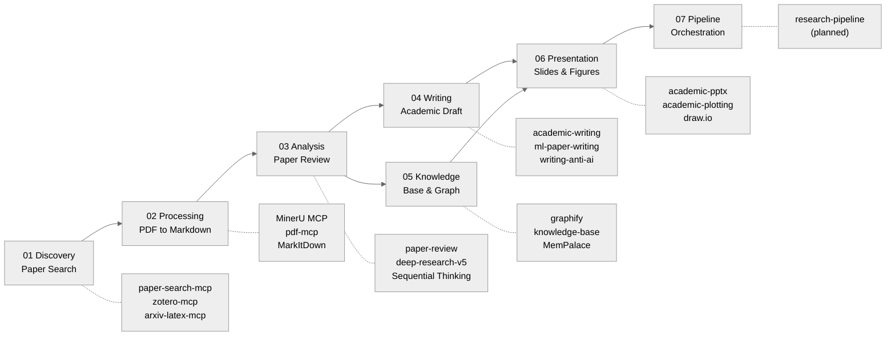

<div align="center">

# AI Research Toolkit

**Full-pipeline AI-assisted academic research workflow powered by Claude Code**

[](https://github.com/debug-zhuweijian/ai-research-toolkit/releases) [](LICENSE) [](https://deepwiki.com/debug-zhuweijian/ai-research-toolkit) [![zread](https://img.shields.io/badge/Ask_Zread-_.svg?style=flat&color=00b0aa&labelColor=000000&logo=data%3Aimage%2Fsvg%2Bxml%3Bbase64%2CPHN2ZyB3aWR0aD0iMTYiIGhlaWdodD0iMTYiIHZpZXdCb3g9IjAgMCAxNiAxNiIgZmlsbD0ibm9uZSIgeG1sbnM9Imh0dHA6Ly93d3cudzMub3JnLzIwMDAvc3ZnIj4KPHBhdGggZD0iTTQuOTYxNTYgMS42MDAxSDIuMjQxNTZDMS44ODgxIDEuNjAwMSAxLjYwMTU2IDEuODg2NjQgMS42MDE1NiAyLjI0MDFWNC45NjAxQzEuNjAxNTYgNS4zMTM1NiAxLjg4ODEgNS42MDAxIDIuMjQxNTYgNS42MDAxSDQuOTYxNTZDNS4zMTUwMiA1LjYwMDEgNS42MDE1NiA1LjMxMzU2IDUuNjAxNTYgNC45NjAxVjIuMjQwMUM1LjYwMTU2IDEuODg2NjQgNS4zMTUwMiAxLjYwMDEgNC45NjE1NiAxLjYwMDFaIiBmaWxsPSIjZmZmIi8%2BCjxwYXRoIGQ9Ik00Ljk2MTU2IDEwLjM5OTlIMi4yNDE1NkMxLjg4ODEgMTAuMzk5OSAxLjYwMTU2IDEwLjY4NjQgMS42MDE1NiAxMS4wMzk5VjEzLjc1OTlDMS42MDE1NiAxNC4xMTM0IDEuODg4MSAxNC4zOTk5IDIuMjQxNTYgMTQuMzk5OUg0Ljk2MTU2QzUuMzE1MDIgMTQuMzk5OSA1LjYwMTU2IDE0LjExMzQgNS42MDE1NiAxMy43NTk5VjExLjAzOTlDNS42MDE1NiAxMC42ODY0IDUuMzE1MDIgMTAuMzk5OSA0Ljk2MTU2IDEwLjM5OTlaIiBmaWxsPSIjZmZmIi8%2BCjxwYXRoIGQ9Ik0xMy43NTg0IDEuNjAwMUgxMS4wMzg0QzEwLjY4NSAxLjYwMDEgMTAuMzk4NCAxLjg4NjY0IDEwLjM5ODQgMi4yNDAxVjQuOTYwMUMxMC4zOTg0IDUuMzEzNTYgMTAuNjg1IDUuNjAwMSAxMS4wMzg0IDUuNjAwMUgxMy43NTg0QzE0LjExMTkgNS42MDAxIDE0LjM5ODQgNS4zMTM1NiAxNC4zOTg0IDQuOTYwMVYyLjI0MDFDMTQuMzk4NCAxLjg4NjY0IDE0LjExMTkgMS42MDAxIDEzLjc1ODQgMS42MDAxWiIgZmlsbD0iI2ZmZiIvPgo8cGF0aCBkPSJNNCAxMkwxMiA0TDQgMTJaIiBmaWxsPSIjI2ZmZiIvPgo8cGF0aCBkPSJNNCAxMkwxMiA0IiBzdHJva2U9IiNmZmZmZiIgc3Ryb2tlLXdpZHRoPSIxLjUiIHN0cm9rZS1saW5lY2FwPSJyb3VuZCIvPgo8L3N2Zz4K&logoColor=ffffff)](https://zread.ai/debug-zhuweijian/ai-research-toolkit)

**[English](./README.md)** | **[中文](./README.zh-CN.md)** | **[日本語](./README.ja.md)** | **[한국어](./README.ko.md)**

</div>

---

An opinionated, end-to-end toolkit that takes you from *discovering papers* to *building a navigable knowledge graph* -- all inside Claude Code. Designed for graduate students who want AI to handle the tedious parts of research so they can focus on thinking.

## Pipeline Overview



Each phase maps to a skill or MCP server you invoke with a slash command or natural language in Claude Code. The pipeline is linear but iterative -- you can run any phase independently or loop back to earlier phases as your understanding deepens.

## Table of Contents

- [Features](#features)
- [Prerequisites](#prerequisites)
- [Quick Start](#quick-start)
- [Usage Walkthrough: From Zero to Knowledge Base](#usage-walkthrough-from-zero-to-knowledge-base)
- [Phase Details](#phase-details)
  - [Phase 01: Discovery](#phase-01-discovery)
  - [Phase 02: Processing](#phase-02-processing)
  - [Phase 03: Analysis](#phase-03-analysis)
  - [Phase 04: Writing](#phase-04-writing)
  - [Phase 05: Knowledge](#phase-05-knowledge)
  - [Phase 06: Presentation](#phase-06-presentation)
  - [Phase 07: Pipeline](#phase-07-pipeline)
- [Profile Presets](#profile-presets)
- [API Keys Guide](#api-keys-guide)
- [MCP Servers](#mcp-servers)
- [Tool Map](#tool-map)
- [Recommended Resources](#recommended-resources)
- [Experimental](#experimental)
- [What's New in v0.2](#whats-new-in-v02)
- [Acknowledgments](#acknowledgments)
- [Contributing](#contributing)
- [License](#license)

## Features

- **Phase 01 -- Discovery** -- Query 20+ academic databases (arXiv, PubMed, Semantic Scholar, CrossRef, DOAJ, etc.) from a single command. Download PDFs with one line. Manage your library with Zotero and Chinese database plugins.
- **Phase 02 -- Processing** -- Convert papers, slides, and documents to clean Markdown via MinerU (GPU-accelerated OCR + layout analysis), pdf-mcp, or MarkItDown. Preserves tables, formulas, and figure references.
- **Phase 03 -- Analysis** -- Single-paper deep review extracting method, evidence quality, and reuse potential. Multi-paper synthesis with parallel sub-agents, citation registry, and traceable claims. Creative research ideation and brainstorming support.
- **Phase 04 -- Writing** -- Draft, polish, and structure papers with domain-specific skills for ML, systems, and general academic writing. Anti-AI-detection tips, reviewer response drafting, and post-acceptance formatting.
- **Phase 05 -- Knowledge** -- Scan, ingest, lint, and query a structured knowledge base. Build navigable knowledge graphs with community detection and interactive visualization. Obsidian workflows for research notes and literature management.
- **Phase 06 -- Presentation** -- Generate conference slides, group meeting decks, academic plots, draw.io diagrams, infographics, and publication-quality figures from your research.
- **Phase 07 -- Pipeline** -- Cross-phase orchestration for end-to-end automated research workflows (planned).

## Prerequisites

| Dependency | Version | Install Command | Verify Command |
|------------|---------|-----------------|----------------|
| Python | 3.10+ | `winget install Python.Python.3.12` (or install via Anaconda below) | `python --version` |
| Node.js | 18+ | [nodejs.org](https://nodejs.org/) or `winget install OpenJS.NodeJS.LTS` | `node --version` |
| Anaconda | Any | [anaconda.com/download](https://www.anaconda.com/download) | `conda --version` |
| uv | Latest | `pip install uv` or `winget install astral-sh.uv` | `uv --version` |
| Git | 2.30+ | `winget install Git.Git` | `git --version` |
| Claude Code | Latest | `npm install -g @anthropic-ai/claude-code` | `claude --version` |
| LibreOffice | 7.0+ | [libreoffice.org](https://www.libreoffice.org/) | `soffice --version` |
| Poppler | 0.84+ | `winget install poppler` or [poppler.freedesktop.org](https://poppler.freedesktop.org/) | `pdftotext -v` |

> **Note for Chinese users:** If you are behind a proxy, set `HTTPS_PROXY` and `NO_PROXY` environment variables before installing. MinerU's OpenXLab API needs to bypass proxy -- add `*.openxlab.org.cn` to `NO_PROXY`.

> **Note for non-Chinese users:** Some MCP servers (web-search-prime, web-reader) default to ZhiPu BigModel. For international users, alternatives like Tavily, Brave Search, or Firecrawl work as drop-in replacements. Configure the equivalent MCP server in `~/.claude.json` with your preferred provider's API key.

## Quick Start

> **Full installation tutorial (2-3 hours)**: [docs/installation-guide.md](docs/installation-guide.md) -- Start from scratch in 8 steps, each with GitHub links, install commands, verification, and troubleshooting.

Below is a quick overview. If this is your first time setting up, **we strongly recommend reading the full tutorial first**.

### A. Clone & Install with Profile

```bash
git clone https://github.com/debug-zhuweijian/ai-research-toolkit.git
cd ai-research-toolkit

# Install with a profile preset
./scripts/install.sh --profile minimal       # Just search + PDF processing
./scripts/install.sh --profile knowledge     # Knowledge management + presentation
./scripts/install.sh --profile full          # Everything
./scripts/install.sh --list                  # Show profiles and modules

# Or install individual modules
./scripts/install.sh --module 03-analysis    # Only Phase 03
```

### B. Install Upstream Tools

Each tool installs independently from its own repository:

| Phase | Tool | GitHub | Install |
|-------|------|--------|---------|
| 01 | paper-search-mcp | [openags/paper-search-mcp](https://github.com/openags/paper-search-mcp) | `pip install paper-search-mcp` |
| 02 | MinerU | [opendatalab/MinerU](https://github.com/opendatalab/MinerU) | `pip install mineru-mcp-server` |
| 02 | pdf-mcp | [angshuman/pdf-mcp](https://github.com/angshuman/pdf-mcp) | `git clone` + `npm install` |
| 02 | MarkItDown | [microsoft/markitdown](https://github.com/microsoft/markitdown) | `pip install markitdown-mcp` |
| 03 | Sequential Thinking | [modelcontextprotocol/servers](https://github.com/modelcontextprotocol/servers) | `npx @modelcontextprotocol/server-sequential-thinking` |
| 05 | Graphify | [safishamsi/graphify](https://github.com/safishamsi/graphify) | `pip install graphifyy` |
| 05 | MemPalace | [MemPalace/mempalace](https://github.com/MemPalace/mempalace) | `conda create` + `pip install` |

See [docs/installation-guide.md](docs/installation-guide.md) for exact commands and verification steps.

### C. Configure MCP Servers

Edit `~/.claude.json` and merge the MCP config:

- **Minimal (3 servers)**: `configs/mcp-servers-minimal.json` -- covers Phase 01-02
- **Full (11 servers)**: `configs/mcp-servers-full.json` -- all phases

Replace all `<YOUR_*>` placeholders with your actual keys and paths.

> **Recommended**: For paper-search-mcp, use `uvx paper-search-mcp` for automatic dependency isolation without polluting your global Python environment.

### D. Set Up API Keys

| Key | Source | Required? | Registration |
|-----|--------|-----------|-------------|
| Anthropic or compatible endpoint | [console.anthropic.com](https://console.anthropic.com/) or compatible (e.g. ZhiPu BigModel) | **Yes** (either works) | Anthropic: $5 minimum; Compatible: varies |
| ZhiPu BigModel | [open.bigmodel.cn](https://open.bigmodel.cn/) | **Yes** | Free tier available |
| MinerU OpenXLab | [openxlab.org.cn](https://openxlab.org.cn) | Recommended | Free (1000 pages/day) |

> **Anthropic-compatible endpoints**: If you run Claude Code through an Anthropic-compatible API (e.g. ZhiPu BigModel GLM series), use that platform's API Key and configure the `base_url` accordingly. An Anthropic API Key is not required in this case.

See [docs/api-keys-guide.md](docs/api-keys-guide.md) for detailed registration walkthroughs.

### E. Verify

```bash
# macOS / Linux / Git Bash
./scripts/verify-setup.sh
```

> **Windows users:** Run this script in Git Bash. If `bash` is not available, run the individual verification commands listed in [docs/installation-guide.md](docs/installation-guide.md) manually.

> Stuck? See [docs/troubleshooting.md](docs/troubleshooting.md) for common issues.

---

## Usage Walkthrough: From Zero to Knowledge Base

### Scenario: You just chose a research direction "Graph Neural Networks"

You are a new graduate student. Your advisor said "look into graph neural networks." Here is how you go from zero to a structured knowledge base in one afternoon.

#### Step 1: Search Papers (Phase 01)

```
> /paper-search search "graph neural networks knowledge distillation" -n 20 -s arxiv,semanticscholar,pubmed
```

> **Note:** The arXiv IDs and search results shown below are illustrative. Your actual results will vary.

Expected output (condensed):

```
Found 60 results (20 per source x 3 sources):

[arxiv] 2401.12345 - A Graph Neural Network Framework for Molecular Property Prediction
         Authors: Zhang et al. (2024)  Citations: 12
         Abstract: We propose a GNN framework that predicts molecular properties...

[semantic] 87f3a... - Attention-Based Graph Convolutional Networks
         Authors: Vaswani et al. (2021)  Citations: 389
         Abstract: We demonstrate attention mechanisms for graph-structured data...

[pubmed] PMID:38291034 - Knowledge distillation for graph neural networks
         Authors: Chen et al. (2023)  Citations: 67
         Abstract: We present a knowledge distillation approach for compressing GNNs...
```

Save the paper IDs that look relevant. You can also search by year range:

```
> /paper-search search "graph neural networks" -n 10 -s semantic -y 2022-2025
```

#### Step 2: Download Papers (Phase 01)

```
> /paper-search download arxiv 2401.12345
```

Output:

```
Downloaded: ./downloads/2401.12345.pdf (2.3 MB)
```

**Tip for Chinese papers (CNKI):** Use [Zotero](https://www.zotero.org/) with the [Jasminum](https://github.com/l0o0/jasminum) plugin and [translators_CN](https://github.com/l0o0/translators_CN) to batch-download from CNKI. Then convert the downloaded PDFs in Step 3.

#### Step 3: Convert PDF to Markdown (Phase 02)

```
> /Geek-skills-mineru-pdf-parser ./downloads/2401.12345.pdf
```

The skill invokes MinerU's MCP server, which sends the PDF to OpenXLab for parsing (no GPU needed on your machine). Output:

```
Input:  ./downloads/2401.12345.pdf
Output: Markdown text (below)

Save to: <OBSIDIAN_VAULT>/Papers/Zhang2024_Graph_Neural_Networks/Zhang2024_EN.md
```

Save the output to a structured directory. The naming convention is `FirstAuthorYear_ShortTitle`:

```
<OBSIDIAN_VAULT>/Papers/Zhang2024_Graph_Neural_Networks/
├── Zhang2024_EN.pdf      <-- original PDF
└── Zhang2024_EN.md       <-- converted Markdown
```

For batch conversion of many PDFs:

```
> Convert all PDFs in ./downloads/ to Markdown using MinerU.
  Save results to <OBSIDIAN_VAULT>/Papers/<AuthorYear_Title>/<name>.md
```

#### Step 4: AI Paper Analysis (Phase 03)

**Single paper review:**

```
> /paper-review Zhang2024_EN.md
```

Output (structured review):

```
## Paper Review: A Graph Neural Network Framework for Molecular Property Prediction

**Research Question:** Can GNNs accurately predict molecular properties with limited labeled data?
**Method:** Transformer-based graph encoder with attention on molecular substructures
**Dataset:** 12 benchmark datasets, 500 molecules each, multi-task learning
**Key Result:** 95.2% average accuracy on molecular property prediction (SOTA)
**Evidence Quality:** MODERATE -- limited benchmark diversity, no external validation
**Limitations:**
  - Only tested on small molecules (no polymer or protein graphs)
  - Benchmark datasets limited to 500 molecules each
  - No comparison with knowledge distillation approaches
**Reusable for you:**
  - The attention architecture (Figure 3) could transfer to your graph learning setup
  - Their data augmentation strategy (Section 4.2) addresses the low-sample problem
  - Open-source code: github.com/...
```

**Multi-paper deep research:**

```
> /deep-research-v5 "Compare graph neural network methods from 2020 to 2025: GCN vs GAT vs GraphSAGE approaches, focusing on scalability and inductive learning capabilities"
```

This dispatches parallel sub-agents that each search, read, and write structured notes. The lead agent synthesizes everything into a long-form report with traceable citations. Typical output: 3000-5000 word report in 5-8 minutes.

#### Step 5: Draft & Write (Phase 04)

Now that you understand the landscape, start writing:

```
> /academic-writing
  "Draft a related work section for my thesis on graph neural networks.
   Cover: GCN-based approaches, attention-based approaches, and hybrid methods.
   Cite the papers in my knowledge base. Target venue: IEEE TPAMI."
```

Use domain-specific writing skills as needed:

```
> /ml-paper-writing          # For ML/AI papers
> /systems-paper-writing     # For systems papers
> /writing-anti-ai           # Tips to reduce AI detection flags
> /review-response           # Draft responses to reviewer comments
> /post-acceptance           # Camera-ready formatting and final checks
```

#### Step 6: Build Knowledge Base (Phase 05)

```
> /knowledge-base scan
```

Output:

```
Scanning <KNOWLEDGE_BASE>/ for new files...
  NEW:      3 files
  CHANGED:  0 files
  DUPE:     0 files

New files:
  [md] Zhang2024_Graph_Neural_Networks_EN.md
  [md] Vaswani2021_Attention_Graph_Convolutional_EN.md
  [md] Chen2023_Knowledge_Distillation_GNN_EN.md
```

Build the knowledge graph:

```
> /graphify <KNOWLEDGE_BASE_PATH>
```

This builds a navigable knowledge graph with community detection. Output:

```
graphify-out/
├── graph.html              <-- Interactive visualization (open in browser)
├── graph.json              <-- GraphRAG-ready JSON
├── graph.graphml           <-- For Gephi / yEd
├── GRAPH_REPORT.md         <-- Audit report: god nodes, communities, coverage
└── wiki/
    ├── index.md            <-- Agent-crawlable wiki index
    ├── community-01.md     <-- One article per community cluster
    ├── community-02.md
    └── ...
```

Open `graph.html` in your browser to explore connections between papers, methods, and concepts. Use `--mode deep` for more thorough edge extraction.

#### Step 7: Create Presentations (Phase 06)

Generate presentation slides:

```
> /academic-pptx
  "Create a 15-minute conference presentation on my survey of graph
   neural network methods. Include: problem statement, taxonomy of
   approaches, comparison table, and future directions."
```

Prepare for group meeting:

```
> /group-meeting-slides
  "Make a 10-minute group meeting update on my literature survey progress.
   Audience: my advisor and 3 labmates. Focus: key findings and gaps."
```

Generate publication figures:

```
> /academic-plotting
  "Create a comparison chart of GNN methods showing accuracy vs. training time."
```

### Quick Reference Table

| I want to... | Command | Phase |
|-------------|---------|-------|
| Search papers across databases | `/paper-search search "query" -n 20 -s arxiv,semantic,pubmed` | 01 |
| Download a paper PDF | `/paper-search download arxiv 2401.12345` | 01 |
| Convert PDF to Markdown | `/Geek-skills-mineru-pdf-parser paper.pdf` | 02 |
| Review a single paper | `/paper-review paper.md` | 03 |
| Synthesize multiple papers | `/deep-research-v5 "research question"` | 03 |
| Brainstorm research ideas | `/brainstorming-research-ideas "topic"` | 03 |
| Draft a paper section | `/academic-writing` | 04 |
| Write an ML paper | `/ml-paper-writing` | 04 |
| Respond to reviewers | `/review-response` | 04 |
| Scan knowledge base | `/knowledge-base scan` | 05 |
| Build knowledge graph | `/graphify <KNOWLEDGE_BASE_PATH>` | 05 |
| Manage Obsidian vault | `/obsidian-markdown` | 05 |
| Make presentation slides | `/academic-pptx` or `/group-meeting-slides` | 06 |
| Create academic plots | `/academic-plotting` | 06 |
| Draw diagrams | `/drawio` | 06 |

---

## Phase Details

### Phase 01: Discovery

| Tool | GitHub | Install |
|------|--------|---------|
| paper-search-mcp | [openags/paper-search-mcp](https://github.com/openags/paper-search-mcp) | `pip install paper-search-mcp` |
| zotero-mcp | [MushroomCatKinsh/zotero-mcp](https://github.com/MushroomCatKinsh/zotero-mcp) | `pip install zotero-mcp-server` |
| arxiv-latex-mcp | [dvai-lab/arxiv-latex-mcp](https://github.com/dvai-lab/arxiv-latex-mcp) | `pip install arxiv-latex-mcp` |
| Zotero | [zotero/zotero](https://github.com/zotero/zotero) | [zotero.org](https://www.zotero.org/) |
| Jasminum (CNKI) | [l0o0/jasminum](https://github.com/l0o0/jasminum) | Zotero .xpi plugin |
| translators_CN | [l0o0/translators_CN](https://github.com/l0o0/translators_CN) | Copy to Zotero translators |

Search 20+ academic databases from a single CLI. Supports arXiv, PubMed, Semantic Scholar, CrossRef, OpenAlex, DBLP, DOAJ, CORE, and more. Optional IEEE/ACM with API keys. Zotero integration for library management, and arxiv-latex-mcp for retrieving full LaTeX source of arXiv papers for precise formula interpretation.

See [modules/01-discovery/README.md](modules/01-discovery/README.md) for detailed usage and source configuration.

### Phase 02: Processing

| Tool | GitHub | Install |
|------|--------|---------|
| MinerU | [opendatalab/MinerU](https://github.com/opendatalab/MinerU) | `pip install mineru-mcp-server` |
| pdf-mcp | [angshuman/pdf-mcp](https://github.com/angshuman/pdf-mcp) | `git clone` + `npm install` |
| MarkItDown | [microsoft/markitdown](https://github.com/microsoft/markitdown) | `pip install markitdown-mcp` |

Convert papers, technical reports, and slide decks into LLM-friendly Markdown. MinerU provides GPU-accelerated parsing with OCR support for scanned documents. pdf-mcp handles local operations (split, merge, extract pages, render to images). MarkItDown covers Office formats (DOCX, PPTX, XLSX). Requires LibreOffice and Poppler for full format support.

See [modules/02-processing/README.md](modules/02-processing/README.md) for backend selection, OCR configuration, and batch conversion.

### Phase 03: Analysis

| Tool | Source | Type |
|------|--------|------|
| paper-review | This repo | Skill |
| paper-proofread | This repo + [upstream](https://github.com/LimHyungTae/awesome-claudecode-paper-proofreading) | Skill |
| deep-research-v5 | This repo | Skill (9 files) |
| brainstorming-research-ideas | This repo | Skill |
| creative-thinking-for-research | This repo | Skill |
| content-research-writer | This repo | Skill |
| Sequential Thinking | [modelcontextprotocol/servers](https://github.com/modelcontextprotocol/servers) | MCP |

Single-paper review extracts research question, method, evidence quality, limitations, and what you can reuse. Paper proofreading provides two-phase LaTeX workspace audit (9 checks) and conference-level content review (9 categories) based on ICRA 2025 Outstanding Reviewer standards. Multi-paper deep research dispatches parallel sub-agents for synthesis with traceable citations. Brainstorming and creative thinking skills help generate novel research directions.

See [modules/03-analysis/README.md](modules/03-analysis/README.md) for analysis templates, proofreading workflows, and research ideation patterns.

### Phase 04: Writing

| Tool | Source | Type |
|------|--------|------|
| academic-writing | This repo | Skill |
| academic-paper | This repo | Skill |
| ml-paper-writing | This repo | Skill |
| systems-paper-writing | This repo | Skill |
| writing-anti-ai | This repo | Skill |
| post-acceptance | This repo | Skill |
| review-response | This repo | Skill |
| results-analysis | This repo | Skill |
| results-report | This repo | Skill |

Domain-specific writing skills for different publication venues. ML paper writing handles experiment tables, ablation studies, and architecture descriptions. Systems paper writing covers evaluation methodology and scalability analysis. Writing-anti-ai provides strategies to reduce AI detection flags. Review-response drafts point-by-point rebuttals. Post-acceptance handles camera-ready formatting, proof corrections, and final checks.

See [modules/04-writing/README.md](modules/04-writing/README.md) for writing workflows, template selection, and submission preparation.

### Phase 05: Knowledge

| Tool | GitHub | Install |
|------|--------|---------|
| Graphify | [safishamsi/graphify](https://github.com/safishamsi/graphify) | `pip install graphifyy` |
| rebuild_graph.py | This repo | Script (see below) |
| knowledge-base | This repo | Skill |
| knowledge-distillation | This repo | Skill |
| obsidian-markdown | This repo | Skill |
| obsidian-bases | This repo | Skill |
| obsidian-cli | This repo | Skill |
| obsidian-literature-workflow | This repo | Skill |
| obsidian-experiment-log | This repo | Skill |
| obsidian-project-bootstrap | This repo | Skill |
| obsidian-project-memory | This repo | Skill |
| MemPalace | [MemPalace/mempalace](https://github.com/MemPalace/mempalace) | `pip install mempalace` (separate conda env) |
| ChromaDB | [chroma-core/chroma](https://github.com/chroma-core/chroma) | `pip install chromadb` |

Build a structured, searchable knowledge base from your research materials. Knowledge-base skill replaces the old kb-* shells with a unified interface. Graphify transforms any folder of documents into a navigable graph with community detection, interactive HTML visualization, and audit reports. **rebuild_graph.py** is a GraphRAG-inspired pipeline that adds LLM-based semantic extraction, incremental caching, Louvain community detection, and gleaning (multi-round extraction to recover missed entities) on top of graphify's code analysis. Seven Obsidian skills now cover Bases queries, CLI automation, literature workflow, experiment logs, project bootstrap, project memory, and Markdown formatting. MemPalace adds persistent semantic memory with knowledge graph support.

See [modules/05-knowledge/README.md](modules/05-knowledge/README.md) for knowledge base architecture, Obsidian setup, and graph generation options.

### Phase 06: Presentation

| Tool | Source | Type |
|------|--------|------|
| academic-pptx | This repo | Skill |
| group-meeting-slides | This repo | Skill |
| academic-plotting | This repo | Skill |
| draw.io MCP | [nicholaschenai/drawio-mcp](https://github.com/nicholaschenai/drawio-mcp) | MCP |
| notion-infographic | This repo | Skill |
| publication-chart-skill | This repo | Skill |
| presenting-conference-talks | This repo | Skill |

Generate publication-ready presentations and figures. Academic-pptx creates conference slide decks with proper academic structure. Group-meeting-slides produces informal lab meeting updates. Academic-plotting generates comparison charts, ablation tables, and training curves. Draw.io MCP creates architecture diagrams, flowcharts, and system diagrams. Notion-infographic builds visual summaries. Presenting-conference-talks helps prepare and rehearse conference presentations.

See [modules/06-presentation/README.md](modules/06-presentation/README.md) for slide templates, plotting examples, and diagram patterns.

### Phase 07: Pipeline

| Tool | Source | Status |
|------|--------|--------|
| research-pipeline | This repo | Planned |

Cross-phase orchestration for automated end-to-end research workflows. Will support chaining phases together (e.g. search -> download -> convert -> review -> summarize) with configurable parameters and error recovery. Currently in planning.

See [modules/07-pipeline/README.md](modules/07-pipeline/README.md) for design proposals and roadmap.

---

## Profile Presets

| Profile | Modules | Skills | Agents | Best For |
|---------|---------|--------|--------|----------|
| `minimal` | 01, 02 | 7 | 2 | Literature search and document processing |
| `knowledge` | 05, 06 | 17 | 2 | Knowledge management and Obsidian |
| `full` | 01-06 | 42 | 16 | Complete toolkit |

Install with `./scripts/install.sh --profile <name>` or install individual modules with `--module <phase>`.

---

## API Keys Guide

### Required Keys

| Key | Source | Free Tier | Required? | Purpose |
|-----|--------|-----------|-----------|---------|
| Anthropic (or compatible endpoint) | [console.anthropic.com](https://console.anthropic.com/) or compatible (e.g. ZhiPu BigModel) | Anthropic: $5 minimum; Compatible: varies | **Yes** (either works) | Claude Code core functionality |
| ZhiPu BigModel | [open.bigmodel.cn](https://open.bigmodel.cn/) | Yes (generous free tier) | **Yes** | Web search, web reader, document analysis via MCP |
| MinerU OpenXLab | [mineru.openxlab.org.cn](https://mineru.openxlab.org.cn/) | Yes (1000 pages/day) | **Yes** | PDF to Markdown conversion API |

> **Using an Anthropic-compatible endpoint**: Claude Code supports Anthropic-compatible API endpoints (e.g. ZhiPu BigModel's GLM series). If you use a compatible endpoint, configure the corresponding API Key and `base_url` -- no Anthropic API Key is needed.

### Optional Keys

| Key | Source | Free? | Purpose |
|-----|--------|-------|---------|
| CORE API | [core.ac.uk/services/api](https://core.ac.uk/services/api) | Yes | 300M+ open access papers (recommended) |
| Semantic Scholar API | [semanticscholar.org/product/api](https://www.semanticscholar.org/product/api) | Yes | Higher rate limits |
| Unpaywall Email | Just set your email | Yes | Locate open access PDFs |
| DOAJ API | [doaj.org/api](https://doaj.org/api/docs) | Yes | DOAJ batch access |
| IEEE API | [developer.ieee.org](https://developer.ieee.org/) | Yes (review needed) | IEEE Xplore search |
| ACM API | [dl.acm.org](https://dl.acm.org/) | Institutional | ACM Digital Library search |

### International Alternatives

For users outside China, the following services can replace ZhiPu BigModel defaults:
- **Web search**: [Tavily](https://tavily.com/) or [Brave Search API](https://brave.com/search/api/) instead of web-search-prime
- **Web reader**: [Firecrawl](https://firecrawl.dev/) or [Jina Reader](https://jina.ai/reader/) instead of web-reader
- **Document analysis**: Any Anthropic-compatible endpoint with vision support

See [docs/api-keys-guide.md](docs/api-keys-guide.md) for detailed setup instructions for each key.

---

## MCP Servers

| Server | Phase | Purpose | Install |
|--------|-------|---------|---------|
| paper-search-mcp | 01 | 20+ database paper search | `pip install paper-search-mcp` |
| zotero-mcp | 01 | Zotero local library management | `pip install zotero-mcp-server` |
| arxiv-latex-mcp | 01 | arXiv LaTeX source retrieval | `pip install arxiv-latex-mcp` |
| mineru-mcp | 02 | PDF to Markdown conversion | `pip install mineru-mcp-server` |
| pdf-mcp | 02 | PDF manipulation (split, merge, render) | `git clone` + `npm install` |
| Sequential Thinking | 03 | Structured multi-step reasoning | `npx @modelcontextprotocol/server-sequential-thinking` |
| MemPalace | 05 | Persistent semantic memory + knowledge graph | `pip install mempalace` |
| draw.io MCP | 06 | Diagram creation (flowcharts, architecture) | `npx @drawio/mcp` |
| web-search-prime | All | Web search (ZhiPu or alternative) | Remote MCP (API key only) |
| web-reader | All | URL to Markdown conversion | Remote MCP (API key only) |
| zread | All | GitHub repo reading | Remote MCP (API key only) |
| zai-mcp-server | All | Image/video analysis | `npx @z_ai/mcp-server` |

Global servers are configured via `configs/mcp-servers-full.json`. Replace `<YOUR_*>` placeholders with your actual keys and paths.

---

## Tool Map

| Tool | Source | License | Phase | Install |
|------|--------|---------|-------|---------|
| [paper-search-mcp](https://github.com/openags/paper-search-mcp) | openags | MIT | 01 | `pip install paper-search-mcp` |
| [zotero-mcp](https://github.com/MushroomCatKinsh/zotero-mcp) | MushroomCatKinsh | MIT | 01 | `pip install zotero-mcp-server` |
| [arxiv-latex-mcp](https://github.com/dvai-lab/arxiv-latex-mcp) | dvai-lab | MIT | 01 | `pip install arxiv-latex-mcp` |
| [Zotero](https://github.com/zotero/zotero) | Zotero | AGPL-3.0 | 01 | [zotero.org](https://www.zotero.org/) |
| [Jasminum](https://github.com/l0o0/jasminum) | l0o0 | GPL-3.0 | 01 | Zotero plugin |
| [translators_CN](https://github.com/l0o0/translators_CN) | l0o0 | GPL-3.0 | 01 | Zotero translators |
| [MinerU](https://github.com/opendatalab/MinerU) | OpenDataLab | Apache-2.0 | 02 | `pip install mineru-mcp-server` |
| [pdf-mcp](https://github.com/angshuman/pdf-mcp) | angshuman | MIT | 02 | `git clone` + `npm install` |
| [MarkItDown](https://github.com/microsoft/markitdown) | Microsoft | MIT | 02 | `pip install markitdown-mcp` |
| [paper-review](modules/03-analysis/skills/paper-review/) | This repo | MIT | 03 | Skill (copy to `~/.claude/skills/`) |
| [paper-proofread](modules/03-analysis/skills/paper-proofread/) | This repo + [LimHyungTae](https://github.com/LimHyungTae/awesome-claudecode-paper-proofreading) | MIT | 03 | Skill (copy to `~/.claude/skills/`) |
| [deep-research-v5](modules/03-analysis/skills/deep-research-v5/) | This repo | MIT | 03 | Skill (9 files) |
| [Sequential Thinking](https://github.com/modelcontextprotocol/servers) | MCP | MIT | 03 | `npx @modelcontextprotocol/server-sequential-thinking` |
| [Claude Code](https://docs.anthropic.com/en/docs/claude-code) | Anthropic | Commercial | All | `npm i -g @anthropic-ai/claude-code` |
| [academic-writing](modules/04-writing/skills/academic-writing/) | This repo | MIT | 04 | Skill (copy to `~/.claude/skills/`) |
| [ml-paper-writing](modules/04-writing/skills/ml-paper-writing/) | This repo | MIT | 04 | Skill (copy to `~/.claude/skills/`) |
| [systems-paper-writing](modules/04-writing/skills/systems-paper-writing/) | This repo | MIT | 04 | Skill (copy to `~/.claude/skills/`) |
| [writing-anti-ai](modules/04-writing/skills/writing-anti-ai/) | This repo | MIT | 04 | Skill (copy to `~/.claude/skills/`) |
| [review-response](modules/04-writing/skills/review-response/) | This repo | MIT | 04 | Skill (copy to `~/.claude/skills/`) |
| [post-acceptance](modules/04-writing/skills/post-acceptance/) | This repo | MIT | 04 | Skill (copy to `~/.claude/skills/`) |
| [results-analysis](modules/04-writing/skills/results-analysis/) | This repo | MIT | 04 | Skill (copy to `~/.claude/skills/`) |
| [results-report](modules/04-writing/skills/results-report/) | This repo | MIT | 04 | Skill (copy to `~/.claude/skills/`) |
| [Graphify](https://github.com/safishamsi/graphify) | safishamsi | MIT | 05 | `pip install graphifyy` |
| [knowledge-base](modules/05-knowledge/skills/knowledge-base/) | This repo | MIT | 05 | Skill (copy to `~/.claude/skills/`) |
| [knowledge-distillation](modules/05-knowledge/skills/knowledge-distillation/) | This repo | MIT | 05 | Skill (copy to `~/.claude/skills/`) |
| [obsidian-*](modules/05-knowledge/skills/) (7 skills) | This repo | MIT | 05 | Skill (copy to `~/.claude/skills/`) |
| [MemPalace](https://github.com/MemPalace/mempalace) | MemPalace | MIT | 05 | `pip install mempalace` (separate conda env) |
| [ChromaDB](https://github.com/chroma-core/chroma) | Chroma | Apache-2.0 | 05 | `pip install chromadb` |
| [academic-pptx](modules/06-presentation/skills/academic-pptx/) | This repo | MIT | 06 | Skill (copy to `~/.claude/skills/`) |
| [group-meeting-slides](modules/06-presentation/skills/group-meeting-slides/) | This repo | MIT | 06 | Skill (copy to `~/.claude/skills/`) |
| [academic-plotting](modules/06-presentation/skills/academic-plotting/) | This repo | MIT | 06 | Skill (copy to `~/.claude/skills/`) |
| [draw.io MCP](https://github.com/nicholaschenai/drawio-mcp) | nicholaschenai | MIT | 06 | `npx @drawio/mcp` |
| [notion-infographic](modules/06-presentation/skills/notion-infographic/) | This repo | MIT | 06 | Skill (copy to `~/.claude/skills/`) |
| [publication-chart-skill](modules/06-presentation/skills/publication-chart-skill/) | This repo | MIT | 06 | Skill (copy to `~/.claude/skills/`) |
| [presenting-conference-talks](modules/06-presentation/skills/presenting-conference-talks/) | This repo | MIT | 06 | Skill (copy to `~/.claude/skills/`) |
| [Playwright MCP](https://github.com/microsoft/playwright-mcp) | Microsoft | Apache-2.0 | All | `npx @playwright/mcp@latest` |
| [Context7](https://github.com/nicholaschenai/context7) | Context7 | MIT | All | Plugin (via compound-engineering) |

---

## Recommended Resources

### AI for Research

- [Awesome AI for Research](https://github.com/THU-KEG/Awesome-AI-for-Research) -- Comprehensive survey of AI-assisted research tools and methods, maintained by Tsinghua KEG
- [EvoScientist](https://github.com/EvoScientist/EvoScientist) -- Self-evolving AI scientists that autonomously discover and validate hypotheses
- [DeepScientist](https://github.com/ResearAI/DeepScientist) -- End-to-end AI-driven research pipeline from ideation to paper
- [LightRAG](https://github.com/HKUDS/LightRAG) -- Lightweight and efficient RAG framework for research document retrieval
- [Open Notebook](https://github.com/lfnovo/open-notebook) -- Open-source alternative to Google's NotebookLM for research note management
- [Paper Proofreading](https://github.com/LimHyungTae/awesome-claudecode-paper-proofreading) -- Curated list of Claude Code workflows for paper proofreading

### Claude Code Ecosystem

- [Awesome Claude Skills](https://github.com/ComposioHQ/awesome-claude-skills) -- Curated collection of reusable Claude Code skills
- [Awesome Claude Code Subagents](https://github.com/VoltAgent/awesome-claude-code-subagents) -- Patterns and examples for multi-agent workflows
- [Oh My Claude Code](https://github.com/Yeachan-Heo/oh-my-claudecode) -- Configuration and plugin management for Claude Code
- [Claude HUD](https://github.com/jarrodwatts/claude-hud) -- Heads-up display for monitoring Claude Code sessions
- [LaTeX Document Skill](https://github.com/ndpvt-web/latex-document-skill) -- Claude Code skill for LaTeX document editing
- [Learn Claude Code](https://github.com/shareAI-lab/learn-claude-code) -- Chinese-language tutorials and examples for Claude Code
- [ClaudeSkills](https://github.com/staruhub/ClaudeSkills) -- Community skill registry and sharing platform

### Plugins Used

- [SuperClaude Framework](https://github.com/SuperClaude-Org/SuperClaude_Framework) -- Enhanced planning, debugging, and TDD workflows
- [Compound Engineering](https://github.com/EveryInc/compound-engineering-plugin) -- Code review, brainstorming, and frontend design tools
- [claude-mem](https://github.com/thedotmack/claude-mem) -- Persistent memory and context management across sessions
- [PUA](https://github.com/tanweai/pua) -- Personality and tone customization for Claude Code

---

## Experimental

The [experimental/](experimental/) directory contains advanced components that require separate platforms:

**DeepScientist Agents (14):** A collection of 14 specialized agents (idea generation, experiment execution, review simulation, rebuttal assistance, figure polishing, etc.) that require the [DeepScientist](https://github.com/DoriRoth/DeepScientist) platform to run. These are not included in standard installations. See [experimental/README.md](experimental/README.md) for the full list and setup instructions.

---

## What's New in v0.2

- **7-phase module structure** -- organized into Discovery, Processing, Analysis, Writing, Knowledge, Presentation, and Pipeline (was 4 phases)
- **42 skills** (was 17) -- 25 new skills across all phases
- **16 agents** -- literature reviewers, LaTeX specialists, rebuttal writers, and more
- **3 profile presets** -- install only what you need (minimal, knowledge, full)
- **7 Obsidian skills** -- Bases, CLI automation, literature workflow, experiment log, project bootstrap, project memory, Markdown formatting
- **Knowledge-base unified skill** -- replaces old kb-scan/kb-apply/kb-lint/kb-stats shell scripts
- **rebuild_graph.py** -- GraphRAG-inspired semantic extraction pipeline with LLM entity extraction, incremental caching, Louvain community detection, and gleaning
- **6 presentation skills** -- academic PPTX, group meeting slides, academic plotting, draw.io, infographics, conference talks
- **14 DeepScientist agents** moved to experimental/ (require separate platform)
- **5 kb-* empty shells** removed, replaced by knowledge-base skill
- **LibreOffice and Poppler** added as prerequisites for full format support
- **International alternatives** documented for non-Chinese users (Tavily, Brave Search, Firecrawl, Jina Reader)

See [CHANGELOG.md](CHANGELOG.md) for full details.

---

## Acknowledgments

This toolkit stands on the shoulders of excellent open-source projects:

### Skill & Agent Sources

- **[AI-Research-SKILLs](https://github.com/orchestra-research/AI-Research-SKILLs)** by orchestra-research -- Origin of 93+ research skills covering literature review, experiment design, data analysis, and paper writing
- **[academic-research-skills](https://github.com/Imbad0202/academic-research-skills)** by Imbad0202 -- Origin of deep-research, academic-paper, academic-paper-reviewer, and academic-pipeline skills
- **[anthropics/skills](https://github.com/anthropics/skills)** by Anthropic -- Origin of document-skills (pdf, docx, xlsx, pptx) for format conversion
- **[a-evolve](https://github.com/A-EVO-Lab/a-evolve)** by A-EVO-Lab -- Origin of the a-evolve skill for evolutionary optimization
- **[writing-anti-ai](https://github.com/gaoruizhang/writing-anti-ai)** by gaoruizhang -- Anti-AI-detection writing skill for academic drafts
- **[DeerFlow](https://github.com/bytedance/deer-flow)** by ByteDance -- Subagent concurrency model and task dispatch patterns referenced in deep-research-v5 skill

### MCP Servers & Infrastructure

- **[MinerU](https://github.com/opendatalab/MinerU)** by OpenDataLab -- High-accuracy PDF parsing with layout analysis and OCR
- **[paper-search-mcp](https://github.com/openags/paper-search-mcp)** by openags -- Unified search across 20+ academic databases
- **[Graphify](https://github.com/safishamsi/graphify)** by safishamsi -- Knowledge graph generation from any document collection
- **[MemPalace](https://github.com/MemPalace/mempalace)** -- Persistent semantic memory with knowledge graph support
- **[ChromaDB](https://github.com/chroma-core/chroma)** -- Open-source embedding database for semantic search
- **[pdf-mcp](https://github.com/angshuman/pdf-mcp)** by angshuman -- MCP server for PDF manipulation operations
- **[MarkItDown](https://github.com/microsoft/markitdown)** by Microsoft -- Document-to-Markdown conversion for Office formats
- **[Playwright MCP](https://github.com/microsoft/playwright-mcp)** by Microsoft -- Browser automation for web-based research
- **[drawio-mcp](https://github.com/nicholaschenai/drawio-mcp)** by nicholaschenai -- MCP server for Draw.io diagram creation
- **[Context7](https://github.com/nicholaschenai/context7)** by nicholaschenai -- Up-to-date documentation retrieval for any library
- **[langsmith-fetch-skill](https://github.com/OthmanAdi/langsmith-fetch-skill)** by OthmanAdi -- LangSmith integration for tracing and evaluation
- **[Sequential Thinking MCP](https://github.com/modelcontextprotocol/servers)** -- Structured multi-step reasoning for complex analysis

### Zotero Ecosystem

- **[Zotero](https://github.com/zotero/zotero)** -- Free, open-source reference manager
- **[Jasminum](https://github.com/l0o0/jasminum)** by l0o0 -- Zotero plugin for Chinese academic databases
- **[translators_CN](https://github.com/l0o0/translators_CN)** by l0o0 -- Chinese translator plugins for Zotero
- **[zotero-mcp](https://github.com/MushroomCatKinsh/zotero-mcp)** by MushroomCatKinsh -- MCP server for Zotero integration
- **[arxiv-latex-mcp](https://github.com/dvai-lab/arxiv-latex-mcp)** by dvai-lab -- arXiv LaTeX source retrieval for precise formula interpretation

### Special Thanks

- **[awesome-claudecode-paper-proofreading](https://github.com/LimHyungTae/awesome-claudecode-paper-proofreading)** by Hyungtae Lim -- Two-phase LaTeX paper proofreading with conference-level review standards

---

## Contributing

Contributions are welcome. This toolkit grows with the community.

**Suggest a new tool or skill:**
1. Open an issue with the `tool-suggestion` label
2. Include: tool name, GitHub link, which phase it fits, and why it is better than existing options
3. If accepted, submit a PR adding the skill to the appropriate `modules/XX-name/skills/` directory and updating this README

**Report a broken link or outdated instruction:**
1. Open an issue with the `bug` label
2. Describe what is broken, what you expected, and your environment (OS, Python version, Claude Code version)

**Add a new language or improve documentation:**
1. Fork the repo
2. Create a branch: `git checkout -b docs/your-improvement`
3. Submit a PR with a clear description of changes

---

## License

[MIT](LICENSE) -- Copyright (c) 2025 debug-zhuweijian

Use it, fork it, break it, fix it, share it. Just keep the license notice.
