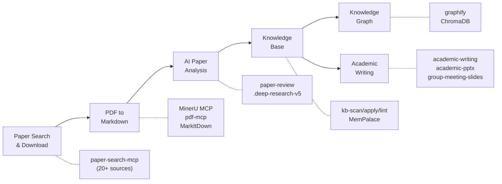

# AI Research Toolkit

> Full-pipeline AI-assisted academic research workflow powered by Claude Code

An opinionated, end-to-end toolkit that takes you from *searching papers* to *building a navigable knowledge graph* -- all inside Claude Code. Designed for graduate students who want AI to handle the tedious parts of research so they can focus on thinking.

## Pipeline Overview



Each phase maps to a skill or MCP server you invoke with a slash command or natural language in Claude Code. The pipeline is linear but iterative -- you can run any phase independently or loop back to earlier phases as your understanding deepens.

## Features

- **Paper Search & Download** -- Query 20+ academic databases (arXiv, PubMed, Semantic Scholar, CrossRef, DOAJ, etc.) from a single command. Download PDFs with one line. Optional IEEE/ACM with API keys.
- **PDF to Markdown** -- Convert papers, slides, and documents to clean Markdown via MinerU (GPU-accelerated OCR + layout analysis), pdf-mcp, or MarkItDown. Preserves tables, formulas, and figure references.
- **AI Paper Analysis** -- Single-paper deep review (`/paper-review`) extracting method, evidence quality, and reuse potential. Multi-paper synthesis (`/deep-research-v5`) with parallel sub-agents, citation registry, and traceable claims.
- **Knowledge Base Management** -- Scan, ingest, lint, and query a structured knowledge base. Powered by `kb-scan` / `kb-apply` / `kb-lint` / `kb-stats` skills with MemPalace for persistent semantic memory.
- **Knowledge Graph** -- Transform any folder of documents into a navigable graph with community detection, interactive HTML visualization, and audit reports via `graphify`.
- **Academic Writing & Presentations** -- Draft, polish, and structure papers (`/academic-writing`). Generate conference slides (`/academic-pptx`), group meeting decks (`/group-meeting-slides`), and rebuttal responses.

## Prerequisites

| Dependency | Version | Install Command | Verify Command |
|------------|---------|-----------------|----------------|
| Python | 3.10+ | [Anaconda](https://www.anaconda.com/download) or `winget install Python.Python.3.12` | `python --version` |
| Node.js | 18+ | [nodejs.org](https://nodejs.org/) or `winget install OpenJS.NodeJS.LTS` | `node --version` |
| Anaconda | Any | [anaconda.com/download](https://www.anaconda.com/download) | `conda --version` |
| uv | Latest | `pip install uv` or `winget install astral-sh.uv` | `uv --version` |
| Git | 2.30+ | `winget install Git.Git` | `git --version` |
| Claude Code | Latest | `npm install -g @anthropic-ai/claude-code` | `claude --version` |

> **Note for Chinese users:** If you are behind a proxy, set `HTTPS_PROXY` and `NO_PROXY` environment variables before installing. MinerU's OpenXLab API needs to bypass proxy -- add `*.openxlab.org.cn` to `NO_PROXY`.

## Quick Start

> **完整安装教程（2-3 小时）**: [docs/installation-guide.md](docs/installation-guide.md) — 从零开始，8 步走完，每一步都有 GitHub 链接、安装命令、验证方法和排错指南。

下面是快速概览。如果你是第一次搭建，**强烈建议先看完整教程**。

### 1. Clone & Install Skills

```bash
git clone https://github.com/debug-zhuweijian/ai-research-toolkit.git
cd ai-research-toolkit
cp -rn skills/* ~/.claude/skills/
cp -rn agents/* ~/.claude/agents/
```

### 2. Install Upstream Tools (from their GitHub repos)

Each tool installs independently from its own repository:

| Phase | Tool | GitHub | Install |
|-------|------|--------|---------|
| 1 | paper-search-mcp | [openags/paper-search-mcp](https://github.com/openags/paper-search-mcp) | `pip install paper-search-mcp` |
| 2 | MinerU | [opendatalab/MinerU](https://github.com/opendatalab/MinerU) | `pip install mineru-mcp-server` |
| 2 | pdf-mcp | [angshuman/pdf-mcp](https://github.com/angshuman/pdf-mcp) | `git clone` + `npm install` |
| 4 | Graphify | [safishamsi/graphify](https://github.com/safishamsi/graphify) | `pip install graphifyy` |
| 4 | MemPalace | [MemPalace/mempalace](https://github.com/MemPalace/mempalace) | `conda create` + `pip install` |

See [docs/installation-guide.md](docs/installation-guide.md) for exact commands and verification steps.

### 3. Configure MCP Servers

Edit `~/.claude.json` and merge the MCP config:

- **Minimal (3 servers)**: `configs/mcp-servers-minimal.json` — covers Phase 1-2
- **Full (11 servers)**: `configs/mcp-servers-full.json` — all phases

Replace all `<YOUR_*>` placeholders with your actual keys and paths.

### 4. Set Up API Keys

| Key | Source | Required? | Registration |
|-----|--------|-----------|-------------|
| Anthropic | [console.anthropic.com](https://console.anthropic.com/) | **Yes** | $5 minimum |
| ZhiPu BigModel | [open.bigmodel.cn](https://open.bigmodel.cn/) | **Yes** | Free tier available |
| MinerU OpenXLab | [openxlab.org.cn](https://openxlab.org.cn) | Recommended | Free |

See [docs/api-keys-guide.md](docs/api-keys-guide.md) for detailed registration walkthroughs.

### 5. Verify

```bash
./scripts/verify-setup.sh
```

---

## Usage Walkthrough: From Zero to Knowledge Base

### Scenario: You just chose a research direction "Graph Neural Networks"

You are a new graduate student. Your advisor said "look into graph neural networks." Here is how you go from zero to a structured knowledge base in one afternoon.

#### Step 1: Search Papers

```
> /paper-search search "graph neural networks knowledge distillation" -n 20 -s arxiv,semanticscholar,pubmed
```

Expected output (condensed):

```
Found 60 results (20 per source × 3 sources):

[arxiv] 2401.12345 - A Graph Neural Network Framework for Molecular Property Prediction
         Authors: Zhang et al. (2024)  Citations: 12
         Abstract: We propose a GNN framework that predicts molecular properties...

[semantic] 87f3a... - Attention-Based Graph Convolutional Networks
         Authors: Vaswani et al. (2021)  Citations: 389
         Abstract: We demonstrate attention mechanisms for graph-structured data...

[pubmed] PMID:38291034 - Knowledge distillation for graph neural networks
         Authors: Chen et al. (2023)  Citations: 67
         Abstract: We present a knowledge distillation approach for compressing GNNs...
```

Save the paper IDs that look relevant. You can also search by year range:

```
> /paper-search search "graph neural networks" -n 10 -s semantic -y 2022-2025
```

#### Step 2: Download Papers

```
> /paper-search download arxiv 2401.12345
```

Output:

```
Downloaded: ./downloads/2401.12345.pdf (2.3 MB)
```

**Tip for Chinese papers (CNKI/知网):** Use [Zotero](https://www.zotero.org/) with the [Jasminum](https://github.com/l0o0/jasminum) plugin and [translators_CN](https://github.com/l0o0/translators_CN) to batch-download from CNKI. Then convert the downloaded PDFs in Step 3.

#### Step 3: Convert PDF to Markdown

```
> /Geek-skills-mineru-pdf-parser ./downloads/2401.12345.pdf
```

The skill invokes MinerU's MCP server, which sends the PDF to OpenXLab for parsing (no GPU needed on your machine). Output:

```
Input:  ./downloads/2401.12345.pdf
Output: Markdown text (below)

Save to: G:\obsidian\base\Zhang2024_Graph_Neural_Networks\Zhang2024_EN.md
```

Save the output to a structured directory. The naming convention is `FirstAuthorYear_ShortTitle`:

```
G:\obsidian\base\Zhang2024_Graph_Neural_Networks\
├── Zhang2024_EN.pdf      ← original PDF
└── Zhang2024_EN.md       ← converted Markdown
```

For batch conversion of many PDFs:

```
> Convert all PDFs in ./downloads/ to Markdown using MinerU.
  Save results to G:\obsidian\base\<AuthorYear_Title>\<name>.md
```

#### Step 4: AI Paper Analysis

**Single paper review:**

```
> /paper-review Zhang2024_EN.md
```

Output (structured review):

```
## Paper Review: A Graph Neural Network Framework for Molecular Property Prediction

**Research Question:** Can GNNs accurately predict molecular properties with limited labeled data?
**Method:** Transformer-based graph encoder with attention on molecular substructures
**Dataset:** 12 benchmark datasets, 500 molecules each, multi-task learning
**Key Result:** 95.2% average accuracy on molecular property prediction (SOTA)
**Evidence Quality:** MODERATE — limited benchmark diversity, no external validation
**Limitations:**
  - Only tested on small molecules (no polymer or protein graphs)
  - Benchmark datasets limited to 500 molecules each
  - No comparison with knowledge distillation approaches
**Reusable for you:**
  - The attention architecture (Figure 3) could transfer to your graph learning setup
  - Their data augmentation strategy (Section 4.2) addresses the low-sample problem
  - Open-source code: github.com/...
```

**Multi-paper deep research:**

```
> /deep-research-v5 "Compare graph neural network methods from 2020 to 2025: GCN vs GAT vs GraphSAGE approaches, focusing on scalability and inductive learning capabilities"
```

This dispatches parallel sub-agents that each search, read, and write structured notes. The lead agent synthesizes everything into a long-form report with traceable citations. Typical output: 3000-5000 word report in 5-8 minutes.

#### Step 5: Build Knowledge Base

```
> /kb-scan
```

Output:

```
Scanning I:\claude-docs\ for new files...
  NEW:      3 files
  CHANGED:  0 files
  DUPE:     0 files

New files:
  [md] Zhang2024_Graph_Neural_Networks_EN.md
  [md] Vaswani2021_Attention_Graph_Convolutional_EN.md
  [md] Chen2023_Knowledge_Distillation_GNN_EN.md
```

Confirm and ingest:

```
> /kb-apply
```

This copies files into the knowledge base, indexes them for semantic search, and runs lint checks:

```
> /kb-lint    # Check for broken links, missing frontmatter, duplicates
> /kb-stats   # Show knowledge base statistics
```

Example `kb-stats` output:

```
Knowledge Base: I:\knowledge\
  Documents:    47
  Total nodes:  1384
  Total edges:  1842
  Coverage:     75.8% (node) / 100% (source)
```

#### Step 6: Generate Knowledge Graph

```
> /graphify I:\knowledge\
```

This builds a navigable knowledge graph with community detection. Output:

```
graphify-out/
├── graph.html              ← Interactive visualization (open in browser)
├── graph.json              ← GraphRAG-ready JSON
├── graph.graphml           ← For Gephi / yEd
├── GRAPH_REPORT.md         ← Audit report: god nodes, communities, coverage
└── wiki/
    ├── index.md            ← Agent-crawlable wiki index
    ├── community-01.md     ← One article per community cluster
    ├── community-02.md
    └── ...
```

Open `graph.html` in your browser to explore connections between papers, methods, and concepts. Use `--mode deep` for more thorough edge extraction.

#### Step 7: Academic Writing

Now that you understand the landscape, start writing:

```
> /academic-writing
  "Draft a related work section for my thesis on graph neural networks.
   Cover: GCN-based approaches, attention-based approaches, and hybrid methods.
   Cite the papers in my knowledge base. Target venue: IEEE TPAMI."
```

Generate presentation slides:

```
> /academic-pptx
  "Create a 15-minute conference presentation on my survey of graph
   neural network methods. Include: problem statement, taxonomy of
   approaches, comparison table, and future directions."
```

Prepare for group meeting:

```
> /group-meeting-slides
  "Make a 10-minute group meeting update on my literature survey progress.
   Audience: my advisor and 3 labmates. Focus: key findings and gaps."
```

### Quick Reference Table

| I want to... | Command | Output |
|-------------|---------|--------|
| Search papers across databases | `/paper-search search "query" -n 20 -s arxiv,semantic,pubmed` | JSON list with titles, authors, citations |
| Download a paper PDF | `/paper-search download arxiv 2401.12345` | PDF file in `./downloads/` |
| Convert PDF to Markdown | `/Geek-skills-mineru-pdf-parser paper.pdf` | Clean Markdown text |
| Review a single paper | `/paper-review paper.md` | Structured analysis (method, evidence, limitations) |
| Synthesize multiple papers | `/deep-research-v5 "research question"` | Long-form report with citations |
| Scan for new files | `/kb-scan` | New/changed/duplicate file report |
| Ingest into knowledge base | `/kb-apply` | Indexed documents in knowledge base |
| Build knowledge graph | `/graphify I:\knowledge\` | Interactive HTML + JSON + audit report |
| Draft a paper section | `/academic-writing` | Publication-ready prose |
| Make presentation slides | `/academic-pptx` or `/group-meeting-slides` | `.pptx` slide deck |

---

## Phase Details

### Phase 1: Paper Search & Download

| Tool | GitHub | Install |
|------|--------|---------|
| paper-search-mcp | [openags/paper-search-mcp](https://github.com/openags/paper-search-mcp) | `pip install paper-search-mcp` |
| Zotero | [zotero/zotero](https://github.com/zotero/zotero) | [zotero.org](https://www.zotero.org/) |
| Jasminum (CNKI) | [l0o0/jasminum](https://github.com/l0o0/jasminum) | Zotero .xpi plugin |
| translators_CN | [l0o0/translators_CN](https://github.com/l0o0/translators_CN) | Copy to Zotero translators |
| Playwright MCP | [microsoft/playwright-mcp](https://github.com/microsoft/playwright-mcp) | `npx -y @playwright/mcp@latest` |

Search 20+ academic databases from a single CLI. Supports arXiv, PubMed, Semantic Scholar, CrossRef, OpenAlex, DBLP, DOAJ, CORE, and more. Optional IEEE/ACM with API keys. Batch download PDFs and manage your paper library.

See [docs/phase1-paper-search.md](docs/phase1-paper-search.md) for detailed usage, source configuration, and batch workflows.

### Phase 2: PDF to Markdown

| Tool | GitHub | Install |
|------|--------|---------|
| MinerU | [opendatalab/MinerU](https://github.com/opendatalab/MinerU) | `pip install mineru-mcp-server` |
| pdf-mcp | [angshuman/pdf-mcp](https://github.com/angshuman/pdf-mcp) | `git clone` + `npm install` |
| MarkItDown | [microsoft/markitdown](https://github.com/microsoft/markitdown) | `pip install markitdown-mcp` |

Convert papers, technical reports, and slide decks into LLM-friendly Markdown. MinerU provides GPU-accelerated parsing with OCR support for scanned documents. pdf-mcp handles local operations (split, merge, extract pages, render to images). MarkItDown covers Office formats.

See [docs/phase2-pdf-to-markdown.md](docs/phase2-pdf-to-markdown.md) for backend selection, OCR configuration, and batch conversion.

### Phase 3: AI Analysis & Writing

| Tool | GitHub / Source | Type |
|------|----------------|------|
| paper-review | This repo `skills/paper-review/` | Skill |
| deep-research-v5 | This repo `skills/deep-research-v5/` | Skill (9 files) |
| academic-writing | This repo `skills/academic-writing/` | Skill |
| academic-pptx | This repo `skills/academic-pptx/` | Skill |
| group-meeting-slides | This repo `skills/group-meeting-slides/` | Skill |
| Sequential Thinking | [modelcontextprotocol/servers](https://github.com/modelcontextprotocol/servers) | MCP |
| web-search-prime | [ZhiPu BigModel](https://open.bigmodel.cn) | MCP |
| web-reader | [ZhiPu BigModel](https://open.bigmodel.cn) | MCP |
| zai-mcp-server | [@z_ai/mcp-server](https://www.npmjs.com/package/@z_ai/mcp-server) | MCP |

Single-paper review extracts research question, method, evidence quality, limitations, and what you can reuse. Multi-paper deep research dispatches parallel sub-agents that each investigate a facet, write structured notes, and return citations. Academic writing skill handles drafting, polishing, and reviewer responses.

See [docs/phase3-ai-analysis-writing.md](docs/phase3-ai-analysis-writing.md) for analysis templates, writing workflows, and slide design patterns.

### Phase 4: Knowledge Base & Graph

| Tool | GitHub | Install |
|------|--------|---------|
| Graphify | [safishamsi/graphify](https://github.com/safishamsi/graphify) | `pip install graphifyy` |
| MemPalace | [MemPalace/mempalace](https://github.com/MemPalace/mempalace) | `pip install mempalace` |
| ChromaDB | [chroma-core/chroma](https://github.com/chroma-core/chroma) | `pip install chromadb` |
| Obsidian | [obsidian.md](https://obsidian.md) | Desktop app |
| kb-* skills | This repo `skills/kb-*/` | Skill |

Build a structured, searchable knowledge base from your research materials. Scan for new files, ingest with automatic indexing, lint for quality, and track statistics. Transform the entire base into a navigable knowledge graph with community detection and interactive visualization.

See [docs/phase4-knowledge-base.md](docs/phase4-knowledge-base.md) for knowledge base architecture, graph generation options, and query patterns.

---

## API Keys Guide

| Key | Source | Free Tier | Required? | Purpose |
|-----|--------|-----------|-----------|---------|
| Anthropic | [console.anthropic.com](https://console.anthropic.com/) | $5 free credit | **Yes** | Claude Code core functionality |
| ZhiPu BigModel | [open.bigmodel.cn](https://open.bigmodel.cn/) | Yes (Generous free tier) | **Yes** | Web search, web reader, document analysis via MCP |
| MinerU OpenXLab | [mineru.openxlab.org.cn](https://mineru.openxlab.org.cn/) | Yes (1000 pages/day) | **Yes** | PDF to Markdown conversion API |

Optional keys (unlock additional paper-search-mcp sources):

| Key | Source | Free? | Purpose |
|-----|--------|-------|---------|
| CORE API | [core.ac.uk/services/api](https://core.ac.uk/services/api) | Yes | 300M+ open access papers (recommended) |
| Semantic Scholar API | [semanticscholar.org/product/api](https://www.semanticscholar.org/product/api) | Yes | Higher rate limits |
| Unpaywall Email | Just set your email | Yes | Locate open access PDFs |
| DOAJ API | [doaj.org/api](https://doaj.org/api/docs) | Yes | DOAJ batch access |
| IEEE API | [developer.ieee.org](https://developer.ieee.org/) | Yes (review needed) | IEEE Xplore search |
| ACM API | [dl.acm.org](https://dl.acm.org/) | Institutional | ACM Digital Library search |

See [docs/api-keys-guide.md](docs/api-keys-guide.md) for detailed setup instructions for each key.

---

## Tool Map

| Tool | Source | License | Phase | Install |
|------|--------|---------|-------|---------|
| [paper-search-mcp](https://github.com/openags/paper-search-mcp) | openags | MIT | 1 | `pip install paper-search-mcp` |
| [MinerU](https://github.com/opendatalab/MinerU) | OpenDataLab | Apache-2.0 | 2 | `pip install mineru-mcp-server` |
| [pdf-mcp](https://github.com/angshuman/pdf-mcp) | angshuman | MIT | 2 | `git clone` + `npm install` |
| [MarkItDown](https://github.com/microsoft/markitdown) | Microsoft | MIT | 2 | `pip install markitdown-mcp` |
| [Claude Code](https://docs.anthropic.com/en/docs/claude-code) | Anthropic | Commercial | All | `npm i -g @anthropic-ai/claude-code` |
| [Graphify](https://github.com/safishamsi/graphify) | safishamsi | MIT | 4 | `pip install graphify` |
| [MemPalace](https://github.com/MemPalace/mempalace) | MemPalace | MIT | 4 | `pip install mempalace` (separate conda env) |
| [ChromaDB](https://github.com/chroma-core/chroma) | Chroma | Apache-2.0 | 4 | `pip install chromadb` |
| [Playwright MCP](https://github.com/microsoft/playwright-mcp) | Microsoft | Apache-2.0 | All | `npx @playwright/mcp@latest` |
| [Sequential Thinking](https://github.com/modelcontextprotocol/servers) | MCP | MIT | 3 | `npx @modelcontextprotocol/server-sequential-thinking` |
| [Zotero](https://github.com/zotero/zotero) | Zotero | AGPL-3.0 | 1 | [zotero.org](https://www.zotero.org/) |
| [Jasminum](https://github.com/l0o0/jasminum) | l0o0 | GPL-3.0 | 1 | Zotero plugin |
| [translators_CN](https://github.com/l0o0/translators_CN) | l0o0 | GPL-3.0 | 1 | Zotero translators |
| [Draw.io MCP](https://github.com/nicholaschenai/drawio-mcp) | nicholaschenai | MIT | All | `npx @drawio/mcp` |
| [web-reader](https://open.bigmodel.cn/) | ZhiPu BigModel | Commercial | All | Remote MCP (API key only) |
| [web-search-prime](https://open.bigmodel.cn/) | ZhiPu BigModel | Commercial | 1, 3 | Remote MCP (API key only) |
| [zread](https://open.bigmodel.cn/) | ZhiPu BigModel | Commercial | All | Remote MCP (API key only) |
| [zai-mcp-server](https://open.bigmodel.cn/) | ZhiPu BigModel | Commercial | All | `npx @z_ai/mcp-server` |
| [Context7](https://github.com/nicholaschenai/context7) | Context7 | MIT | All | Plugin (via compound-engineering) |

---

## Recommended Resources

### AI for Research

- [Awesome AI for Research](https://github.com/THU-KEG/Awesome-AI-for-Research) -- Comprehensive survey of AI-assisted research tools and methods, maintained by Tsinghua KEG
- [EvoScientist](https://github.com/EvoScientist/EvoScientist) -- Self-evolving AI scientists that autonomously discover and validate hypotheses
- [DeepScientist](https://github.com/ResearAI/DeepScientist) -- End-to-end AI-driven research pipeline from ideation to paper
- [LightRAG](https://github.com/HKUDS/LightRAG) -- Lightweight and efficient RAG framework for research document retrieval
- [Open Notebook](https://github.com/lfnovo/open-notebook) -- Open-source alternative to Google's NotebookLM for research note management
- [Paper Proofreading](https://github.com/LimHyungTae/awesome-claudecode-paper-proofreading) -- Curated list of Claude Code workflows for paper proofreading

### Claude Code Ecosystem

- [Awesome Claude Skills](https://github.com/ComposioHQ/awesome-claude-skills) -- Curated collection of reusable Claude Code skills
- [Awesome Claude Code Subagents](https://github.com/VoltAgent/awesome-claude-code-subagents) -- Patterns and examples for multi-agent workflows
- [Oh My Claude Code](https://github.com/Yeachan-Heo/oh-my-claudecode) -- Configuration and plugin management for Claude Code
- [Claude HUD](https://github.com/jarrodwatts/claude-hud) -- Heads-up display for monitoring Claude Code sessions
- [LaTeX Document Skill](https://github.com/ndpvt-web/latex-document-skill) -- Claude Code skill for LaTeX document editing
- [Learn Claude Code](https://github.com/shareAI-lab/learn-claude-code) -- Chinese-language tutorials and examples for Claude Code
- [ClaudeSkills](https://github.com/staruhub/ClaudeSkills) -- Community skill registry and sharing platform

### Plugins Used

- [SuperClaude Framework](https://github.com/SuperClaude-Org/SuperClaude_Framework) -- Enhanced planning, debugging, and TDD workflows
- [Compound Engineering](https://github.com/EveryInc/compound-engineering-plugin) -- Code review, brainstorming, and frontend design tools
- [claude-mem](https://github.com/thedotmack/claude-mem) -- Persistent memory and context management across sessions
- [PUA](https://github.com/tanweai/pua) -- Personality and tone customization for Claude Code

---

## Acknowledgments

This toolkit stands on the shoulders of excellent open-source projects:

- **[MinerU](https://github.com/opendatalab/MinerU)** by OpenDataLab -- High-accuracy PDF parsing with layout analysis and OCR
- **[paper-search-mcp](https://github.com/openags/paper-search-mcp)** by openags -- Unified search across 20+ academic databases
- **[Graphify](https://github.com/safishamsi/graphify)** by safishamsi -- Knowledge graph generation from any document collection
- **[MemPalace](https://github.com/MemPalace/mempalace)** -- Persistent semantic memory with knowledge graph support
- **[ChromaDB](https://github.com/chroma-core/chroma)** -- Open-source embedding database for semantic search
- **[pdf-mcp](https://github.com/angshuman/pdf-mcp)** by angshuman -- MCP server for PDF manipulation operations
- **[MarkItDown](https://github.com/microsoft/markitdown)** by Microsoft -- Document-to-Markdown conversion for Office formats
- **[Playwright MCP](https://github.com/microsoft/playwright-mcp)** by Microsoft -- Browser automation for web-based research
- **[Sequential Thinking MCP](https://github.com/modelcontextprotocol/servers)** -- Structured multi-step reasoning for complex analysis
- **[Zotero](https://github.com/zotero/zotero)** -- Free, open-source reference manager
- **[Jasminum](https://github.com/l0o0/jasminum)** by l0o0 -- Zotero plugin for Chinese academic databases
- **[translators_CN](https://github.com/l0o0/translators_CN)** by l0o0 -- Chinese translator plugins for Zotero

---

## Contributing

Contributions are welcome. This toolkit grows with the community.

**Suggest a new tool or skill:**
1. Open an issue with the `tool-suggestion` label
2. Include: tool name, GitHub link, which phase it fits, and why it is better than existing options
3. If accepted, submit a PR adding the skill to `skills/` and updating this README

**Report a broken link or outdated instruction:**
1. Open an issue with the `bug` label
2. Describe what is broken, what you expected, and your environment (OS, Python version, Claude Code version)

**Add a new language or improve documentation:**
1. Fork the repo
2. Create a branch: `git checkout -b docs/your-improvement`
3. Submit a PR with a clear description of changes

---

## License

[MIT](LICENSE) -- Copyright (c) 2025 debug-zhuweijian

Use it, fork it, break it, fix it, share it. Just keep the license notice.
