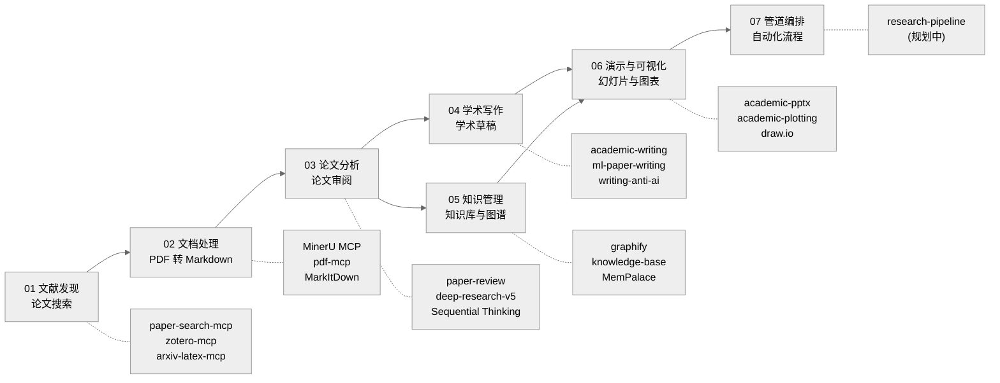

<div align="center">

# AI Research Toolkit

**基于 Claude Code 的全管道 AI 辅助学术研究工作流**

[](https://github.com/debug-zhuweijian/ai-research-toolkit/releases) [](LICENSE) [](https://deepwiki.com/debug-zhuweijian/ai-research-toolkit) [![zread](https://img.shields.io/badge/Ask_Zread-_.svg?style=flat&color=00b0aa&labelColor=000000&logo=data%3Aimage%2Fsvg%2Bxml%3Bbase64%2CPHN2ZyB3aWR0aD0iMTYiIGhlaWdodD0iMTYiIHZpZXdCb3g9IjAgMCAxNiAxNiIgZmlsbD0ibm9uZSIgeG1sbnM9Imh0dHA6Ly93d3cudzMub3JnLzIwMDAvc3ZnIj4KPHBhdGggZD0iTTQuOTYxNTYgMS42MDAxSDIuMjQxNTZDMS44ODgxIDEuNjAwMSAxLjYwMTU2IDEuODg2NjQgMS42MDE1NiAyLjI0MDFWNC45NjAxQzEuNjAxNTYgNS4zMTM1NiAxLjg4ODEgNS42MDAxIDIuMjQxNTYgNS42MDAxSDQuOTYxNTZDNS4zMTUwMiA1LjYwMDEgNS42MDE1NiA1LjMxMzU2IDUuNjAxNTYgNC45NjAxVjIuMjQwMUM1LjYwMTU2IDEuODg2NjQgNS4zMTUwMiAxLjYwMDEgNC45NjE1NiAxLjYwMDFaIiBmaWxsPSIjZmZmIi8%2BCjxwYXRoIGQ9Ik00Ljk2MTU2IDEwLjM5OTlIMi4yNDE1NkMxLjg4ODEgMTAuMzk5OSAxLjYwMTU2IDEwLjY4NjQgMS42MDE1NiAxMS4wMzk5VjEzLjc1OTlDMS42MDE1NiAxNC4xMTM0IDEuODg4MSAxNC4zOTk5IDIuMjQxNTYgMTQuMzk5OUg0Ljk2MTU2QzUuMzE1MDIgMTQuMzk5OSA1LjYwMTU2IDE0LjExMzQgNS42MDE1NiAxMy43NTk5VjExLjAzOTlDNS42MDE1NiAxMC42ODY0IDUuMzE1MDIgMTAuMzk5OSA0Ljk2MTU2IDEwLjM5OTlaIiBmaWxsPSIjZmZmIi8%2BCjxwYXRoIGQ9Ik0xMy43NTg0IDEuNjAwMUgxMS4wMzg0QzEwLjY4NSAxLjYwMDEgMTAuMzk4NCAxLjg4NjY0IDEwLjM5ODQgMi4yNDAxVjQuOTYwMUMxMC4zOTg0IDUuMzEzNTYgMTAuNjg1IDUuNjAwMSAxMS4wMzg0IDUuNjAwMUgxMy43NTg0QzE0LjExMTkgNS42MDAxIDE0LjM5ODQgNS4zMTM1NiAxNC4zOTg0IDQuOTYwMVYyLjI0MDFDMTQuMzk4NCAxLjg4NjY0IDE0LjExMTkgMS42MDAxIDEzLjc1ODQgMS42MDAxWiIgZmlsbD0iI2ZmZiIvPgo8cGF0aCBkPSJNNCAxMkwxMiA0TDQgMTJaIiBmaWxsPSIjI2ZmZiIvPgo8cGF0aCBkPSJNNCAxMkwxMiA0IiBzdHJva2U9IiNmZmZmZiIgc3Ryb2tlLXdpZHRoPSIxLjUiIHN0cm9rZS1saW5lY2FwPSJyb3VuZCIvPgo8L3N2Zz4K&logoColor=ffffff)](https://zread.ai/debug-zhuweijian/ai-research-toolkit)

**[English](./README.md)** | **[中文](./README.zh-CN.md)** | **[日本語](./README.ja.md)** | **[한국어](./README.ko.md)**

</div>

---

一套有主见的端到端工具集，带你从*发现论文*到*构建可导航的知识图谱*——全部在 Claude Code 内完成。专为研究生设计，让 AI 处理研究中繁琐的部分，你可以把精力集中在思考上。

## 管道总览



每个阶段对应一个 Skill 或 MCP 服务器，通过斜杠命令或自然语言在 Claude Code 中调用。管道是线性的但可以迭代——你可以独立运行任意阶段，也可以随着理解加深回到前面的阶段。

## 目录

- [功能特性](#功能特性)
- [前置依赖](#前置依赖)
- [快速开始](#快速开始)
- [使用演练：从零到知识库](#使用演练从零到知识库)
- [各阶段详情](#各阶段详情)
  - [阶段 01：文献发现](#阶段-01文献发现)
  - [阶段 02：文档处理](#阶段-02文档处理)
  - [阶段 03：论文分析](#阶段-03论文分析)
  - [阶段 04：学术写作](#阶段-04学术写作)
  - [阶段 05：知识管理](#阶段-05知识管理)
  - [阶段 06：演示与可视化](#阶段-06演示与可视化)
  - [阶段 07：管道编排](#阶段-07管道编排)
- [安装预设](#安装预设)
- [API 密钥指南](#api-密钥指南)
- [MCP 服务器](#mcp-服务器)
- [工具清单](#工具清单)
- [推荐资源](#推荐资源)
- [实验性功能](#实验性功能)
- [v0.2 更新内容](#v02-更新内容)
- [致谢](#致谢)
- [贡献指南](#贡献指南)
- [许可证](#许可证)

## 功能特性

- **阶段 01 -- 文献发现** -- 一条命令查询 20+ 学术数据库（arXiv、PubMed、Semantic Scholar、CrossRef、DOAJ 等）。一行代码下载 PDF。用 Zotero 和中文数据库插件管理文献库。
- **阶段 02 -- 文档处理** -- 通过 MinerU（GPU 加速 OCR + 版面分析）、pdf-mcp 或 MarkItDown 将论文、幻灯片和文档转换为干净的 Markdown。保留表格、公式和图片引用。
- **阶段 03 -- 论文分析** -- 单篇论文深度审阅，提取方法、证据质量和复用潜力。多篇论文综合分析，使用并行子智能体、引用注册表和可追溯的论点。创造性研究构思与头脑风暴支持。
- **阶段 04 -- 学术写作** -- 使用面向 ML、系统研究和通用学术写作的领域专用 Skill 起草、润色和组织论文。反 AI 检测技巧、审稿人回复起草和录用后排版。
- **阶段 05 -- 知识管理** -- 扫描、导入、检查和查询结构化知识库。用社区检测和交互式可视化构建可导航的知识图谱。Obsidian 工作流用于研究笔记和文献管理。
- **阶段 06 -- 演示与可视化** -- 从研究成果生成会议幻灯片、组会报告、学术图表、draw.io 图、信息图和出版质量的图片。
- **阶段 07 -- 管道编排** -- 跨阶段的端到端自动化研究工作流（规划中）。

## 前置依赖

| 依赖 | 版本 | 安装命令 | 验证命令 |
|------|------|----------|----------|
| Python | 3.10+ | `winget install Python.Python.3.12`（或通过下面的 Anaconda 安装） | `python --version` |
| Node.js | 18+ | [nodejs.org](https://nodejs.org/) 或 `winget install OpenJS.NodeJS.LTS` | `node --version` |
| Anaconda | 任意版本 | [anaconda.com/download](https://www.anaconda.com/download) | `conda --version` |
| uv | 最新版 | `pip install uv` 或 `winget install astral-sh.uv` | `uv --version` |
| Git | 2.30+ | `winget install Git.Git` | `git --version` |
| Claude Code | 最新版 | `npm install -g @anthropic-ai/claude-code` | `claude --version` |
| LibreOffice | 7.0+ | [libreoffice.org](https://www.libreoffice.org/) | `soffice --version` |
| Poppler | 0.84+ | `winget install poppler` 或 [poppler.freedesktop.org](https://poppler.freedesktop.org/) | `pdftotext -v` |

> **中国用户注意：** 如果你在代理后面，安装前请设置 `HTTPS_PROXY` 和 `NO_PROXY` 环境变量。MinerU 的 OpenXLab API 需要绕过代理——请将 `*.openxlab.org.cn` 加入 `NO_PROXY`。

> **国际用户注意：** 部分 MCP 服务器（web-search-prime、web-reader）默认使用智谱 BigModel。国际用户可以使用 Tavily、Brave Search 或 Firecrawl 作为替代方案，直接替换即可。在 `~/.claude.json` 中配置对应 MCP 服务器和你偏好的服务商 API 密钥。

## 快速开始

> **完整安装教程（2-3 小时）**：[docs/installation-guide.md](docs/installation-guide.md)——从零开始 8 步搞定，每步都有 GitHub 链接、安装命令、验证步骤和常见问题排查。

下面是快速概览。如果你是第一次设置，**强烈建议先阅读完整教程**。

### A. 克隆并按预设安装

```bash
git clone https://github.com/debug-zhuweijian/ai-research-toolkit.git
cd ai-research-toolkit

# 按预设安装
./scripts/install.sh --profile researcher    # 研究者推荐
./scripts/install.sh --profile writer        # 专注论文写作
./scripts/install.sh --profile full          # 全部安装
./scripts/install.sh --profile minimal       # 仅搜索 + PDF 处理

# 或安装单独模块
./scripts/install.sh --module 03-analysis    # 仅阶段 03
```

### B. 安装上游工具

每个工具独立安装，来源各自仓库：

| 阶段 | 工具 | GitHub | 安装方式 |
|------|------|--------|----------|
| 01 | paper-search-mcp | [openags/paper-search-mcp](https://github.com/openags/paper-search-mcp) | `pip install paper-search-mcp` |
| 02 | MinerU | [opendatalab/MinerU](https://github.com/opendatalab/MinerU) | `pip install mineru-mcp-server` |
| 02 | pdf-mcp | [angshuman/pdf-mcp](https://github.com/angshuman/pdf-mcp) | `git clone` + `npm install` |
| 02 | MarkItDown | [microsoft/markitdown](https://github.com/microsoft/markitdown) | `pip install markitdown-mcp` |
| 03 | Sequential Thinking | [modelcontextprotocol/servers](https://github.com/modelcontextprotocol/servers) | `npx @modelcontextprotocol/server-sequential-thinking` |
| 05 | Graphify | [safishamsi/graphify](https://github.com/safishamsi/graphify) | `pip install graphifyy` |
| 05 | MemPalace | [MemPalace/mempalace](https://github.com/MemPalace/mempalace) | `conda create` + `pip install` |

详细命令和验证步骤请参考 [docs/installation-guide.md](docs/installation-guide.md)。

### C. 配置 MCP 服务器

编辑 `~/.claude.json` 并合并 MCP 配置：

- **最小配置（3 个服务器）**：`configs/mcp-servers-minimal.json`——覆盖阶段 01-02
- **完整配置（11 个服务器）**：`configs/mcp-servers-full.json`——全部阶段

将所有 `<YOUR_*>` 占位符替换为你实际的密钥和路径。

> **推荐**：paper-search-mcp 使用 `uvx paper-search-mcp`，可自动隔离依赖，不污染全局 Python 环境。

### D. 配置 API 密钥

| 密钥 | 来源 | 是否必需？ | 注册 |
|------|------|-----------|------|
| Anthropic 或兼容端点 | [console.anthropic.com](https://console.anthropic.com/) 或兼容平台（如智谱 BigModel） | **是**（任选其一） | Anthropic：最低 $5；兼容平台：各不相同 |
| 智谱 BigModel | [open.bigmodel.cn](https://open.bigmodel.cn/) | **是** | 有免费额度 |
| MinerU OpenXLab | [openxlab.org.cn](https://openxlab.org.cn) | 推荐 | 免费（1000 页/天） |

> **Anthropic 兼容端点**：如果你通过 Anthropic 兼容 API（如智谱 BigModel GLM 系列）运行 Claude Code，使用该平台的 API Key 并相应配置 `base_url`。这种情况下不需要 Anthropic API Key。

详细注册步骤请参考 [docs/api-keys-guide.md](docs/api-keys-guide.md)。

### E. 验证安装

```bash
# macOS / Linux / Git Bash
./scripts/verify-setup.sh
```

> **Windows 用户：** 请在 Git Bash 中运行此脚本。如果没有 `bash`，请手动运行 [docs/installation-guide.md](docs/installation-guide.md) 中列出的各验证命令。

> 遇到问题？请参考 [docs/troubleshooting.md](docs/troubleshooting.md) 中的常见问题。

---

## 使用演练：从零到知识库

### 场景：你刚选定了研究方向"图神经网络"

你是一名刚入学的研究生。导师说"研究一下图神经网络"。下面演示你如何在一个下午从零开始构建结构化的知识库。

#### 第 1 步：搜索论文（阶段 01）

```
> /paper-search search "graph neural networks knowledge distillation" -n 20 -s arxiv,semanticscholar,pubmed
```

> **注意：** 下面展示的 arXiv ID 和搜索结果仅供演示，你的实际结果会有所不同。

预期输出（精简版）：

```
Found 60 results (20 per source x 3 sources):

[arxiv] 2401.12345 - A Graph Neural Network Framework for Molecular Property Prediction
         Authors: Zhang et al. (2024)  Citations: 12
         Abstract: We propose a GNN framework that predicts molecular properties...

[semantic] 87f3a... - Attention-Based Graph Convolutional Networks
         Authors: Vaswani et al. (2021)  Citations: 389
         Abstract: We demonstrate attention mechanisms for graph-structured data...

[pubmed] PMID:38291034 - Knowledge distillation for graph neural networks
         Authors: Chen et al. (2023)  Citations: 67
         Abstract: We present a knowledge distillation approach for compressing GNNs...
```

保存看起来相关的论文 ID。你也可以按年份范围搜索：

```
> /paper-search search "graph neural networks" -n 10 -s semantic -y 2022-2025
```

#### 第 2 步：下载论文（阶段 01）

```
> /paper-search download arxiv 2401.12345
```

输出：

```
Downloaded: ./downloads/2401.12345.pdf (2.3 MB)
```

**中文论文提示（知网/CNKI）：** 使用 [Zotero](https://www.zotero.org/) 配合 [Jasminum](https://github.com/l0o0/jasminum) 插件和 [translators_CN](https://github.com/l0o0/translators_CN) 从知网批量下载。然后在第 3 步中转换下载的 PDF。

#### 第 3 步：将 PDF 转换为 Markdown（阶段 02）

```
> /Geek-skills-mineru-pdf-parser ./downloads/2401.12345.pdf
```

该 Skill 会调用 MinerU 的 MCP 服务器，将 PDF 发送到 OpenXLab 进行解析（本机无需 GPU）。输出：

```
Input:  ./downloads/2401.12345.pdf
Output: Markdown text (below)

Save to: <OBSIDIAN_VAULT>/Papers/Zhang2024_Graph_Neural_Networks/Zhang2024_EN.md
```

将输出保存到结构化目录。命名规范为 `第一作者年份_短标题`：

```
<OBSIDIAN_VAULT>/Papers/Zhang2024_Graph_Neural_Networks/
├── Zhang2024_EN.pdf      <-- 原始 PDF
└── Zhang2024_EN.md       <-- 转换后的 Markdown
```

批量转换多个 PDF：

```
> Convert all PDFs in ./downloads/ to Markdown using MinerU.
  Save results to <OBSIDIAN_VAULT>/Papers/<AuthorYear_Title>/<name>.md
```

#### 第 4 步：AI 论文分析（阶段 03）

**单篇论文审阅：**

```
> /paper-review Zhang2024_EN.md
```

输出（结构化审阅）：

```
## Paper Review: A Graph Neural Network Framework for Molecular Property Prediction

**Research Question:** Can GNNs accurately predict molecular properties with limited labeled data?
**Method:** Transformer-based graph encoder with attention on molecular substructures
**Dataset:** 12 benchmark datasets, 500 molecules each, multi-task learning
**Key Result:** 95.2% average accuracy on molecular property prediction (SOTA)
**Evidence Quality:** MODERATE -- limited benchmark diversity, no external validation
**Limitations:**
  - Only tested on small molecules (no polymer or protein graphs)
  - Benchmark datasets limited to 500 molecules each
  - No comparison with knowledge distillation approaches
**Reusable for you:**
  - The attention architecture (Figure 3) could transfer to your graph learning setup
  - Their data augmentation strategy (Section 4.2) addresses the low-sample problem
  - Open-source code: github.com/...
```

**多篇论文深度研究：**

```
> /deep-research-v5 "Compare graph neural network methods from 2020 to 2025: GCN vs GAT vs GraphSAGE approaches, focusing on scalability and inductive learning capabilities"
```

这会调度并行的子智能体，各自搜索、阅读和撰写结构化笔记。主导智能体将所有内容综合成带有可追溯引用的长篇报告。典型输出：5-8 分钟内生成 3000-5000 字的报告。

#### 第 5 步：起草与写作（阶段 04）

理解了研究全貌后，开始写作：

```
> /academic-writing
  "Draft a related work section for my thesis on graph neural networks.
   Cover: GCN-based approaches, attention-based approaches, and hybrid methods.
   Cite the papers in my knowledge base. Target venue: IEEE TPAMI."
```

根据需要使用领域专用的写作 Skill：

```
> /ml-paper-writing          # ML/AI 论文
> /systems-paper-writing     # 系统论文
> /writing-anti-ai           # 降低 AI 检测标记的技巧
> /review-response           # 起草审稿人回复
> /post-acceptance           # Camera-ready 排版和最终检查
```

#### 第 6 步：构建知识库（阶段 05）

```
> /knowledge-base scan
```

输出：

```
Scanning <KNOWLEDGE_BASE>/ for new files...
  NEW:      3 files
  CHANGED:  0 files
  DUPE:     0 files

New files:
  [md] Zhang2024_Graph_Neural_Networks_EN.md
  [md] Vaswani2021_Attention_Graph_Convolutional_EN.md
  [md] Chen2023_Knowledge_Distillation_GNN_EN.md
```

构建知识图谱：

```
> /graphify <KNOWLEDGE_BASE_PATH>
```

这会构建一个带社区检测的可导航知识图谱。输出：

```
graphify-out/
├── graph.html              <-- 交互式可视化（浏览器打开）
├── graph.json              <-- GraphRAG 就绪的 JSON
├── graph.graphml           <-- 供 Gephi / yEd 使用
├── GRAPH_REPORT.md         <-- 审计报告：核心节点、社区、覆盖率
└── wiki/
    ├── index.md            <-- 智能体可爬取的 wiki 索引
    ├── community-01.md     <-- 每个社区聚类一篇文章
    ├── community-02.md
    └── ...
```

在浏览器中打开 `graph.html`，探索论文、方法和概念之间的关联。使用 `--mode deep` 获取更彻底的边提取。

#### 第 7 步：制作演示文稿（阶段 06）

生成演讲幻灯片：

```
> /academic-pptx
  "Create a 15-minute conference presentation on my survey of graph
   neural network methods. Include: problem statement, taxonomy of
   approaches, comparison table, and future directions."
```

准备组会汇报：

```
> /group-meeting-slides
  "Make a 10-minute group meeting update on my literature survey progress.
   Audience: my advisor and 3 labmates. Focus: key findings and gaps."
```

生成出版图片：

```
> /academic-plotting
  "Create a comparison chart of GNN methods showing accuracy vs. training time."
```

### 快速参考表

| 我想... | 命令 | 阶段 |
|---------|------|------|
| 跨数据库搜索论文 | `/paper-search search "query" -n 20 -s arxiv,semantic,pubmed` | 01 |
| 下载论文 PDF | `/paper-search download arxiv 2401.12345` | 01 |
| 将 PDF 转为 Markdown | `/Geek-skills-mineru-pdf-parser paper.pdf` | 02 |
| 审阅单篇论文 | `/paper-review paper.md` | 03 |
| 综合分析多篇论文 | `/deep-research-v5 "研究问题"` | 03 |
| 头脑风暴研究想法 | `/brainstorming-research-ideas "主题"` | 03 |
| 起草论文章节 | `/academic-writing` | 04 |
| 写 ML 论文 | `/ml-paper-writing` | 04 |
| 回复审稿人 | `/review-response` | 04 |
| 扫描知识库 | `/knowledge-base scan` | 05 |
| 构建知识图谱 | `/graphify <KNOWLEDGE_BASE_PATH>` | 05 |
| 管理 Obsidian vault | `/obsidian-markdown` | 05 |
| 制作演讲幻灯片 | `/academic-pptx` 或 `/group-meeting-slides` | 06 |
| 创建学术图表 | `/academic-plotting` | 06 |
| 绘制示意图 | `/drawio` | 06 |

---

## 各阶段详情

### 阶段 01：文献发现

| 工具 | GitHub | 安装方式 |
|------|--------|----------|
| paper-search-mcp | [openags/paper-search-mcp](https://github.com/openags/paper-search-mcp) | `pip install paper-search-mcp` |
| zotero-mcp | [MushroomCatKinsh/zotero-mcp](https://github.com/MushroomCatKinsh/zotero-mcp) | `pip install zotero-mcp-server` |
| arxiv-latex-mcp | [dvai-lab/arxiv-latex-mcp](https://github.com/dvai-lab/arxiv-latex-mcp) | `pip install arxiv-latex-mcp` |
| Zotero | [zotero/zotero](https://github.com/zotero/zotero) | [zotero.org](https://www.zotero.org/) |
| Jasminum（知网） | [l0o0/jasminum](https://github.com/l0o0/jasminum) | Zotero .xpi 插件 |
| translators_CN | [l0o0/translators_CN](https://github.com/l0o0/translators_CN) | 复制到 Zotero translators 目录 |

通过单个 CLI 搜索 20+ 学术数据库。支持 arXiv、PubMed、Semantic Scholar、CrossRef、OpenAlex、DBLP、DOAJ、CORE 等。可选配 IEEE/ACM（需要 API 密钥）。Zotero 集成用于文献库管理，arxiv-latex-mcp 用于获取 arXiv 论文的完整 LaTeX 源码以精确解读公式。

详细用法和来源配置请参考 [modules/01-discovery/README.md](modules/01-discovery/README.md)。

### 阶段 02：文档处理

| 工具 | GitHub | 安装方式 |
|------|--------|----------|
| MinerU | [opendatalab/MinerU](https://github.com/opendatalab/MinerU) | `pip install mineru-mcp-server` |
| pdf-mcp | [angshuman/pdf-mcp](https://github.com/angshuman/pdf-mcp) | `git clone` + `npm install` |
| MarkItDown | [microsoft/markitdown](https://github.com/microsoft/markitdown) | `pip install markitdown-mcp` |

将论文、技术报告和幻灯片转换为 LLM 友好的 Markdown。MinerU 提供 GPU 加速解析，支持扫描文档的 OCR。pdf-mcp 处理本地操作（拆分、合并、提取页面、渲染为图片）。MarkItDown 覆盖 Office 格式（DOCX、PPTX、XLSX）。完整格式支持需要 LibreOffice 和 Poppler。

后端选择、OCR 配置和批量转换请参考 [modules/02-processing/README.md](modules/02-processing/README.md)。

### 阶段 03：论文分析

| 工具 | 来源 | 类型 |
|------|------|------|
| paper-review | 本仓库 | Skill |
| paper-proofread | 本仓库 + [上游](https://github.com/LimHyungTae/awesome-claudecode-paper-proofreading) | Skill |
| deep-research-v5 | 本仓库 | Skill（9 个文件） |
| brainstorming-research-ideas | 本仓库 | Skill |
| creative-thinking-for-research | 本仓库 | Skill |
| content-research-writer | 本仓库 | Skill |
| Sequential Thinking | [modelcontextprotocol/servers](https://github.com/modelcontextprotocol/servers) | MCP |

单篇论文审阅提取研究问题、方法、证据质量、局限性和可复用内容。论文校对提供两阶段 LaTeX 工作区审计（9 项检查）和基于 ICRA 2025 杰出审稿人标准的会议级内容审查（9 个类别）。多篇论文深度研究调度并行子智能体进行综合分析，附带可追溯引用。头脑风暴和创造性思维 Skill 帮助生成新颖的研究方向。

分析模板、校对工作流和研究构思模式请参考 [modules/03-analysis/README.md](modules/03-analysis/README.md)。

### 阶段 04：学术写作

| 工具 | 来源 | 类型 |
|------|------|------|
| academic-writing | 本仓库 | Skill |
| academic-paper | 本仓库 | Skill |
| ml-paper-writing | 本仓库 | Skill |
| systems-paper-writing | 本仓库 | Skill |
| writing-anti-ai | 本仓库 | Skill |
| post-acceptance | 本仓库 | Skill |
| review-response | 本仓库 | Skill |
| results-analysis | 本仓库 | Skill |
| results-report | 本仓库 | Skill |

面向不同出版场景的领域专用写作 Skill。ML 论文写作处理实验表格、消融实验和架构描述。系统论文写作覆盖评估方法论和可扩展性分析。writing-anti-ai 提供降低 AI 检测标记的策略。review-response 起草逐条回复。post-acceptance 处理 camera-ready 排版、校对修正和最终检查。

写作工作流、模板选择和投稿准备请参考 [modules/04-writing/README.md](modules/04-writing/README.md)。

### 阶段 05：知识管理

| 工具 | GitHub | 安装方式 |
|------|--------|----------|
| Graphify | [safishamsi/graphify](https://github.com/safishamsi/graphify) | `pip install graphifyy` |
| knowledge-base | 本仓库 | Skill |
| knowledge-distillation | 本仓库 | Skill |
| obsidian-markdown | 本仓库 | Skill |
| obsidian-literature-workflow | 本仓库 | Skill |
| obsidian-research-log | 本仓库 | Skill |
| obsidian-synthesis-map | 本仓库 | Skill |
| obsidian-experiment-log | 本仓库 | Skill |
| obsidian-link-graph | 本仓库 | Skill |
| obsidian-project-memory | 本仓库 | Skill |
| MemPalace | [MemPalace/mempalace](https://github.com/MemPalace/mempalace) | `pip install mempalace`（独立 conda 环境） |
| ChromaDB | [chroma-core/chroma](https://github.com/chroma-core/chroma) | `pip install chromadb` |

从研究材料构建结构化的、可搜索的知识库。knowledge-base Skill 用统一接口替代了旧的 kb-* 脚本。Graphify 将任意文档文件夹转换为可导航的图谱，带社区检测、交互式 HTML 可视化和审计报告。7 个 Obsidian Skill 提供专门的工作流：文献笔记、研究日志、综合图谱、实验日志、链接图、项目记忆和 Markdown 格式化。MemPalace 增加了带知识图谱支持的持久化语义记忆。

知识库架构、Obsidian 设置和图谱生成选项请参考 [modules/05-knowledge/README.md](modules/05-knowledge/README.md)。

### 阶段 06：演示与可视化

| 工具 | 来源 | 类型 |
|------|--------|------|
| academic-pptx | 本仓库 | Skill |
| group-meeting-slides | 本仓库 | Skill |
| academic-plotting | 本仓库 | Skill |
| draw.io MCP | [nicholaschenai/drawio-mcp](https://github.com/nicholaschenai/drawio-mcp) | MCP |
| notion-infographic | 本仓库 | Skill |
| publication-chart-skill | 本仓库 | Skill |
| presenting-conference-talks | 本仓库 | Skill |

生成出版级的演示文稿和图片。academic-pptx 创建带规范学术结构的会议幻灯片。group-meeting-slides 制作非正式的组会汇报。academic-plotting 生成对比图、消融表和训练曲线。draw.io MCP 创建架构图、流程图和系统图。notion-infographic 构建可视化摘要。presenting-conference-talks 帮助准备和排练会议演讲。

幻灯片模板、绘图示例和图表模式请参考 [modules/06-presentation/README.md](modules/06-presentation/README.md)。

### 阶段 07：管道编排

| 工具 | 来源 | 状态 |
|------|--------|------|
| research-pipeline | 本仓库 | 规划中 |

用于端到端自动化研究工作流的跨阶段编排。将支持串联各阶段（如搜索 -> 下载 -> 转换 -> 审阅 -> 摘要），带可配置参数和错误恢复。目前处于规划阶段。

设计方案和路线图请参考 [modules/07-pipeline/README.md](modules/07-pipeline/README.md)。

---

## 安装预设

| 预设 | 模块 | Skill 数 | Agent 数 | 适用场景 |
|------|------|----------|----------|----------|
| `minimal` | 01, 02 | 7 | 2 | 文献搜索和文档处理 |
| `writer` | 04, 06 | 16 | 7 | 学术写作和演示 |
| `researcher` | 01-04 | 25 | 14 | 完整研究工作流（推荐） |
| `knowledge` | 05, 06 | 17 | 2 | 知识管理和 Obsidian |
| `full` | 01-06 | 42 | 16 | 完整工具集 |

使用 `./scripts/install.sh --profile <名称>` 按预设安装，或使用 `--module <阶段>` 安装单独模块。

---

## API 密钥指南

### 必需密钥

| 密钥 | 来源 | 免费额度 | 是否必需？ | 用途 |
|------|------|----------|-----------|------|
| Anthropic（或兼容端点） | [console.anthropic.com](https://console.anthropic.com/) 或兼容平台（如智谱 BigModel） | Anthropic：最低 $5；兼容平台：各不相同 | **是**（任选其一） | Claude Code 核心功能 |
| 智谱 BigModel | [open.bigmodel.cn](https://open.bigmodel.cn/) | 有（免费额度充足） | **是** | 通过 MCP 提供网络搜索、网页阅读、文档分析 |
| MinerU OpenXLab | [mineru.openxlab.org.cn](https://mineru.openxlab.org.cn/) | 有（1000 页/天） | **是** | PDF 转 Markdown 转换 API |

> **使用 Anthropic 兼容端点**：Claude Code 支持 Anthropic 兼容 API 端点（如智谱 BigModel 的 GLM 系列）。如果你使用兼容端点，配置对应的 API Key 和 `base_url` 即可——无需 Anthropic API Key。

### 可选密钥

| 密钥 | 来源 | 免费？ | 用途 |
|------|------|--------|------|
| CORE API | [core.ac.uk/services/api](https://core.ac.uk/services/api) | 是 | 3 亿+ 开放获取论文（推荐） |
| Semantic Scholar API | [semanticscholar.org/product/api](https://www.semanticscholar.org/product/api) | 是 | 更高速率限制 |
| Unpaywall 邮箱 | 设置你的邮箱即可 | 是 | 定位开放获取 PDF |
| DOAJ API | [doaj.org/api](https://doaj.org/api/docs) | 是 | DOAJ 批量访问 |
| IEEE API | [developer.ieee.org](https://developer.ieee.org/) | 是（需审核） | IEEE Xplore 搜索 |
| ACM API | [dl.acm.org](https://dl.acm.org/) | 机构访问 | ACM Digital Library 搜索 |

### 国际替代方案

对于中国以外的用户，以下服务可替代智谱 BigModel 默认配置：
- **网络搜索**：[Tavily](https://tavily.com/) 或 [Brave Search API](https://brave.com/search/api/) 替代 web-search-prime
- **网页阅读**：[Firecrawl](https://firecrawl.dev/) 或 [Jina Reader](https://jina.ai/reader/) 替代 web-reader
- **文档分析**：任何支持视觉的 Anthropic 兼容端点

各密钥的详细配置说明请参考 [docs/api-keys-guide.md](docs/api-keys-guide.md)。

---

## MCP 服务器

| 服务器 | 阶段 | 用途 | 安装方式 |
|--------|------|------|----------|
| paper-search-mcp | 01 | 20+ 数据库论文搜索 | `pip install paper-search-mcp` |
| zotero-mcp | 01 | Zotero 本地文献库管理 | `pip install zotero-mcp-server` |
| arxiv-latex-mcp | 01 | arXiv LaTeX 源码获取 | `pip install arxiv-latex-mcp` |
| mineru-mcp | 02 | PDF 转 Markdown | `pip install mineru-mcp-server` |
| pdf-mcp | 02 | PDF 操作（拆分、合并、渲染） | `git clone` + `npm install` |
| Sequential Thinking | 03 | 结构化多步推理 | `npx @modelcontextprotocol/server-sequential-thinking` |
| MemPalace | 05 | 持久化语义记忆 + 知识图谱 | `pip install mempalace` |
| draw.io MCP | 06 | 图表创建（流程图、架构图） | `npx @drawio/mcp` |
| web-search-prime | 全部 | 网络搜索（智谱或替代方案） | 远程 MCP（仅需 API 密钥） |
| web-reader | 全部 | URL 转 Markdown | 远程 MCP（仅需 API 密钥） |
| zread | 全部 | GitHub 仓库阅读 | 远程 MCP（仅需 API 密钥） |
| zai-mcp-server | 全部 | 图片/视频分析 | `npx @z_ai/mcp-server` |

全局服务器通过 `configs/mcp-servers-full.json` 配置。将 `<YOUR_*>` 占位符替换为你实际的密钥和路径。

---

## 工具清单

| 工具 | 来源 | 许可证 | 阶段 | 安装方式 |
|------|------|--------|------|----------|
| [paper-search-mcp](https://github.com/openags/paper-search-mcp) | openags | MIT | 01 | `pip install paper-search-mcp` |
| [zotero-mcp](https://github.com/MushroomCatKinsh/zotero-mcp) | MushroomCatKinsh | MIT | 01 | `pip install zotero-mcp-server` |
| [arxiv-latex-mcp](https://github.com/dvai-lab/arxiv-latex-mcp) | dvai-lab | MIT | 01 | `pip install arxiv-latex-mcp` |
| [Zotero](https://github.com/zotero/zotero) | Zotero | AGPL-3.0 | 01 | [zotero.org](https://www.zotero.org/) |
| [Jasminum](https://github.com/l0o0/jasminum) | l0o0 | GPL-3.0 | 01 | Zotero 插件 |
| [translators_CN](https://github.com/l0o0/translators_CN) | l0o0 | GPL-3.0 | 01 | Zotero translators |
| [MinerU](https://github.com/opendatalab/MinerU) | OpenDataLab | Apache-2.0 | 02 | `pip install mineru-mcp-server` |
| [pdf-mcp](https://github.com/angshuman/pdf-mcp) | angshuman | MIT | 02 | `git clone` + `npm install` |
| [MarkItDown](https://github.com/microsoft/markitdown) | Microsoft | MIT | 02 | `pip install markitdown-mcp` |
| [paper-review](skills/paper-review/) | 本仓库 | MIT | 03 | Skill（复制到 `~/.claude/skills/`） |
| [paper-proofread](skills/paper-proofread/) | 本仓库 + [LimHyungTae](https://github.com/LimHyungTae/awesome-claudecode-paper-proofreading) | MIT | 03 | Skill（复制到 `~/.claude/skills/`） |
| [deep-research-v5](skills/deep-research-v5/) | 本仓库 | MIT | 03 | Skill（9 个文件） |
| [Sequential Thinking](https://github.com/modelcontextprotocol/servers) | MCP | MIT | 03 | `npx @modelcontextprotocol/server-sequential-thinking` |
| [Claude Code](https://docs.anthropic.com/en/docs/claude-code) | Anthropic | 商业许可 | 全部 | `npm i -g @anthropic-ai/claude-code` |
| [academic-writing](skills/academic-writing/) | 本仓库 | MIT | 04 | Skill（复制到 `~/.claude/skills/`） |
| [ml-paper-writing](skills/ml-paper-writing/) | 本仓库 | MIT | 04 | Skill（复制到 `~/.claude/skills/`） |
| [systems-paper-writing](skills/systems-paper-writing/) | 本仓库 | MIT | 04 | Skill（复制到 `~/.claude/skills/`） |
| [writing-anti-ai](skills/writing-anti-ai/) | 本仓库 | MIT | 04 | Skill（复制到 `~/.claude/skills/`） |
| [review-response](skills/review-response/) | 本仓库 | MIT | 04 | Skill（复制到 `~/.claude/skills/`） |
| [post-acceptance](skills/post-acceptance/) | 本仓库 | MIT | 04 | Skill（复制到 `~/.claude/skills/`） |
| [results-analysis](skills/results-analysis/) | 本仓库 | MIT | 04 | Skill（复制到 `~/.claude/skills/`） |
| [results-report](skills/results-report/) | 本仓库 | MIT | 04 | Skill（复制到 `~/.claude/skills/`） |
| [Graphify](https://github.com/safishamsi/graphify) | safishamsi | MIT | 05 | `pip install graphifyy` |
| [knowledge-base](skills/knowledge-base/) | 本仓库 | MIT | 05 | Skill（复制到 `~/.claude/skills/`） |
| [knowledge-distillation](skills/knowledge-distillation/) | 本仓库 | MIT | 05 | Skill（复制到 `~/.claude/skills/`） |
| [obsidian-*](skills/)（7 个 Skill） | 本仓库 | MIT | 05 | Skill（复制到 `~/.claude/skills/`） |
| [MemPalace](https://github.com/MemPalace/mempalace) | MemPalace | MIT | 05 | `pip install mempalace`（独立 conda 环境） |
| [ChromaDB](https://github.com/chroma-core/chroma) | Chroma | Apache-2.0 | 05 | `pip install chromadb` |
| [academic-pptx](skills/academic-pptx/) | 本仓库 | MIT | 06 | Skill（复制到 `~/.claude/skills/`） |
| [group-meeting-slides](skills/group-meeting-slides/) | 本仓库 | MIT | 06 | Skill（复制到 `~/.claude/skills/`） |
| [academic-plotting](skills/academic-plotting/) | 本仓库 | MIT | 06 | Skill（复制到 `~/.claude/skills/`） |
| [draw.io MCP](https://github.com/nicholaschenai/drawio-mcp) | nicholaschenai | MIT | 06 | `npx @drawio/mcp` |
| [notion-infographic](skills/notion-infographic/) | 本仓库 | MIT | 06 | Skill（复制到 `~/.claude/skills/`） |
| [publication-chart-skill](skills/publication-chart-skill/) | 本仓库 | MIT | 06 | Skill（复制到 `~/.claude/skills/`） |
| [presenting-conference-talks](skills/presenting-conference-talks/) | 本仓库 | MIT | 06 | Skill（复制到 `~/.claude/skills/`） |
| [Playwright MCP](https://github.com/microsoft/playwright-mcp) | Microsoft | Apache-2.0 | 全部 | `npx @playwright/mcp@latest` |
| [Context7](https://github.com/nicholaschenai/context7) | Context7 | MIT | 全部 | 插件（通过 compound-engineering） |

---

## 推荐资源

### AI 辅助研究

- [Awesome AI for Research](https://github.com/THU-KEG/Awesome-AI-for-Research) -- 清华 KEG 维护的 AI 辅助研究工具与方法综合调研
- [EvoScientist](https://github.com/EvoScientist/EvoScientist) -- 自进化 AI 科学家，自主发现和验证假说
- [DeepScientist](https://github.com/ResearAI/DeepScientist) -- 从构思到论文的端到端 AI 研究管道
- [LightRAG](https://github.com/HKUDS/LightRAG) -- 轻量高效的研究文档检索 RAG 框架
- [Open Notebook](https://github.com/lfnovo/open-notebook) -- Google NotebookLM 的开源替代方案，用于研究笔记管理
- [Paper Proofreading](https://github.com/LimHyungTae/awesome-claudecode-paper-proofreading) -- Claude Code 论文校对工作流合集

### Claude Code 生态

- [Awesome Claude Skills](https://github.com/ComposioHQ/awesome-claude-skills) -- 可复用的 Claude Code Skill 合集
- [Awesome Claude Code Subagents](https://github.com/VoltAgent/awesome-claude-code-subagents) -- 多智能体工作流的模式和示例
- [Oh My Claude Code](https://github.com/Yeachan-Heo/oh-my-claudecode) -- Claude Code 的配置和插件管理
- [Claude HUD](https://github.com/jarrodwatts/claude-hud) -- 监控 Claude Code 会话的抬头显示
- [LaTeX Document Skill](https://github.com/ndpvt-web/latex-document-skill) -- LaTeX 文档编辑的 Claude Code Skill
- [Learn Claude Code](https://github.com/shareAI-lab/learn-claude-code) -- Claude Code 中文教程和示例
- [ClaudeSkills](https://github.com/staruhub/ClaudeSkills) -- 社区 Skill 注册和分享平台

### 使用的插件

- [SuperClaude Framework](https://github.com/SuperClaude-Org/SuperClaude_Framework) -- 增强的规划、调试和 TDD 工作流
- [Compound Engineering](https://github.com/EveryInc/compound-engineering-plugin) -- 代码审查、头脑风暴和前端设计工具
- [claude-mem](https://github.com/thedotmack/claude-mem) -- 跨会话的持久化记忆和上下文管理
- [PUA](https://github.com/tanweai/pua) -- Claude Code 的个性和语气定制

---

## 实验性功能

[experimental/](experimental/) 目录包含需要独立平台的高级组件：

**DeepScientist 智能体（14 个）：** 一组 14 个专用智能体（想法生成、实验执行、审稿模拟、rebuttal 辅助、图片润色等），需要 [DeepScientist](https://github.com/DoriRoth/DeepScientist) 平台才能运行。这些不包含在标准安装中。完整列表和设置说明请参考 [experimental/README.md](experimental/README.md)。

---

## v0.2 更新内容

- **7 阶段模块结构** -- 组织为文献发现、文档处理、论文分析、学术写作、知识管理、演示与可视化、管道编排（原为 4 个阶段）
- **42 个 Skill**（原为 17 个）-- 各阶段新增 25 个 Skill
- **16 个 Agent** -- 文献审阅者、LaTeX 专家、rebuttal 撰写者等
- **5 个安装预设** -- 只安装你需要的（minimal、writer、researcher、knowledge、full）
- **7 个 Obsidian Skill** -- 文献工作流、研究日志、综合图谱、实验日志、链接图、项目记忆、Markdown 格式化
- **knowledge-base 统一 Skill** -- 替代旧的 kb-scan/kb-apply/kb-lint/kb-stats 脚本
- **6 个演示 Skill** -- 学术 PPTX、组会幻灯片、学术绘图、draw.io、信息图、会议演讲
- **14 个 DeepScientist Agent** 移至 experimental/（需要独立平台）
- **5 个 kb-* 空壳** 已移除，由 knowledge-base Skill 替代
- **LibreOffice 和 Poppler** 新增为前置依赖，支持完整格式
- **国际替代方案** 为非中国用户提供了文档说明（Tavily、Brave Search、Firecrawl、Jina Reader）

完整详情请参考 [CHANGELOG.md](CHANGELOG.md)。

---

## 致谢

本工具集建立在这些优秀的开源项目之上：

### 技能与 Agent 来源

- **[AI-Research-SKILLs](https://github.com/orchestra-research/AI-Research-SKILLs)** by orchestra-research -- 93+ 研究技能的来源，涵盖文献综述、实验设计、数据分析和论文写作
- **[academic-research-skills](https://github.com/Imbad0202/academic-research-skills)** by Imbad0202 -- deep-research、academic-paper、academic-paper-reviewer、academic-pipeline 技能的来源
- **[anthropics/skills](https://github.com/anthropics/skills)** by Anthropic -- 文档处理技能（pdf、docx、xlsx、pptx）的来源
- **[a-evolve](https://github.com/A-EVO-Lab/a-evolve)** by A-EVO-Lab -- 演化优化技能 a-evolve 的来源
- **[writing-anti-ai](https://github.com/gaoruizhang/writing-anti-ai)** by gaoruizhang -- 学术写作中的反 AI 检测技能

### MCP 服务器与基础设施

- **[MinerU](https://github.com/opendatalab/MinerU)** by OpenDataLab -- 高精度 PDF 解析，带版面分析和 OCR
- **[paper-search-mcp](https://github.com/openags/paper-search-mcp)** by openags -- 统一搜索 20+ 学术数据库
- **[Graphify](https://github.com/safishamsi/graphify)** by safishamsi -- 从任意文档集合生成知识图谱
- **[MemPalace](https://github.com/MemPalace/mempalace)** -- 带知识图谱支持的持久化语义记忆
- **[ChromaDB](https://github.com/chroma-core/chroma)** -- 开源嵌入数据库，用于语义搜索
- **[pdf-mcp](https://github.com/angshuman/pdf-mcp)** by angshuman -- PDF 操作 MCP 服务器
- **[MarkItDown](https://github.com/microsoft/markitdown)** by Microsoft -- Office 格式的文档转 Markdown 工具
- **[Playwright MCP](https://github.com/microsoft/playwright-mcp)** by Microsoft -- 用于网页研究的浏览器自动化
- **[drawio-mcp](https://github.com/nicholaschenai/drawio-mcp)** by nicholaschenai -- Draw.io 图表创建的 MCP 服务器
- **[Context7](https://github.com/nicholaschenai/context7)** by nicholaschenai -- 任意库的最新文档检索
- **[langsmith-fetch-skill](https://github.com/OthmanAdi/langsmith-fetch-skill)** by OthmanAdi -- LangSmith 集成，用于追踪和评估
- **[Sequential Thinking MCP](https://github.com/modelcontextprotocol/servers)** -- 用于复杂分析的结构化多步推理

### Zotero 生态

- **[Zotero](https://github.com/zotero/zotero)** -- 免费开源的文献管理器
- **[Jasminum](https://github.com/l0o0/jasminum)** by l0o0 -- 中文数据库的 Zotero 插件
- **[translators_CN](https://github.com/l0o0/translators_CN)** by l0o0 -- Zotero 的中文翻译器插件
- **[zotero-mcp](https://github.com/MushroomCatKinsh/zotero-mcp)** by MushroomCatKinsh -- Zotero 集成的 MCP 服务器
- **[arxiv-latex-mcp](https://github.com/dvai-lab/arxiv-latex-mcp)** by dvai-lab -- arXiv LaTeX 源码获取，精确解读公式

### 特别鸣谢

- **[awesome-claudecode-paper-proofreading](https://github.com/LimHyungTae/awesome-claudecode-paper-proofreading)** by Hyungtae Lim -- 两阶段 LaTeX 论文校对，基于会议级审稿标准

---

## 贡献指南

欢迎贡献。本工具集随社区共同成长。

**推荐新工具或 Skill：**
1. 提交一个带 `tool-suggestion` 标签的 Issue
2. 包含：工具名称、GitHub 链接、适合的阶段、相比现有方案的优势
3. 如被接受，提交 PR 将 Skill 添加到对应的 `modules/XX-name/skills/` 目录并更新本 README

**报告失效链接或过时说明：**
1. 提交一个带 `bug` 标签的 Issue
2. 描述问题、你的期望和你的环境（操作系统、Python 版本、Claude Code 版本）

**添加新语言或改进文档：**
1. Fork 本仓库
2. 创建分支：`git checkout -b docs/your-improvement`
3. 提交 PR，附上清晰的变更说明

---

## 许可证

[MIT](LICENSE) -- Copyright (c) 2025 debug-zhuweijian

用吧，fork 吧，弄坏了修吧，修好了分享吧。保留许可证声明就行。
