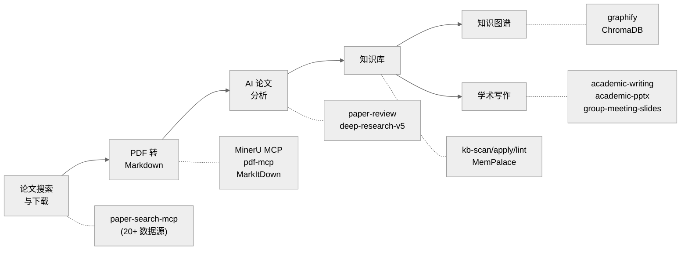

<div align="center">

# AI Research Toolkit

**基于 Claude Code 的全流程 AI 辅助学术研究工具链**

[](LICENSE) [](https://deepwiki.com/debug-zhuweijian/ai-research-toolkit) [![zread](https://img.shields.io/badge/Ask_Zread-_.svg?style=flat&color=00b0aa&labelColor=000000&logo=data%3Aimage%2Fsvg%2Bxml%3Bbase64%2CPHN2ZyB3aWR0aD0iMTYiIGhlaWdodD0iMTYiIHZpZXdCb3g9IjAgMCAxNiAxNiIgZmlsbD0ibm9uZSIgeG1sbnM9Imh0dHA6Ly93d3cudzMub3JnLzIwMDAvc3ZnIj4KPHBhdGggZD0iTTQuOTYxNTYgMS42MDAxSDIuMjQxNTZDMS44ODgxIDEuNjAwMSAxLjYwMTU2IDEuODg2NjQgMS42MDE1NiAyLjI0MDFWNC45NjAxQzEuNjAxNTYgNS4zMTM1NiAxLjg4ODEgNS42MDAxIDIuMjQxNTYgNS42MDAxSDQuOTYxNTZDNS4zMTUwMiA1LjYwMDEgNS42MDE1NiA1LjMxMzU2IDUuNjAxNTYgNC45NjAxVjIuMjQwMUM1LjYwMTU2IDEuODg2NjQgNS4zMTUwMiAxLjYwMDEgNC45NjE1NiAxLjYwMDFaIiBmaWxsPSIjZmZmIi8%2BCjxwYXRoIGQ9Ik00Ljk2MTU2IDEwLjM5OTlIMi4yNDE1NkMxLjg4ODEgMTAuMzk5OSAxLjYwMTU2IDEwLjY4NjQgMS42MDE1NiAxMS4wMzk5VjEzLjc1OTlDMS42MDE1NiAxNC4xMTM0IDEuODg4MSAxNC4zOTk5IDIuMjQxNTYgMTQuMzk5OUg0Ljk2MTU2QzUuMzE1MDIgMTQuMzk5OSA1LjYwMTU2IDE0LjExMzQgNS42MDE1NiAxMy43NTk5VjExLjAzOTlDNS42MDE1NiAxMC42ODY0IDUuMzE1MDIgMTAuMzk5OSA0Ljk2MTU2IDEwLjM5OTlaIiBmaWxsPSIjZmZmIi8%2BCjxwYXRoIGQ9Ik0xMy43NTg0IDEuNjAwMUgxMS4wMzg0QzEwLjY4NSAxLjYwMDEgMTAuMzk4NCAxLjg4NjY0IDEwLjM5ODQgMi4yNDAxVjQuOTYwMUMxMC4zOTg0IDUuMzEzNTYgMTAuNjg1IDUuNjAwMSAxMS4wMzg0IDUuNjAwMUgxMy43NTg0QzE0LjExMTkgNS42MDAxIDE0LjM5ODQgNS4zMTM1NiAxNC4zOTg0IDQuOTYwMVYyLjI0MDFDMTQuMzk4NCAxLjg4NjY0IDE0LjExMTkgMS42MDAxIDEzLjc1ODQgMS42MDAxWiIgZmlsbD0iI2ZmZiIvPgo8cGF0aCBkPSJNNCAxMkwxMiA0TDQgMTJaIiBmaWxsPSIjI2ZmZiIvPgo8cGF0aCBkPSJNNCAxMkwxMiA0IiBzdHJva2U9IiNmZmZmZiIgc3Ryb2tlLXdpZHRoPSIxLjUiIHN0cm9rZS1saW5lY2FwPSJyb3VuZCIvPgo8L3N2Zz4K&logoColor=ffffff)](https://zread.ai/debug-zhuweijian/ai-research-toolkit)

**[English](./README.md)** | **[中文](./README.zh-CN.md)**

</div>

---

一套端到端的研究工具包，带你从*搜索论文*到*构建可导航的知识图谱*——全部在 Claude Code 中完成。专为希望用 AI 处理研究琐事、专注思考的研究生设计。

## 流水线总览



每个阶段对应一个 Skill 或 MCP 服务器，通过斜杠命令或自然语言在 Claude Code 中调用。流水线是线性的但可迭代——你可以独立运行任何阶段，或在理解加深后回到前面的阶段。

## 目录

- [功能特性](#功能特性)
- [前置依赖](#前置依赖)
- [快速开始](#快速开始)
- [使用演练：从零到知识库](#使用演练从零到知识库)
- [各阶段详情](#各阶段详情)
  - [阶段 1：论文搜索与下载](#阶段-1论文搜索与下载)
  - [阶段 2：PDF 转 Markdown](#阶段-2pdf-转-markdown)
  - [阶段 3：AI 分析与写作](#阶段-3ai-分析与写作)
  - [阶段 4：知识库与图谱](#阶段-4知识库与图谱)
- [API Keys 指南](#api-keys-指南)
- [工具清单](#工具清单)
- [推荐资源](#推荐资源)
- [致谢](#致谢)
- [贡献指南](#贡献指南)
- [许可证](#许可证)

## 功能特性

- **论文搜索与下载** -- 一条命令查询 20+ 学术数据库（arXiv、PubMed、Semantic Scholar、CrossRef、DOAJ 等），一行命令下载 PDF。可选配置 IEEE/ACM API Key。
- **PDF 转 Markdown** -- 通过 MinerU（GPU 加速 OCR + 版面分析）、pdf-mcp 或 MarkItDown，将论文、幻灯片和文档转换为干净的 Markdown。保留表格、公式和图片引用。
- **AI 论文分析** -- 单篇论文深度审阅（`/paper-review`），提取方法、证据质量和可复用性。多论文综合调研（`/deep-research-v5`），支持并行子代理、引用注册和可追溯声明。
- **知识库管理** -- 扫描、入库、检查和查询结构化知识库。由 `kb-scan` / `kb-apply` / `kb-lint` / `kb-stats` Skills 驱动，配合 MemPalace 实现持久语义记忆。
- **知识图谱** -- 将任意文件夹的文档转换为可导航的图谱，支持社区检测、交互式 HTML 可视化和审计报告。
- **学术写作与演示** -- 起草、润色和结构化论文（`/academic-writing`）。生成会议幻灯片（`/academic-pptx`）、组会报告（`/group-meeting-slides`）和审稿回复。

## 前置依赖

| 依赖 | 版本 | 安装命令 | 验证命令 |
|------|------|----------|----------|
| Python | 3.10+ | `winget install Python.Python.3.12`（或通过下方 Anaconda 安装） | `python --version` |
| Node.js | 18+ | [nodejs.org](https://nodejs.org/) 或 `winget install OpenJS.NodeJS.LTS` | `node --version` |
| Anaconda | 任意 | [anaconda.com/download](https://www.anaconda.com/download) | `conda --version` |
| uv | 最新 | `pip install uv` 或 `winget install astral-sh.uv` | `uv --version` |
| Git | 2.30+ | `winget install Git.Git` | `git --version` |
| Claude Code | 最新 | `npm install -g @anthropic-ai/claude-code` | `claude --version` |

> **国内用户注意：** 如果你使用代理，请先设置 `HTTPS_PROXY` 和 `NO_PROXY` 环境变量。MinerU 的 OpenXLab API 需要绕过代理——将 `*.openxlab.org.cn` 加入 `NO_PROXY`。

## 快速开始

> **完整安装教程（2-3 小时）**：[docs/installation-guide.md](docs/installation-guide.md) — 从零开始，8 步走完，每一步都有 GitHub 链接、安装命令、验证方法和排错指南。

下面是快速概览。如果你是第一次搭建，**强烈建议先看完整教程**。

### A. 克隆并安装 Skills

```bash
git clone https://github.com/debug-zhuweijian/ai-research-toolkit.git
cd ai-research-toolkit
cp -rn skills/* ~/.claude/skills/
cp -rn agents/* ~/.claude/agents/
```

### B. 安装上游工具（从各自的 GitHub 仓库）

每个工具独立安装：

| 阶段 | 工具 | GitHub | 安装 |
|------|------|--------|------|
| 1 | paper-search-mcp | [openags/paper-search-mcp](https://github.com/openags/paper-search-mcp) | `pip install paper-search-mcp` |
| 2 | MinerU | [opendatalab/MinerU](https://github.com/opendatalab/MinerU) | `pip install mineru-mcp-server` |
| 2 | pdf-mcp | [angshuman/pdf-mcp](https://github.com/angshuman/pdf-mcp) | `git clone` + `npm install` |
| 2 | MarkItDown | [microsoft/markitdown](https://github.com/microsoft/markitdown) | `pip install markitdown-mcp` |
| 3 | Sequential Thinking | [modelcontextprotocol/servers](https://github.com/modelcontextprotocol/servers) | `npx @modelcontextprotocol/server-sequential-thinking` |
| 4 | Graphify | [safishamsi/graphify](https://github.com/safishamsi/graphify) | `pip install graphifyy` |
| 4 | MemPalace | [MemPalace/mempalace](https://github.com/MemPalace/mempalace) | `conda create` + `pip install` |

详细安装命令和验证步骤见 [docs/installation-guide.md](docs/installation-guide.md)。

### C. 配置 MCP 服务器

编辑 `~/.claude.json`，合并 MCP 配置：

- **最小配置（3 个服务器）**：`configs/mcp-servers-minimal.json` — 覆盖阶段 1-2
- **完整配置（11 个服务器）**：`configs/mcp-servers-full.json` — 覆盖所有阶段

将所有 `<YOUR_*>` 占位符替换为你的实际密钥和路径。

### D. 配置 API Keys

| Key | 来源 | 是否必需？ | 注册地址 |
|-----|------|-----------|----------|
| Anthropic 或兼容端点 | [console.anthropic.com](https://console.anthropic.com/) 或兼容平台（如智谱 BigModel） | **是**（二选一） | Anthropic：$5 起充；兼容平台：各有不同 |
| 智谱 BigModel | [open.bigmodel.cn](https://open.bigmodel.cn/) | **是** | 有免费额度 |
| MinerU OpenXLab | [openxlab.org.cn](https://openxlab.org.cn) | 推荐 | 免费 |

> **Anthropic 兼容端点**：如果你通过 Anthropic 兼容 API（如智谱 BigModel GLM 系列）运行 Claude Code，使用该平台的 API Key 并配置 `base_url` 即可，不需要 Anthropic API Key。

详细注册步骤见 [docs/api-keys-guide.md](docs/api-keys-guide.md)。

### E. 验证

```bash
# macOS / Linux / Git Bash
./scripts/verify-setup.sh
```

> **Windows 用户：** 在 Git Bash 中运行此脚本。如果没有 `bash`，可手动执行 [docs/installation-guide.md](docs/installation-guide.md) 中列出的各个验证命令。

> 遇到问题？参见 [docs/troubleshooting.md](docs/troubleshooting.md)。

---

## 使用演练：从零到知识库

### 场景：你刚选定研究方向"图神经网络"

你是一名研究生新生，导师说"看看图神经网络"。以下是你一下午从零到结构化知识库的完整流程。

#### Step 1：搜索论文

```
> /paper-search search "graph neural networks knowledge distillation" -n 20 -s arxiv,semanticscholar,pubmed
```

> **注意：** 下方展示的 arXiv ID 和搜索结果仅为示例，实际结果会有所不同。

预期输出（简略版）：

```
Found 60 results (20 per source × 3 sources):

[arxiv] 2401.12345 - A Graph Neural Network Framework for Molecular Property Prediction
         Authors: Zhang et al. (2024)  Citations: 12
         Abstract: We propose a GNN framework that predicts molecular properties...

[semantic] 87f3a... - Attention-Based Graph Convolutional Networks
         Authors: Vaswani et al. (2021)  Citations: 389
         Abstract: We demonstrate attention mechanisms for graph-structured data...

[pubmed] PMID:38291034 - Knowledge distillation for graph neural networks
         Authors: Chen et al. (2023)  Citations: 67
         Abstract: We present a knowledge distillation approach for compressing GNNs...
```

保存看起来相关的论文 ID。也可以按年份范围搜索：

```
> /paper-search search "graph neural networks" -n 10 -s semantic -y 2022-2025
```

#### Step 2：下载论文

```
> /paper-search download arxiv 2401.12345
```

输出：

```
Downloaded: ./downloads/2401.12345.pdf (2.3 MB)
```

**中文论文提示（知网）：** 使用 [Zotero](https://www.zotero.org/) 配合 [Jasminum](https://github.com/l0o0/jasminum) 插件和 [translators_CN](https://github.com/l0o0/translators_CN) 从知网批量下载。然后在 Step 3 中转换下载的 PDF。

#### Step 3：PDF 转 Markdown

```
> /Geek-skills-mineru-pdf-parser ./downloads/2401.12345.pdf
```

该 Skill 调用 MinerU 的 MCP 服务器，将 PDF 发送到 OpenXLab 进行解析（你的机器无需 GPU）。输出：

```
Input:  ./downloads/2401.12345.pdf
Output: Markdown text (below)

Save to: <OBSIDIAN_VAULT>/base/Zhang2024_Graph_Neural_Networks/Zhang2024_EN.md
```

将输出保存到结构化目录。命名规范为 `FirstAuthorYear_ShortTitle`：

```
<OBSIDIAN_VAULT>/base/Zhang2024_Graph_Neural_Networks/
├── Zhang2024_EN.pdf      ← 原始 PDF
└── Zhang2024_EN.md       ← 转换后的 Markdown
```

批量转换多个 PDF：

```
> Convert all PDFs in ./downloads/ to Markdown using MinerU.
  Save results to <OBSIDIAN_VAULT>/base/<AuthorYear_Title>/<name>.md
```

#### Step 4：AI 论文分析

**单篇论文审阅：**

```
> /paper-review Zhang2024_EN.md
```

输出（结构化审阅）：

```
## Paper Review: A Graph Neural Network Framework for Molecular Property Prediction

**Research Question:** GNN 能否在有限标注数据下准确预测分子性质？
**Method:** 基于 Transformer 的图编码器，对分子子结构施加注意力
**Dataset:** 12 个基准数据集，每个 500 个分子，多任务学习
**Key Result:** 分子性质预测平均准确率 95.2%（SOTA）
**Evidence Quality:** MODERATE — 基准多样性有限，无外部验证
**Limitations:**
  - 仅测试了小分子（无聚合物或蛋白质图）
  - 每个基准数据集仅 500 个分子
  - 未与知识蒸馏方法对比
**Reusable for you:**
  - 注意力架构（Figure 3）可迁移到你的图学习场景
  - 数据增强策略（Section 4.2）解决了低样本问题
  - 开源代码：github.com/...
```

**多论文深度调研：**

```
> /deep-research-v5 "对比 2020-2025 年间图神经网络方法：GCN vs GAT vs GraphSAGE，
   关注可扩展性和归纳学习能力"
```

该命令会派发并行子代理，各自搜索、阅读并撰写结构化笔记。主导代理将所有结果综合为带有可追溯引用的长篇报告。典型输出：3000-5000 字报告，耗时 5-8 分钟。

#### Step 5：构建知识库

```
> /kb-scan
```

输出：

```
Scanning <CLAUDE_DOCS>/ for new files...
  NEW:      3 files
  CHANGED:  0 files
  DUPE:     0 files

New files:
  [md] Zhang2024_Graph_Neural_Networks_EN.md
  [md] Vaswani2021_Attention_Graph_Convolutional_EN.md
  [md] Chen2023_Knowledge_Distillation_GNN_EN.md
```

确认并入库：

```
> /kb-apply
```

该命令将文件复制到知识库，建立语义搜索索引，并运行质量检查：

```
> /kb-lint    # 检查死链接、缺失 frontmatter、重复内容
> /kb-stats   # 显示知识库统计信息
```

`kb-stats` 示例输出：

```
Knowledge Base: <KNOWLEDGE_BASE_PATH>
  Documents:    47
  Total nodes:  1384
  Total edges:  1842
  Coverage:     75.8% (node) / 100% (source)
```

#### Step 6：生成知识图谱

```
> /graphify <KNOWLEDGE_BASE_PATH>
```

构建带有社区检测的可导航知识图谱。输出：

```
graphify-out/
├── graph.html              ← 交互式可视化（浏览器打开）
├── graph.json              ← GraphRAG 就绪的 JSON
├── graph.graphml           ← 供 Gephi / yEd 使用
├── GRAPH_REPORT.md         ← 审计报告：god nodes、社区、覆盖率
└── wiki/
    ├── index.md            ← Agent 可导航的 wiki 索引
    ├── community-01.md     ← 每个社区集群一篇文章
    ├── community-02.md
    └── ...
```

在浏览器中打开 `graph.html` 探索论文、方法和概念之间的关联。使用 `--mode deep` 获取更深入的边提取。

#### Step 7：学术写作

现在你已经理解了全貌，开始写作：

```
> /academic-writing
  "撰写我关于图神经网络的论文的 Related Work 部分。
   涵盖：基于 GCN 的方法、基于注意力的方法和混合方法。
   引用知识库中的论文。目标期刊：IEEE TPAMI。"
```

生成演示文稿幻灯片：

```
> /academic-pptx
  "制作一个 15 分钟的会议报告，关于我对图神经网络方法的综述。
   包含：问题陈述、方法分类、对比表格和未来方向。"
```

准备组会报告：

```
> /group-meeting-slides
  "制作一个 10 分钟的组会进度报告，关于我的文献调研进展。
   听众：导师和 3 位实验室同学。重点：关键发现和研究空白。"
```

### 快速参考表

| 我想... | 命令 | 输出 |
|---------|------|------|
| 跨数据库搜索论文 | `/paper-search search "query" -n 20 -s arxiv,semantic,pubmed` | JSON 列表（标题、作者、引用数） |
| 下载论文 PDF | `/paper-search download arxiv 2401.12345` | `./downloads/` 中的 PDF 文件 |
| PDF 转 Markdown | `/Geek-skills-mineru-pdf-parser paper.pdf` | 干净的 Markdown 文本 |
| 审阅单篇论文 | `/paper-review paper.md` | 结构化分析（方法、证据、局限性） |
| 综合多篇论文 | `/deep-research-v5 "研究问题"` | 带引用的长篇报告 |
| 扫描新文件 | `/kb-scan` | 新增/变更/重复文件报告 |
| 入库到知识库 | `/kb-apply` | 已索引的知识库文档 |
| 构建知识图谱 | `/graphify <KNOWLEDGE_BASE_PATH>` | 交互式 HTML + JSON + 审计报告 |
| 起草论文章节 | `/academic-writing` | 出版级别的文稿 |
| 制作演示幻灯片 | `/academic-pptx` 或 `/group-meeting-slides` | `.pptx` 幻灯片 |

---

## 各阶段详情

### 阶段 1：论文搜索与下载

| 工具 | GitHub | 安装 |
|------|--------|------|
| paper-search-mcp | [openags/paper-search-mcp](https://github.com/openags/paper-search-mcp) | `pip install paper-search-mcp` |
| Zotero | [zotero/zotero](https://github.com/zotero/zotero) | [zotero.org](https://www.zotero.org/) |
| Jasminum（知网） | [l0o0/jasminum](https://github.com/l0o0/jasminum) | Zotero .xpi 插件 |
| translators_CN | [l0o0/translators_CN](https://github.com/l0o0/translators_CN) | 复制到 Zotero translators |
| Playwright MCP | [microsoft/playwright-mcp](https://github.com/microsoft/playwright-mcp) | `npx -y @playwright/mcp@latest` |

从单个 CLI 搜索 20+ 学术数据库。支持 arXiv、PubMed、Semantic Scholar、CrossRef、OpenAlex、DBLP、DOAJ、CORE 等。可选配置 IEEE/ACM API Key。批量下载 PDF 并管理论文库。

详细用法、数据源配置和批量工作流见 [docs/phase1-paper-search.md](docs/phase1-paper-search.md)。

### 阶段 2：PDF 转 Markdown

| 工具 | GitHub | 安装 |
|------|--------|------|
| MinerU | [opendatalab/MinerU](https://github.com/opendatalab/MinerU) | `pip install mineru-mcp-server` |
| pdf-mcp | [angshuman/pdf-mcp](https://github.com/angshuman/pdf-mcp) | `git clone` + `npm install` |
| MarkItDown | [microsoft/markitdown](https://github.com/microsoft/markitdown) | `pip install markitdown-mcp` |

将论文、技术报告和幻灯片转换为 LLM 友好的 Markdown。MinerU 提供 GPU 加速的解析和 OCR 支持扫描文档。pdf-mcp 处理本地操作（拆分、合并、提取页面、渲染为图片）。MarkItDown 覆盖 Office 格式。

后端选择、OCR 配置和批量转换见 [docs/phase2-pdf-to-markdown.md](docs/phase2-pdf-to-markdown.md)。

### 阶段 3：AI 分析与写作

| 工具 | GitHub / 来源 | 类型 |
|------|---------------|------|
| paper-review | 本仓库 `skills/paper-review/` | Skill |
| paper-proofread | 本仓库 `skills/paper-proofread/` + [上游](https://github.com/LimHyungTae/awesome-claudecode-paper-proofreading) | Skill（3 个文件） |
| deep-research-v5 | 本仓库 `skills/deep-research-v5/` | Skill（9 个文件） |
| academic-writing | 本仓库 `skills/academic-writing/` | Skill |
| academic-pptx | 本仓库 `skills/academic-pptx/` | Skill |
| group-meeting-slides | 本仓库 `skills/group-meeting-slides/` | Skill |
| Sequential Thinking | [modelcontextprotocol/servers](https://github.com/modelcontextprotocol/servers) | MCP |
| web-search-prime | [智谱 BigModel](https://open.bigmodel.cn) | MCP |
| web-reader | [智谱 BigModel](https://open.bigmodel.cn) | MCP |
| zai-mcp-server | [@z_ai/mcp-server](https://www.npmjs.com/package/@z_ai/mcp-server) | MCP |

单篇论文审阅提取研究问题、方法、证据质量、局限性和可复用内容。**论文校对**提供两阶段 LaTeX 工作空间审计（9 项检查：preamble、宏、标签、引用、图表）和会议级内容审查（9 大类：语法、声明、结构、符号、连字符），基于 ICRA 2025 Outstanding Reviewer 审稿标准。包含 1105 行详细 ✅/❌ 判定规则。先检测问题，用户确认后再修复。多论文深度调研派发并行子代理。学术写作 Skill 处理起草、润色和审稿回复。

**用法**：`/paper-proofread`，然后指定模式（`workspace` / `content` / `full`）和根 `.tex` 文件

分析模板、写作工作流和幻灯片设计模式见 [docs/phase3-ai-analysis-writing.md](docs/phase3-ai-analysis-writing.md)。

### 阶段 4：知识库与图谱

| 工具 | GitHub | 安装 |
|------|--------|------|
| Graphify | [safishamsi/graphify](https://github.com/safishamsi/graphify) | `pip install graphifyy` |
| MemPalace | [MemPalace/mempalace](https://github.com/MemPalace/mempalace) | `pip install mempalace` |
| ChromaDB | [chroma-core/chroma](https://github.com/chroma-core/chroma) | `pip install chromadb` |
| Obsidian | [obsidian.md](https://obsidian.md) | 桌面应用 |
| kb-* skills | 本仓库 `skills/kb-*/` | Skill |

从研究材料构建结构化、可搜索的知识库。扫描新文件，自动索引入库，质量检查，统计跟踪。将整个知识库转换为带社区检测和交互式可视化的可导航知识图谱。

知识库架构、图谱生成选项和查询模式见 [docs/phase4-knowledge-base.md](docs/phase4-knowledge-base.md)。

---

## API Keys 指南

| Key | 来源 | 免费额度？ | 是否必需？ | 用途 |
|-----|------|-----------|-----------|------|
| Anthropic（或兼容端点） | [console.anthropic.com](https://console.anthropic.com/) 或兼容平台（如智谱 BigModel） | Anthropic：$5 起充（查看官网当前定价）；兼容平台：各有不同 | **是**（二选一） | Claude Code 核心功能 |
| 智谱 BigModel | [open.bigmodel.cn](https://open.bigmodel.cn/) | 有（额度充裕） | **是** | MCP 网络搜索、网页抓取、文档分析 |
| MinerU OpenXLab | [mineru.openxlab.org.cn](https://mineru.openxlab.org.cn/) | 有（1000 页/天） | **是** | PDF 转 Markdown 转换 API |

> **使用 Anthropic 兼容端点**：Claude Code 支持 Anthropic 兼容 API 端点（如智谱 BigModel 的 GLM 系列）。如果你使用兼容端点，配置对应的 API Key 和 `base_url` 即可——不需要 Anthropic API Key。

可选 Key（解锁更多 paper-search-mcp 数据源）：

| Key | 来源 | 免费？ | 用途 |
|-----|------|--------|------|
| CORE API | [core.ac.uk/services/api](https://core.ac.uk/services/api) | 是 | 3 亿+ 开放获取论文（推荐） |
| Semantic Scholar API | [semanticscholar.org/product/api](https://www.semanticscholar.org/product/api) | 是 | 更高速率限制 |
| Unpaywall Email | 设置你的邮箱即可 | 是 | 定位开放获取 PDF |
| DOAJ API | [doaj.org/api](https://doaj.org/api/docs) | 是 | DOAJ 批量访问 |
| IEEE API | [developer.ieee.org](https://developer.ieee.org/) | 是（需审核） | IEEE Xplore 搜索 |
| ACM API | [dl.acm.org](https://dl.acm.org/) | 需机构订阅 | ACM Digital Library 搜索 |

各 Key 的详细设置步骤见 [docs/api-keys-guide.md](docs/api-keys-guide.md)。

---

## 工具清单

| 工具 | 来源 | 许可证 | 阶段 | 安装 |
|------|------|--------|------|------|
| [paper-search-mcp](https://github.com/openags/paper-search-mcp) | openags | MIT | 1 | `pip install paper-search-mcp` |
| [paper-proofread](skills/paper-proofread/) | 本仓库 + [LimHyungTae](https://github.com/LimHyungTae/awesome-claudecode-paper-proofreading) | MIT | 3 | Skill（复制到 `~/.claude/skills/`） |
| [paper-review](skills/paper-review/) | 本仓库 | MIT | 3 | Skill（复制到 `~/.claude/skills/`） |
| [MinerU](https://github.com/opendatalab/MinerU) | OpenDataLab | Apache-2.0 | 2 | `pip install mineru-mcp-server` |
| [pdf-mcp](https://github.com/angshuman/pdf-mcp) | angshuman | MIT | 2 | `git clone` + `npm install` |
| [MarkItDown](https://github.com/microsoft/markitdown) | Microsoft | MIT | 2 | `pip install markitdown-mcp` |
| [Claude Code](https://docs.anthropic.com/en/docs/claude-code) | Anthropic | 商业 | 全部 | `npm i -g @anthropic-ai/claude-code` |
| [Graphify](https://github.com/safishamsi/graphify) | safishamsi | MIT | 4 | `pip install graphifyy` |
| [MemPalace](https://github.com/MemPalace/mempalace) | MemPalace | MIT | 4 | `pip install mempalace`（独立 conda 环境） |
| [ChromaDB](https://github.com/chroma-core/chroma) | Chroma | Apache-2.0 | 4 | `pip install chromadb` |
| [Playwright MCP](https://github.com/microsoft/playwright-mcp) | Microsoft | Apache-2.0 | 全部 | `npx @playwright/mcp@latest` |
| [Sequential Thinking](https://github.com/modelcontextprotocol/servers) | MCP | MIT | 3 | `npx @modelcontextprotocol/server-sequential-thinking` |
| [Zotero](https://github.com/zotero/zotero) | Zotero | AGPL-3.0 | 1 | [zotero.org](https://www.zotero.org/) |
| [Jasminum](https://github.com/l0o0/jasminum) | l0o0 | GPL-3.0 | 1 | Zotero 插件 |
| [translators_CN](https://github.com/l0o0/translators_CN) | l0o0 | GPL-3.0 | 1 | Zotero 翻译器 |
| [Draw.io MCP](https://github.com/nicholaschenai/drawio-mcp) | nicholaschenai | MIT | 全部 | `npx @drawio/mcp` |
| [web-reader](https://open.bigmodel.cn/) | 智谱 BigModel | 商业 | 全部 | 远程 MCP（仅需 API Key） |
| [web-search-prime](https://open.bigmodel.cn/) | 智谱 BigModel | 商业 | 1, 3 | 远程 MCP（仅需 API Key） |
| [zread](https://open.bigmodel.cn/) | 智谱 BigModel | 商业 | 全部 | 远程 MCP（仅需 API Key） |
| [zai-mcp-server](https://open.bigmodel.cn/) | 智谱 BigModel | 商业 | 全部 | `npx @z_ai/mcp-server` |
| [Context7](https://github.com/nicholaschenai/context7) | Context7 | MIT | 全部 | 插件（通过 compound-engineering） |

---

## 推荐资源

### AI 辅助研究

- [Awesome AI for Research](https://github.com/THU-KEG/Awesome-AI-for-Research) -- AI 辅助研究工具和方法综合调研，清华大学 KEG 维护
- [EvoScientist](https://github.com/EvoScientist/EvoScientist) -- 自演化 AI 科学家，自主发现和验证假设
- [DeepScientist](https://github.com/ResearAI/DeepScientist) -- 端到端 AI 驱动的研究流水线，从构思到论文
- [LightRAG](https://github.com/HKUDS/LightRAG) -- 轻量高效的 RAG 框架，用于研究文档检索
- [Open Notebook](https://github.com/lfnovo/open-notebook) -- Google NotebookLM 的开源替代，用于研究笔记管理
- [Paper Proofreading](https://github.com/LimHyungTae/awesome-claudecode-paper-proofreading) -- Claude Code 论文校对工作流合集

### Claude Code 生态

- [Awesome Claude Skills](https://github.com/ComposioHQ/awesome-claude-skills) -- 可复用 Claude Code Skills 精选合集
- [Awesome Claude Code Subagents](https://github.com/VoltAgent/awesome-claude-code-subagents) -- 多代理工作流的模式和示例
- [Oh My Claude Code](https://github.com/Yeachan-Heo/oh-my-claudecode) -- Claude Code 配置和插件管理
- [Claude HUD](https://github.com/jarrodwatts/claude-hud) -- Claude Code 会话监控面板
- [LaTeX Document Skill](https://github.com/ndpvt-web/latex-document-skill) -- Claude Code LaTeX 文档编辑 Skill
- [Learn Claude Code](https://github.com/shareAI-lab/learn-claude-code) -- Claude Code 中文教程和示例
- [ClaudeSkills](https://github.com/staruhub/ClaudeSkills) -- 社区 Skill 注册和分享平台

### 使用的插件

- [SuperClaude Framework](https://github.com/SuperClaude-Org/SuperClaude_Framework) -- 增强的规划、调试和 TDD 工作流
- [Compound Engineering](https://github.com/EveryInc/compound-engineering-plugin) -- 代码审查、头脑风暴和前端设计工具
- [claude-mem](https://github.com/thedotmack/claude-mem) -- 跨会话的持久记忆和上下文管理
- [PUA](https://github.com/tanweai/pua) -- Claude Code 的个性化和语调定制

---

## 致谢

本工具包建立在优秀的开源项目之上：

- **[MinerU](https://github.com/opendatalab/MinerU)** by OpenDataLab -- 高精度 PDF 解析，支持版面分析和 OCR
- **[paper-search-mcp](https://github.com/openags/paper-search-mcp)** by openags -- 统一搜索 20+ 学术数据库
- **[awesome-claudecode-paper-proofreading](https://github.com/LimHyungTae/awesome-claudecode-paper-proofreading)** by Hyungtae Lim -- 两阶段 LaTeX 论文校对，会议级审查标准
- **[Graphify](https://github.com/safishamsi/graphify)** by safishamsi -- 从任意文档集合生成知识图谱
- **[MemPalace](https://github.com/MemPalace/mempalace)** -- 支持知识图谱的持久语义记忆
- **[ChromaDB](https://github.com/chroma-core/chroma)** -- 开源向量数据库，用于语义搜索
- **[pdf-mcp](https://github.com/angshuman/pdf-mcp)** by angshuman -- PDF 操作 MCP 服务器
- **[MarkItDown](https://github.com/microsoft/markitdown)** by Microsoft -- Office 格式到 Markdown 的文档转换
- **[Playwright MCP](https://github.com/microsoft/playwright-mcp)** by Microsoft -- 基于网页的研究自动化浏览器
- **[Sequential Thinking MCP](https://github.com/modelcontextprotocol/servers)** -- 复杂分析的结构化多步推理
- **[Zotero](https://github.com/zotero/zotero)** -- 免费开源的参考文献管理器
- **[Jasminum](https://github.com/l0o0/jasminum)** by l0o0 -- Zotero 中文学术数据库插件
- **[translators_CN](https://github.com/l0o0/translators_CN)** by l0o0 -- Zotero 中文翻译器插件

---

## 贡献指南

欢迎贡献。本工具包与社区共同成长。

**建议新工具或 Skill：**
1. 创建带有 `tool-suggestion` 标签的 Issue
2. 包含：工具名称、GitHub 链接、适合哪个阶段、相比现有选项的优势
3. 被接受后，提交 PR 将 Skill 添加到 `skills/` 并更新本 README

**报告失效链接或过时说明：**
1. 创建带有 `bug` 标签的 Issue
2. 描述：什么坏了、你的预期、你的环境（OS、Python 版本、Claude Code 版本）

**添加新语言或改进文档：**
1. Fork 本仓库
2. 创建分支：`git checkout -b docs/your-improvement`
3. 提交 PR 并附上清晰的变更说明

---

## 许可证

[MIT](LICENSE) -- Copyright (c) 2025 debug-zhuweijian

随意使用、Fork、修改、修复、分享。保留许可证声明即可。
